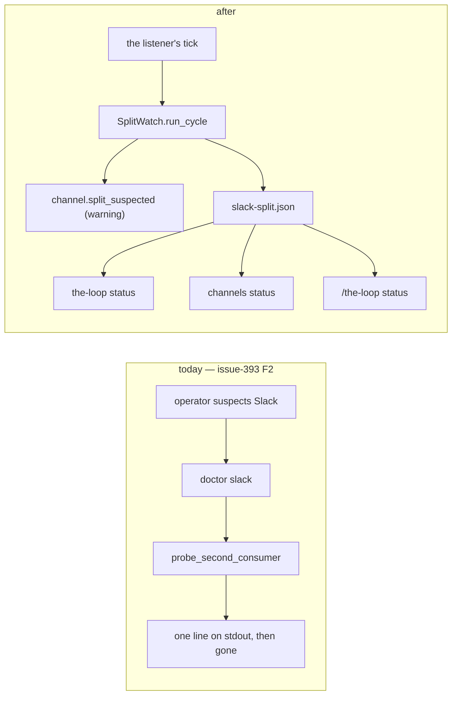
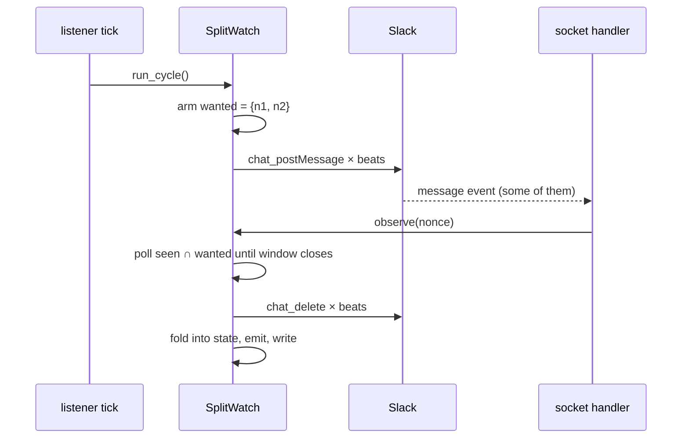

<!-- Authored per the the-loop:writing skill. -->

# Design: the listener measures its own share of the traffic

> Phase 2 of 4. Derived from [bugfix.md](bugfix.md); reviewed with
> [testing-plan.md](testing-plan.md) at one gate.

## Overview

The measurement already exists and is correct. What is missing is that it runs only when
asked, and that its answer dies with the process. This change moves the measurement into
the listener's own loop and gives it somewhere to put the answer.



Both halves of the doctor's mechanism survive: `doctor slack` keeps its own probe
untouched, and a heartbeat still goes into the event log as `channel.heartbeat`, so the
doctor's `_LogReceiver` keeps working exactly as it does today.

## Architecture

### The one thing the listener can measure and the doctor cannot

The doctor, when a listener is running, measures *through the event log* — it posts, then
reads back what the listener wrote. Inside the listener that indirection is unnecessary
and unwanted: the handler that sees the heartbeat is the same process that posted it, so
the receipt is a set in memory.



A split shows as `seen ⊂ wanted`. Nothing else in the loop can produce that shortfall:
the handler runs on the SDK's own thread the moment the envelope arrives, and a heartbeat
never enters the inbound pipeline.

### Where each piece lives

| file | change |
|---|---|
| `the_loop/channels/splitwatch.py` | **new** — `SplitState`, `SplitWatch`, the remedy text, the renderers |
| `the_loop/channels/slack.py` | build the watch, feed it from the heartbeat branch, run a cycle at connect and on each reconcile deadline; one new config field |
| `the_loop/channels/doctor.py` | `central_channel` made public (the watch resolves the channel the same way); the remedy sentence comes from `splitwatch` |
| `the_loop/eventlog.py` | two catalog entries |
| `the_loop/state.py` | `StateLayout.slack_split` + its `GENERATED_PATHS` classification |
| `the_loop/core/lifecycle.py` | `slackSplit` in `status_all`, `split_line` for the renderers |
| `the_loop/commands/lifecycle_cmd.py` | print it under the listener row |
| `the_loop/commands/channels_cmd.py` | one `split check:` line, `[!]` when short |
| `the_loop/channels/commands.py` | the same line in `/the-loop status` |
| `.the-loop/cli-config.schema.json` | `channels.slack.read.splitCheckBeats` |

## Components & interfaces

### `the_loop/channels/splitwatch.py` — new

```python
SPLIT_REMEDY: str            # the two remedies, in order — the one sentence every surface prints
SPLIT_CAVEAT: str            # "Evidence, not proof: Slack lists no connections"
DEFAULT_BEATS = 2
DEFAULT_WINDOW_SECONDS = 5.0
ESCALATE_EVERY = 6           # after the first warning, one more every 6 short checks
RETAINED = 8                 # how many verdicts the rolling window keeps

@dataclass(frozen=True)
class SplitState:            # one reading of <root>/local/slack-split.json
    verdict: str             # ok | split-suspected | unverifiable
    beats: int; echoed: int; window_seconds: float
    channel: str; reason: str; checked_at: str
    checks: int; short: int; consecutive_short: int
    recent: Tuple[str, ...]  # the last RETAINED verdicts, oldest first
    interval_seconds: int
    def flapping(self) -> bool     # any retained verdict is short
    def suspected(self) -> bool    # latest is short, or flapping

class SplitWatch:
    @classmethod
    def for_config(cls, cli_config, *, client, ...) -> Optional["SplitWatch"]
    def observe(self, nonce: str) -> None          # called from the socket handler
    def run_cycle(self, stop_event=None) -> SplitState

def read_state(path) -> Optional[SplitState]
def split_state_path(cli_config) -> str
def split_lines(state) -> List[str]                # [] when there is nothing to say
```

`for_config` returns `None` — and the listener then does nothing — when the channel is
disabled, when `splitCheckBeats` is `0`, or when there is no bot token. Everything else
is a runtime `unverifiable`, which is recorded rather than skipped.

`run_cycle` never raises: every failure path returns an `unverifiable` state with a
reason, exactly as `probe_second_consumer` does.

### `the_loop/channels/slack.py` — the wiring

Three edits, all inside `run_socket_listener`:

1. `watch = splitwatch.SplitWatch.for_config(frozen_config, client=web_client)` before
   `handle` is defined, so the closure can reach it.
2. In the heartbeat branch, after the existing `eventlog.emit`, `watch.observe(nonce)`.
   The emit stays first and unconditional: the doctor reads it.
3. The idle loop gains one call. The check runs once after `catch_up(frozen_config)` at
   connect, and again beside each reconcile on the existing `due` deadline — no second
   thread and no second cadence key, so `read.catchUpSeconds: 0` keeps its connect-only
   contract for both.

`SlackChannelConfig` gains `split_check_beats: int`, parsed by `_split_check_beats`,
which clamps like its neighbour `_catch_up_seconds`: a non-integer or negative value
falls back to the default with a warning, and anything above `MAX_SPLIT_BEATS` (5) is
lowered — a check is a measurement, not a broadcast.

### The state file — `<root>/local/slack-split.json`

Machine-**local**, for the reason `poll-status.json` is: it describes what *this*
process, on *this* host, heard. Copied elsewhere it would report a split that host never
had. Written with the same `tempfile` + `os.replace` the poller heartbeat uses, and a
write that fails warns once and is swallowed.

```json
{
  "verdict": "split-suspected",
  "checkedAt": "2026-09-21T07:41:02Z",
  "beats": 2, "echoed": 1, "windowSeconds": 5.0,
  "channel": "C0ABCDEF", "reason": "",
  "checks": 12, "short": 5, "consecutiveShort": 1,
  "recent": ["ok", "split-suspected", "ok", "split-suspected"],
  "intervalSeconds": 900
}
```

Ids, counts and timestamps. No token, no nonce, no message text.

## Data models

`recent` is the whole of the flap handling. Each completed check appends its verdict and
the list is cut to the newest `RETAINED` (8). `suspected()` is true when the latest
verdict is short **or** any retained one is — so the reporter's `2/3 → 1/3 → 3/3 → 1/3`
reads as suspected throughout, and a deployment that has truly recovered goes quiet after
8 clean checks (2 hours at the default cadence).

## Error handling

| failure | behaviour |
|---|---|
| no configured channel, or it resolves to nothing | `unverifiable` with the reason; no post |
| `chat_postMessage` raises | `unverifiable`; whatever was posted is still deleted |
| `chat_delete` raises | debug line; the measurement already happened |
| the state file cannot be written | warn once, keep listening |
| `run_cycle` raises anything at all | caught in the listener, logged, listening continues |
| the listener is stopped mid-window | the wait aborts on the stop event; no state written |
| the state file is absent or corrupt | `read_state` → `None`; every surface prints nothing |

## Security design

- The check touches no credential beyond the two environment variables the listener
  already read to connect, and writes no fingerprint of either.
- No scope is added: posting and deleting the heartbeat is `chat:write`, held already. A
  `chat_delete` the app may not perform leaves the marker message in the room — visible
  litter, never a leak.
- The state file is forgeable by anyone who can write `state.root`, so it drives a report
  and nothing else: no gate, no authorization and no routing reads it. This is the same
  contract `poll-status.json` carries.
- A forged heartbeat can only make a short check look clean (a missed warning), never
  make a clean one look short. The failure direction is toward silence, which is the
  direction that cannot produce a false accusation against an operator's deployment.

## Testing strategy

Unit tests over `SplitWatch` with a fake client and an injected nonce factory — no
network, no sleep beyond the polling granularity. Integration tests drive
`run_socket_listener` against the existing fake Socket Mode client in
`tests/test_channels_integration.py` style, and the status surfaces against a written
state file. The redaction assertion is a substring search for the token values over every
line, record and file the change can produce.

## Trade-offs & decisions

**A clean check does not clear the report; eight do.** The issue asks for "one clean cycle
clears the state", and that is what the escalation counter does — a clean check resets
`consecutiveShort`, so the warning stream stops at once. The *report* is deliberately
stickier, because the reporter's own evidence is `2/3 → 1/3 → 3/3 → 1/3`: under a real
split each check is a coin toss, and a rule that hides the finding on the first head
would have hidden this incident from the operator half the times they looked. The cost is
that a genuinely resolved split keeps its line for up to eight checks after the fix; the
line names the last check's result, so it reads as recovering rather than broken.

**Two beats, not the doctor's three.** The doctor is a one-shot an operator is waiting
on, and pays three posts for a 87% single-run detection. The watch runs forever: two beats
per 900s costs 8 messages an hour and detects a split with probability 0.75 per check —
which is 99.6% within four checks, an hour. Configurable to 5, and to `0` for off.

**The reconcile's deadline, not a new one.** A second cadence key would be a second thing
to get wrong, and the reconcile's cadence is already the deployment's answer to "how late
may an inbound envelope be" — which is precisely the question a split makes urgent.

**Inline in the tick, not a thread.** The window is 5 seconds and the wait aborts on the
stop event, so the listener's shutdown latency is unchanged in the worst case that
matters. A thread would need its own lifecycle for no gain — `catch_up`, which does more
network work, already runs inline here.

## Open questions

None.
