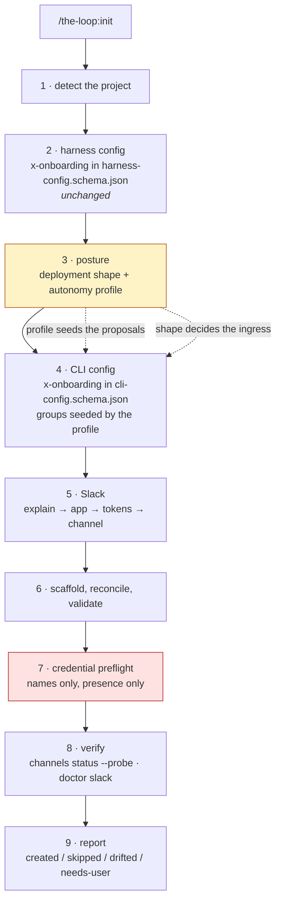
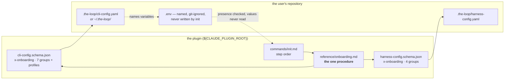
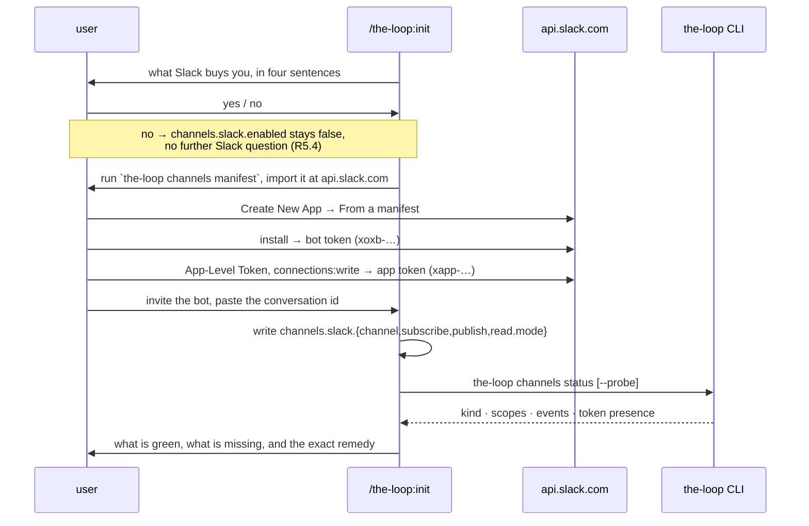
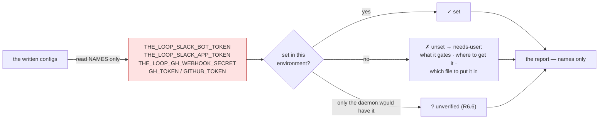

<!-- Authored per the the-loop:writing skill. -->

# Design: the `/the-loop:init` onboarding a person can finish

> Phase 2 of 4 (requirements → design → testing plan → tasks). Derives from
> [requirements.md](requirements.md). Source:
> [issue-415](https://github.com/MadaraUchiha-314/the-loop/issues/415).

## Overview

**The walkthrough machinery already exists and works; this work item points it at the
config that matters and adds three things it cannot infer.** `reference/onboarding.md`
defines a grouped, schema-driven procedure — read `x-onboarding.groups`, explain the
group, show the proposal with its provenance, ask once, offer the fast path — and
`harness-config.schema.json` declares the groups it walks. Nothing about that procedure is
specific to the harness config. So the bulk of this change is **an `x-onboarding` block in
`cli-config.schema.json`**, and the command file learns to walk two schemas instead of
one.

Three things the existing procedure has no vocabulary for are added beside it:

1. **An autonomy ladder** (`x-onboarding.profiles`) — named rungs, each a small bundle of
   config values, so the user's threshold for automation is one answer instead of six.
2. **A deployment shape** — personal machine or always-on host — which is the fact that
   decides the ingress, and which no schema default can know.
3. **A credential preflight** — read the four environment-variable *names* the written
   config declares and report which are set, presence only.

Nothing here is code that runs. The deliverable is the schema metadata, the procedure in
the skill, the command file that executes it, a test that keeps the metadata honest, and
the documentation. That is the right shape: the walkthrough is executed by the agent, and
the agent's instructions are files.



## Architecture

### Where each piece of knowledge lives

The governing rule, restated because it is the one this design can most easily break:
**the schema says what to ask; the command file says how to ask; the skill reference says
what "how to ask" means.** A group explanation written into `commands/init.md` is drift
waiting to happen, and the whole reason `x-onboarding` exists.

| Knowledge | Home | Why there |
|---|---|---|
| Which CLI-config keys are asked together, in what order, at what ask level | `.the-loop/cli-config.schema.json` → `x-onboarding.groups` | The schema is the only file that cannot go stale against the keys |
| What each key means, its default, its legal values, its examples | the property's `description` / `default` / `enum` / `examples` | Already true today; the walkthrough reads them |
| The autonomy ladder and each rung's values | `.the-loop/cli-config.schema.json` → `x-onboarding.profiles` | Every value is a config path; the schema is where a renamed path is detectable |
| The procedure (how a group is presented, provenance, fast path, re-runs) | `skills/the-loop/reference/onboarding.md` | One procedure, now walked twice |
| The step order and what init does between groups | `commands/init.md` | The command is the orchestration |
| The deployment shape question | `reference/onboarding.md` | It is procedure, not config: its answer is a proposal, never a stored key |
| The credential preflight | `reference/onboarding.md` + `commands/init.md` step | Reads names out of the written config; stores nothing |

### The two schemas, walked by one procedure



## Components & interfaces

### C1 — `x-onboarding.groups` in `cli-config.schema.json`

Seven groups, covering every top-level property except `version` (which init stamps, and
which the harness schema exempts for the same reason). The shape is byte-for-byte the
shape `harness-config.schema.json` already uses — `id`, `title`, `ask`, `explain`,
`keys` — so the procedure needs no branch for which schema it is reading.

| # | `id` | `ask` | `keys` | What the group decides |
|---|---|---|---|---|
| 1 | `posture` | `always` | *(none)* | The deployment shape and the autonomy profile. Carries no key: it sets the **proposals** the next four groups confirm. |
| 2 | `deployment` | `confirm` | `state`, `env`, `instance` | Where this instance keeps its files, where its credentials come from, what it is called when more than one watches a repository. |
| 3 | `ingress` | `confirm` | `repositories`, `webhooks`, `polling` | What is watched, and how an event reaches the daemon. |
| 4 | `execution` | `confirm` | `routing`, `harnesses`, `models`, `effort` | What happens when an event matches: the arming labels, who may drive, where the checkout goes, which harness and model run. |
| 5 | `channels` | `confirm` | `channels` | Slack: the app, the tokens, the conversation, what it hears and what it may do. |
| 6 | `review` | `advanced` | `critics`, `reviews` | The critic roster and how many review rounds a work item gets. |
| 7 | `operations` | `advanced` | `service`, `eventLog`, `integrations`, `standingSessions`, `selfDiagnosis` | The control-plane service, the event log, which GitHub, standing sessions, self-diagnosis. |

A group with `keys: []` is not an invention: the harness schema's `people` group already
carries none, existing to establish a sibling file. `posture` carries none for the
adjacent reason — its answers are not keys, they are the provenance of other keys'
proposals ("*from the profile you picked*", R7.4).

### C2 — `x-onboarding.profiles`, the autonomy ladder

```json
"profiles": {
  "description": "…",
  "recommended": "watch-and-ask",
  "ladder": [
    { "id": "…", "title": "…", "summary": "…", "stillHuman": "…", "values": { "<config.path>": <value> } }
  ]
}
```

`ladder` is an array, not an object, because the order *is* the ladder and JSON object
order is not a contract. `values` keys are absolute dotted config paths; a test resolves
each against the schema (§Testing strategy), which is what makes R2.4 real.

**The three rungs.** Every value below exists in the schema today; the first rung is
literally the shipped defaults.

| | `commands-only` | `watch-and-ask` *(recommended)* | `armed` |
|---|---|---|---|
| `routing.enabled` | `false` | `true` | `true` |
| `routing.spawnOnUnmatched` | `never` | `labeled` | `labeled` |
| `routing.control.requireStartCommand` | *(n/a)* | `true` | `false` |
| `routing.mergeOnApproval` | *(n/a)* | `false` | `true` |
| `webhooks.ghWebhook.enabled` / `polling.enabled` | `false` / `false` | *from the deployment shape* | *from the deployment shape* |
| `channels.slack.enabled` | `false` | *asked separately* | *asked separately* |
| `selfDiagnosis.enabled` | `false` | `false` | `true` |

- **`commands-only`** — the-loop is the slash commands in your editor. No daemon, nothing
  watching, nothing running when you close the session. This rung exists so that "not
  yet" is an answer the walkthrough accepts (R2.5) rather than a user fighting it, and
  because it is what a first-time reader should be allowed to choose before they have
  watched the loop work once.
- **`watch-and-ask`** — the daemon watches the repository, but **you** start every work
  item: labelling arms it, and nothing spawns until an authorized user comments
  `the-loop start`. An approved pull request stops at approved; you merge it. This is the
  recommendation because it is the rung where the user sees the loop work while every
  irreversible act is still theirs.
- **`armed`** — the labels are the go-ahead: an armed item spawns on its own, and a pull
  request that clears its approval gate merges itself.

**Why three and not five.** A ladder is only useful if a reader can hold all of it at
once and place themselves on it. The three rungs are the three genuinely different
answers to "what am I willing to let it do while I am not looking": nothing, watch but
ask, go. A fourth rung between two of these would be a config difference the user cannot
feel, and a fifth above `armed` would have to be `spawnOnUnmatched: always` — any
unmatched event spawning a session — which is not a threshold, it is a footgun, and is
deliberately absent from the ladder. An operator who wants it can still write it; the
walkthrough will not propose it.

**Three keys no profile touches, and the reason matters.**

- `routing.authorizedUsers` — who may drive the loop is established with the user **by
  name** (R3 abuse case 4). A threshold is not a grant.
- `routing.harnessTrust.enabled` (default `true`) — it already defaults to what a working
  deployment needs, and a rung that flipped it would be selling a footgun as caution.
- Anything the process graph or the risk tiers read — the invariant of Requirement 3,
  enforced as a test rather than a promise (§Testing strategy, A4).

### C3 — The deployment shape

One question, asked at the top of the `posture` group, whose answer is never stored:

> **Where will the-loop's daemon run?** *(a) On this machine — a laptop or a desktop I
> close.* *(b) On an always-on host with an inbound route — a cloud box, a VM, a
> container.* *(c) Nowhere yet.*

The mapping is mechanical, and it is the mapping `polling-options.md` already documents
("for hosts a webhook cannot reach: behind NAT or a firewall, a laptop"):

| Answer | Ingress proposed | Also proposed | What init says |
|---|---|---|---|
| personal machine | `polling.enabled: true`, `polling.sources[0].provider: github` | `routing.workspace.root` | A webhook receiver needs an inbound route this machine does not have; polling asks GitHub instead. |
| always-on host | `webhooks.ghWebhook.enabled: true` | `routing.workspace.root`, `webhooks.ghWebhook.secretEnv` as a credential to set | The receiver is the lower-latency ingress and needs the shared secret and a GitHub webhook pointed at it. |
| nowhere yet | neither | neither | Routing stays off; the report says so, and re-running init later is the way back (R4.5). |

Init may answer this from detection where detection is unambiguous — a cloud-shell or
container environment, a `$CODESPACES`-style marker — but it asks whenever it is not, and
it always shows the answer it inferred rather than acting on it silently.

### C4 — The Slack group

The `channels` group is where the 868-line reference page becomes a walkthrough. Its
`explain` text carries the short form only: **one thread per work item; `subscribe` is
what the channel hears; `publish` is what a message there may become; GitHub stays the
ledger**. Everything longer is a link, per R7.5.

The order is the order the [Slack guide](/guide/slack) already establishes, and init walks
it as steps rather than restating it:



`subscribe` is proposed from the schema default plus the events a first deployment
actually wants to see; `publish` is proposed as the schema default (`work-item.reply`)
and **nothing more** — R5.3 forbids proposing an authority the user did not ask for, and
`publish` is precisely a grant.

Where the CLI is absent (the user installed the plugin but not `the-loopy-one`), init
prints the two commands and reports the channel as **unverified**, never as working
(R5.6).

### C5 — The credential preflight

Runs after the configs are written and validated, and before the report.



Four rules govern it, and the first is the one a reviewer should check hardest:

1. **Presence, never value.** `[ -n "${NAME:-}" ]` and nothing else. No value, no prefix,
   no length, no hash, no echo, no log (R6.2, abuse case 2). The existing
   `channels status` line — `_presence()` returning `"set"` or `"unset"` — is the
   contract this matches, deliberately.
2. **Names come from the config, not from a list.** `channels.slack.botTokenEnv`,
   `appTokenEnv`, `webhooks.ghWebhook.secretEnv` and `integrations.github.api.tokenEnv`
   are read out of what was just written, so an operator who renamed a variable is
   checked on *their* name. The four defaults are the fallback, not the source.
3. **Only what the configuration actually needs.** A deployment that declined Slack is
   not told about `THE_LOOP_SLACK_APP_TOKEN`; a deployment on polling is not told about
   the webhook secret. A checklist of irrelevant variables is how a checklist stops being
   read.
4. **`env.file` is offered, and its safety is checked.** When the user wants one, init
   proposes a path, states plainly that it will hold secrets, and verifies `.gitignore`
   covers it — offering to add the line when it does not (R6.5, abuse case 1). Init
   never writes a value into it; the user does.

### C6 — `commands/init.md`, restructured

Today's steps 1–8 become 1–9. The changes, in place:

| Step | Change |
|---|---|
| 1 · detect | Unchanged, plus: detect the deployment shape where it is unambiguous. |
| 2 · harness config | Unchanged. |
| **3 · posture** | **New.** Deployment shape, then the profile question, from `x-onboarding.profiles`. |
| **4 · CLI config** | **Replaces** today's single "track it here or in your home directory?" question. That question stays — it is still the first thing the group asks — and is followed by the seven-group walkthrough, with the profile's values as the proposals. |
| **5 · Slack** | **New**, as C4. |
| 6 · reconcile | Unchanged, except that `.the-loop/cli-config.yaml` is now written with the walkthrough's answers rather than from the bare template. |
| 7 · labels, 8 · validate, 9 · hooks | Unchanged (renumbered). |
| **10 · preflight & verify** | **New**, as C5, plus `channels status --probe` / `doctor slack` where Slack was configured. |
| 11 · report | Gains the applied profile's id (R3.4) and the credential lines under **needs-user**. |

`--defaults` and `--dry-run` keep their existing contracts and extend over the new steps:
no question is asked, no credential is *reported as* missing-and-unasked without landing
in **needs-user**, and `--dry-run` still writes nothing — including no `.gitignore` line.

### C7 — `reference/onboarding.md`, extended

Four new sections, and one edit to an existing one:

- **§ Two configs, one procedure** — the walkthrough runs twice; the CLI config's groups
  come from `cli-config.schema.json`; nothing else differs.
- **§ The autonomy ladder** — how a profile is presented, that it is a proposal and not an
  application, and the invariant that no rung buys away a gate.
- **§ The deployment shape** — the question, the mapping, and that the answer is never
  stored.
- **§ The credential preflight** — the four rules of C5.
- **§ How to present a group** gains R7's writing contract: lead with what the group
  decides, show provenance, link rather than restate, and offer the exit at every group.

## UI/UX design

N/A — the surface is a conversation in an agent harness and a set of markdown
instructions. There is no rendered artifact to prototype. The nearest thing to a visual
design is the presentation contract in R7, which lives in `reference/onboarding.md`.

## Data models

None. Nothing is persisted that is not already a config key. The two new facts the
walkthrough learns — the deployment shape and the applied profile — are handled
differently on purpose:

- The **deployment shape** is *not* stored. It is a question whose whole output is the
  ingress proposal; storing it would create a second source of truth for "is the webhook
  enabled" that nothing reads.
- The **applied profile** is stored as **a comment in the written `cli-config.yaml`**
  (`# onboarding profile: watch-and-ask`) and named in the report (R3.4). A comment, not a
  key: a key would be config the CLI must then define semantics for, and the profile has
  no runtime meaning — it is provenance. It is also what a re-run reads to know the
  profile question was already answered (R1.8).

## Error handling

| Situation | Behaviour |
|---|---|
| `cli-config.schema.json` has no `x-onboarding` (an older plugin) | Fall back to today's single question and report it — the walkthrough degrades, init does not fail. |
| The CLI (`the-loop`) is not on `PATH` | Every verification step prints the command for the user to run and reports **unverified**; init never claims a check it did not run (R5.6). |
| `channels status --probe` fails or the token is unset | Report what it said, under **needs-user**, with the remedy. A failed probe is a finding, not an init failure. |
| A credential's variable is unset | **needs-user** with the variable name, what it gates, and where to get it. Never a fallback to a weaker configuration. |
| `.gitignore` does not cover the proposed `env.file` | Report and offer the line. Under `--dry-run`, report only. |
| The user abandons the walkthrough midway | Everything established so far is written; the rest lands in **needs-user**; a re-run raises only the gaps (R1.8). |

## Testing strategy

One new test module, `cli/tests/test_onboarding_schema.py`, because the failure this
design is most exposed to is **metadata that stops matching the schema it annotates** —
a key renamed, a group forgotten, a profile path that quietly resolves to nothing. That
is mechanical and therefore testable; the prose is a review item.

| | Assertion | The failure it catches |
|---|---|---|
| A1 | Both schemas' `x-onboarding` declare the same `askLevels` vocabulary | The two walkthroughs diverge into two procedures |
| A2 | Every key in every group exists in the schema's `properties` | A group naming a key that was renamed or removed |
| A3 | Every top-level property except `version` is in **exactly one** group | A new config block nobody is ever asked about; a key asked twice |
| A4 | Every profile `values` path resolves to a schema leaf, and its value satisfies that leaf's `type`/`enum` | R2.4 — a renamed path silently doing nothing |
| A5 | Every profile `values` path's first segment is in the allowed set (`webhooks`, `polling`, `routing`, `service`, `selfDiagnosis`, `channels`) | **R3.2** — a rung reaching a key the graph or the risk tiers read |
| A6 | The first rung's values equal the schema defaults for those paths | R2.5 — "not yet" drifting into "a bit of automation" |
| A7 | `recommended` names a rung in the ladder; every rung has `id`, `title`, `summary`, `stillHuman`, `values`; ids are unique | A ladder with a dangling recommendation or a rung missing its explanation |

A5 is the load-bearing one. Requirement 3 is a safety property, and a safety property
that lives only in prose is a hope. Expressed as "no profile may write outside these six
top-level blocks", it becomes a red build the moment somebody tries.

Existing suites this touches, and what has to happen for them to stay green:

- **`test_config_schema_parity.py`** — the packaged `cli/the_loop/schemas/cli-config.schema.json`
  must be **byte-identical** to the authored one, so the edit is followed by a `cp`.
- **`test_configschema.py::test_the_schemas_use_no_keyword_the_validator_ignores`** — its
  walker descends into every schema keyword, so an `x-onboarding` block would report
  `title`, `explain`, `ladder` and every config path inside `values` as though they were
  JSON Schema keywords. Two one-line changes fix it honestly: `x-onboarding` joins
  `configschema.SUPPORTED` (documentation-only, like `title` and `examples`), and joins
  the test's `_DATA_KEYWORDS` (its contents are data, exactly like `examples` and
  `default`). Neither weakens the guard: a new *constraining* keyword still fails it.
- **`test_docs_parity.py`** — `_schema_leaves` walks `properties` only, so a root-level
  `x-onboarding` adds no leaf and needs no options page. P3/P4 are unaffected, and this
  is asserted in the testing plan rather than assumed.
- **`scripts/validate_config.py`** — validates configs *against* the schema; an unknown
  root keyword is ignored by both `jsonschema` and `configschema`.

## Security considerations

The security surface of this change is one sentence: **init now stands next to the
credentials, and must not touch them.**

- **The value boundary.** The preflight reads `os.environ`-style *presence* for names the
  config declares. Nothing else. No value is read into a variable that is later printed,
  no value reaches a config file, no value reaches the event log, and the report carries
  names and `set`/`unset`/`unverified` only. This matches `channels status`'s existing
  `_presence()` contract on purpose: one behaviour, already reviewed, now reused.
- **What this change actually improves.** Before it, the most likely way a the-loop user
  leaks a Slack bot token was committing the `.env` the documentation told them to create,
  because nothing checked `.gitignore`. R6.5 makes that check part of the walkthrough.
- **Untrusted repository content.** Detection reads files in a repository the user may not
  have audited. Those files are *proposed as paths*, never executed and never followed as
  instructions — the behaviour init already has, restated in `reference/onboarding.md` so
  that the new steps inherit it explicitly rather than by accident.
- **Authority is never bundled.** No profile grants anyone anything: `authorizedUsers`
  stays a named-person question, and `channels.slack.publish` — the channel's authority —
  is proposed at the schema default and never widened without an ask. A5 in the test
  matrix is what keeps the first of these true mechanically; R5.3 is a review item.
- **Autonomy is bounded by design, not by discipline.** The highest rung still requires
  every `routing.autoExecuteLabels` entry on an item before anything spawns, and still
  stops at `phase-selection`, at both artifact gates, at the pull-request approval and at
  the tier-4 security sign-off. `spawnOnUnmatched: always` is not on the ladder.
- **New attack surface introduced:** none. No new endpoint, no new command, no new
  credential, no new file that holds a secret, no parsing of untrusted input that was not
  already parsed.

## Migration & rollout

None required. An existing `.the-loop/cli-config.yaml` is untouched by a re-run except
where it has a gap (R1.8), and the profile question is skipped where the provenance
comment shows it was already answered. A user on an older plugin gets today's behaviour
(§Error handling, row 1).

## Decisions

No `docs/decisions/decision-<nnn>.md` is opened by this work item: every judgement call
here is a rendering of rules already decided — issue-352/decision-123 (the schema is the
source of truth, the skill infers what it can), issue-220 (schemas ship with the plugin),
decision-032 (the CLI config is independent of the repository), issue-281 (gates own
approvals). The one genuinely new judgement — three rungs, and `spawnOnUnmatched: always`
excluded from the ladder — is recorded in §C2 and enforced by test A5, which is a stronger
record than a decision file that nothing reads.

## What to check first

1. **Test A5** (`cli/tests/test_onboarding_schema.py`) — it is the mechanical form of
   Requirement 3. If it is weak, the safety property is prose.
2. **The `armed` rung's `stillHuman` text** — it is the sentence a bold user reads before
   picking the top of the ladder, and it must be true.
3. **The preflight's presence check** — that no code path anywhere in the new steps reads
   a credential's value.
