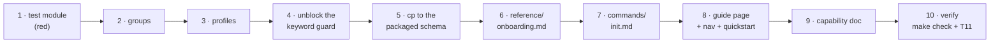

<!-- Authored per the the-loop:writing skill. -->

# Tasks: the `/the-loop:init` onboarding a person can finish

> The last spec artifact. Derived from [design.md](design.md) and
> [testing-plan.md](testing-plan.md). Gate-less (issue-281): it advances on shape.

## Execution DAG

## Task list

- [x] 1. Write the onboarding-metadata test module, red first
  - New `cli/tests/test_onboarding_schema.py` with A1–A7 from design §Testing strategy,
    each carrying a Gherkin `Scenario:` docstring per `testing.gherkinDocstrings`.
  - It must fail on the current tree (no `x-onboarding` in the CLI schema) — that failure
    is the red.
  - _Depends on:_ none
  - _Requirements:_ R1.2, R1.3, R2.1, R2.4, R2.5, R3.1, R3.2
  - _Test:_ `T1 — pytest cli/tests/test_onboarding_schema.py` (red)
- [x] 2. Add `x-onboarding.groups` + `askLevels` to `.the-loop/cli-config.schema.json`
  - Seven groups per design §C1, same shape as the harness schema's block; `version`
    exempt; `posture` carries `keys: []`.
  - Turns A1–A3 green.
  - _Depends on:_ 1
  - _Requirements:_ R1.1–R1.5, R7.1
  - _Test:_ `T1 — pytest cli/tests/test_onboarding_schema.py -k "groups or ask_levels"` (green)
- [x] 3. Add `x-onboarding.profiles` — the three-rung ladder
  - `recommended: watch-and-ask`; `ladder` an array of `{id, title, summary, stillHuman,
    values}` per design §C2. Values only under `webhooks`, `polling`, `routing`,
    `service`, `selfDiagnosis`, `channels`.
  - Turns A4–A7 green, including the safety assertion.
  - _Depends on:_ 2
  - _Requirements:_ R2.1, R2.4, R2.5, R2.6, R3.1, R3.2
  - _Test:_ `T1/T8 — pytest cli/tests/test_onboarding_schema.py -k profile` (green)
- [x] 4. Teach the keyword guard that `x-onboarding` is metadata
  - Add `"x-onboarding"` to `configschema.SUPPORTED` under its documentation-only
    comment, and to `_DATA_KEYWORDS` in `cli/tests/test_configschema.py` beside
    `examples`/`default`/`enum`, each with the one-line reason.
  - _Depends on:_ 3
  - _Requirements:_ NFR — no new keyword the validator ignores
  - _Test:_ `T10 — pytest cli/tests/test_configschema.py` (green)
- [x] 5. Copy the authored schema over the packaged one
  - `cp .the-loop/cli-config.schema.json cli/the_loop/schemas/cli-config.schema.json`.
  - _Depends on:_ 4
  - _Requirements:_ NFR — packaged parity
  - _Test:_ `T10 — pytest cli/tests/test_config_schema_parity.py` (green)
- [x] 6. Extend `skills/the-loop/reference/onboarding.md`
  - Four new sections (two configs one procedure; the autonomy ladder; the deployment
    shape; the credential preflight) and R7's presentation contract folded into
    §How to present a group. No group explanation or key meaning restated here.
  - _Depends on:_ 5
  - _Requirements:_ R1.1, R2.2, R2.3, R2.7, R4.1–R4.5, R6.1–R6.6, R7.1–R7.6
  - _Test:_ `T11 — the dry-run walkthrough reaches each new section`
- [x] 7. Restructure `commands/init.md` to the eleven steps
  - Per design §C6: new posture step, the CLI-config walkthrough replacing the lone
    tracking question, the Slack step, the preflight-and-verify step, the profile in the
    report. `--dry-run` / `--defaults` contracts extended over all of them.
  - _Depends on:_ 6
  - _Requirements:_ R1.6, R1.7, R1.8, R3.4, R4, R5, R6
  - _Test:_ `T11 — the dry-run walkthrough; T8 — the static credential-value grep`
- [x] 8. Add `docs/guide/onboarding.md`, wire the sidebar, refresh the quickstart
  - The user-facing view: what init asks, the ladder as a table, the credential
    checklist. Sidebar entry between Installation and Quickstart; quickstart §1 rewritten
    to say what init now does.
  - _Depends on:_ 7
  - _Requirements:_ R7.5 (link rather than restate)
  - _Test:_ `T12 — pytest cli/tests/test_docs_parity.py` (unaffected leaves), `make lint`
- [x] 9. Update `docs/capabilities/distribution.md`
  - Current behaviour lines for the two-schema walkthrough, the ladder, the preflight;
    a history row for issue-415.
  - _Depends on:_ 8
  - _Requirements:_ the loop's rule — capability docs change in the same PR
  - _Test:_ `make lint`
- [x] 10. Verify and record
  - `make check`, then the T11 dry-run walkthrough with every credential variable unset;
    fill `testing-plan.md` §Verification results and write the evidence files.
  - _Depends on:_ 9
  - _Requirements:_ all
  - _Test:_ `All — make check` + `T11`

## Out of scope for this DAG

No task touches the process graph, the risk tiers, `docs/guide/slack.md`, or any CLI
command's behaviour. If a task appears to require one, stop and raise it on the ticket —
that is a different work item.
