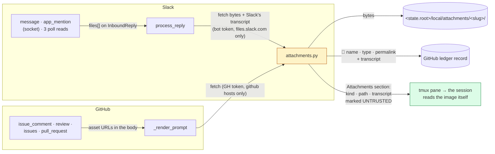

<!-- Authored per the the-loop:writing skill. -->

# Design: multi-modal messages are forwarded to the session, never parsed by the loop

> Phase 2 of 4 (requirements → design → testing plan → tasks). Derives from
> [requirements.md](requirements.md). Source:
> [issue-416](https://github.com/MadaraUchiha-314/the-loop/issues/416).

## Overview

**The loop fetches; it never interprets.** One new module,
`cli/the_loop/channels/attachments.py`, does the whole job for both channels: it turns a
Slack file object or a GitHub asset URL into a saved file under the state root plus one
line of fixed words, and renders those lines as an **Attachments** section the session
reads. The Slack pipeline gains a `files` field on its normalized message and one call
before the record; the GitHub dispatcher gains one call after the prompt is rendered.
Nothing else in either path moves, and the text-only carriers stay text: a path and a
transcript are text.



## What was found

The issue asked where parsing is required and whether it is required at all. The
investigation's answer, so the design does not have to be taken on faith:

| Question | Finding | Consequence |
|---|---|---|
| Does any inbound path read a file today? | No. Every `InboundReply` is built from `text`, `user`, `ts`, `thread_ts` and the bot flags (`inbound.py`, `slack.py`'s three readers, `snapshot_thread`). `files`, `subtype: file_share`, `blocks` and `attachments` are never read. | A file-only message has empty `text`, is mirrored as an empty quote and refused by `reply_session` ("the reply text is empty"). |
| Can the Slack app fetch a file? | No. `url_private_download` needs the bot token **and** the `files:read` scope; the manifest declares neither. | The manifest gains `files:read`; the probe measures it. |
| Who transcribes a voice note? | **Slack does.** An audio clip's file object carries `transcription: {status, locale, preview: {content, has_more}}` and a `vtt` URL with the full captions, produced by Slack before the message is delivered. | The loop forwards Slack's transcript. No speech-to-text anywhere in the-loop. |
| What can the session do with a path? | Claude Code — the only harness kind the-loop hosts interactively (`harness/cursor_agent.py` implements no interactive argv) — reads an image or a PDF from a path with its own file-reading tool. Audio it cannot read; the transcript is the readable form. | Images and PDFs are handed over as paths with "read it"; audio as path + transcript; anything else as a path with its type. |
| How does a GitHub image travel? | As `` inside the comment body, verbatim in `$payload_excerpt`. A public repository's asset is fetchable by anyone; a private one needs a GitHub credential. | The daemon — which holds the token — fetches; the URL is always named, so the session can still try itself. |
| Where is the delivery seam? | One string pasted into a tmux pane (`TmuxRunner.deliver`). `reply_session(ref, text, …)` frames it; the dispatcher renders it. | The section is appended to the delivered text, on both paths, with no new transport. |

So the only "parsing" is structural — reading fields Slack already provides and
stripping WebVTT cue timings from a captions file — and the only network work is a
download. That is the whole of what the loop does with a file, and it is what
[decision-135](../../decisions/decision-135.md) records.

## Architecture

### Where each piece of knowledge lives

| Knowledge | Home | Why there |
|---|---|---|
| What a file is, how it is fetched, named, saved and rendered | `channels/attachments.py` | One module for both channels: the caps, the host allow-lists, the redirect rule and the section format are written once |
| That a Slack message carries files | `InboundReply.files` (`channels/base.py`) | The normalized message is the one thing every reader and the pipeline share |
| When Slack files are fetched and what they become on the record and in the pane | `channels/inbound.py::process_reply` | It is where classification, record and delivery already meet |
| That a GitHub body carries asset URLs | `webhook/dispatcher.py::_render_prompt` | The one function both the event prompt and the spawn prompt pass through |
| Where the files live | `StateLayout.attachments_dir` + `GENERATED_PATHS` | The layout is the only declaration the portability tests and the state page trust |
| The scope, and the finding when it is missing | the manifest + `slack.py::attachment_findings` | Beside `mention_findings`, measured by the same probe |

### The one fetch

```mermaid
sequenceDiagram
  participant P as pipeline / dispatcher
  participant A as attachments.fetch_url
  participant H as the file host
  P->>A: url, credential, allowed hosts, cap
  A->>A: host of url ∈ allowed? else "off-host", no request
  A->>H: GET (Authorization only when host allowed), no auto-redirect
  H-->>A: 3xx Location
  A->>A: next host ∈ allowed? else "redirected off-host", stop
  A->>H: GET (≤ 5 hops)
  H-->>A: 200, body streamed
  A->>A: read ≤ cap + 1 byte; over → "over the cap", nothing saved
  A-->>P: content type, bytes
```

`urllib` is opened with a handler that **does not follow redirects**, and the loop walks
them by hand so the credential's destination is checked on every hop. This matters on
GitHub in particular: an asset URL answers with a redirect to a signed
`*.githubusercontent.com` URL, which is inside the allowed set — but a redirect anywhere
else is refused with the credential still unsent.

## Components & interfaces

### C1 — `channels/attachments.py`

```python
@dataclass(frozen=True)
class Attachment:
    name: str        # the sanitised file name the section and the record show
    kind: str        # image | audio | video | pdf | file — from the media type, then the extension
    mimetype: str
    size: int        # bytes actually saved, else the declared size
    source: str      # "slack" | "github"
    link: str        # a human-facing link: the Slack permalink, the GitHub asset URL
    path: str = ""   # the saved file, when fetched
    transcript: str = ""   # Slack's own transcript for an audio clip, verbatim
    error: str = ""  # fixed words when not fetched: no-token | off-host | over-cap | transfer-failed | too-many | no-scope

MAX_FILES = 10; MAX_BYTES = 25 * 1024 * 1024; TIMEOUT_SECONDS = 30.0
TRANSCRIPT_RETRIES = 3; TRANSCRIPT_WAIT_SECONDS = 2.0

def fetch_url(url, *, credential="", allowed_hosts=(), max_bytes=MAX_BYTES, timeout=TIMEOUT_SECONDS, opener=None) -> Tuple[str, bytes]
def slack_attachments(files, *, token, dest_dir, files_info=None, fetch=fetch_url, sleep=time.sleep) -> List[Attachment]
def github_attachment_urls(text, *, hosts=()) -> List[str]
def github_attachments(urls, *, token, dest_dir, hosts=(), fetch=fetch_url) -> List[Attachment]
def render_section(attachments) -> str        # the pane's Attachments section
def record_lines(attachments) -> str          # the ledger's 📎 lines (+ quoted transcript)
def vtt_to_text(vtt) -> str
def safe_name(name) -> str
def kind_of(mimetype, name) -> str
```

- `slack_attachments` reads, per file object: `id`, `name`, `mimetype`, `size`,
  `permalink`, `url_private_download` (else `url_private`), `transcription`, `vtt`. It
  fetches the bytes to `dest_dir/<id>-<safe name>` (an existing file is reused). For
  `kind == "audio"`: `transcription.status == "complete"` → fetch `vtt` and strip it, else
  `preview.content`; `processing` and `files_info` given → re-read up to
  `TRANSCRIPT_RETRIES` times, `sleep(TRANSCRIPT_WAIT_SECONDS)` between; anything else →
  no transcript, said in the section. Every failure is an `Attachment` with `error`
  set; the function never raises. Files past `MAX_FILES` are returned with
  `error="too-many"`, unfetched.
- `github_attachment_urls` matches, in order of appearance and de-duplicated:
  `https://github.com/user-attachments/assets/<id>`, `https://github.com/<o>/<r>/assets/<id>`,
  `https://user-images.githubusercontent.com/…`, `https://private-user-images.githubusercontent.com/…`,
  and the first two shapes on each host in `hosts` (the configured GitHub Enterprise
  host). It matches the URL whether it sits in ``, `` or bare.
- `github_attachments` saves to `dest_dir/<last path segment>[.<ext from content type>]`;
  an existing file is reused without a request (R4.4).
- `render_section` (the pane) and `record_lines` (the ledger) are pure formatters. The
  section opens with a fixed frame — what the files are, that an image or PDF is read
  with the session's file-reading tool, that a transcript is Slack's and everything is
  UNTRUSTED data — then one numbered line per attachment. The record lines carry the
  name, type, size and **link** only, never a path, and the transcript as a quote.

### C2 — `InboundReply.files`

```python
files: Tuple[Mapping[str, Any], ...] = ()   # the message's file objects, as Slack sent them
```

Populated in `handle_socket_event` (both branches), `fetch_replies`, `fetch_kickoffs`,
`fetch_channel_messages`. A default of `()` keeps every existing constructor and test
unchanged.

### C3 — `process_reply`, one call before the record

After classification and the grant check, for `event_type` in
`{work-item.reply, gate.feedback, control.command}` and a non-empty `reply.files`:

```python
attached = bot.fetch_attachments(reply.files, reply.work_item)   # never raises
text = join(reply.text, record_lines(attached))                  # → the Event, the ledger
pane_text = join(reply.text, render_section(attached))           # → _deliver, reply kind only
```

`SlackBotChannel.fetch_attachments` reads the bot token the way `_client` does, builds
`dest_dir` from `layout_from_config(cli_config).attachments_dir / slug`, passes the
client's `files_info` for the transcript wait, and returns `slack_attachments(...)`.
With no token it returns every file as `error="no-token"` — still named, still linked.

`context.added` and `decision.recorded` are untouched: the snapshot (C4) names files
itself, and a decision is the text typed.

### C4 — the thread snapshot and the kickoff

`snapshot_thread` appends ` 📎 <name> (<permalink>)` per file to a message's line, so a
screenshot in a recorded thread is a link rather than a blank. `process_kickoff` appends
`record_lines` for the message's files to the issue body — names and permalinks, no
fetch, since there is no session yet.

### C5 — the dispatcher, one call after the render

```python
def _render_prompt(self, routed, work_item, template, graph_context=""):
    rendered = ...  # unchanged
    return rendered + self._attachments_section(routed, work_item)
```

`_attachments_section` collects bodies from `payload["comment"]`, `["review"]`,
`["issue"]`, `["pull_request"]`, runs `github_attachment_urls` with the configured host
(`ghhost.github_host(self.cli_config)` when it is not github.com), and — only when there
is at least one URL — fetches with the first set variable of
`integrations.github.api.tokenEnv` (default `GH_TOKEN`, `GITHUB_TOKEN`) as the
credential, into `attachments_dir / slug`. No URL → the empty string, and the prompt is
byte-identical to today's. The section sits **after** the excerpt, outside its JSON, and
outside the template: a custom `routing.promptTemplate` gets it too.

### C6 — the scope and the finding

The manifest gains `files:read` under the read-only scopes with its reason.
`attachment_findings(scopes)` mirrors `mention_findings`: `None` → no finding; scope
present → no finding; else one sentence. `probe_subscription` appends it, so
`channels status --probe` and the listener's startup log both print it.

### C7 — the layout

`StateLayout.attachments_dir` → `<root>/local/attachments`; a `GENERATED_PATHS` entry
(`portable=False`, with its `why`) and the matching row and tree line on
`docs/cli/state.md`. Machine-local by the same rule as a session record: a path on this
box, meaningful only to the session running on it.

## UI/UX design

N/A — the surfaces are a pasted prompt, a GitHub comment and a Slack thread line; there
is no rendered artifact to prototype. The Attachments section's exact wording is the
nearest thing, and it is pinned by the unit tests.

## Data models

None persisted. The `Attachment` value lives for one delivery. The files on disk are
opaque bytes under a declared directory; nothing indexes them.

## Error handling

| Situation | Behaviour |
|---|---|
| No bot token / no GitHub token | Every file `error="no-token"`; named and linked; delivered. |
| `files:read` missing | Slack answers the download with an HTML sign-in page or an error; recorded `transfer-failed` on the file and `no-scope` in the probe's findings. |
| A URL off the allowed hosts, or a redirect leaving them | `off-host`; no request carries the credential. |
| A file over the cap, declared or streamed | `over-cap`; nothing saved. |
| Transfer error or timeout | `transfer-failed`; the message is delivered with the reason. |
| Transcript still processing after the retries | No transcript; the section says so and names the audio path. |
| The state root is not writable | `transfer-failed` with the OS error's class in the log, never in the section; delivered. |
| A message with files and no text | Delivered: the section is the text. |
| The same GitHub asset again for the same item | Reused from disk; no request. |

## Security design

The requirements' boundaries, each with the mechanism and the test that proves it:

| Boundary / abuse case | Mechanism | Test |
|---|---|---|
| A1 — a file URL off Slack's host | `fetch_url` checks the host against `allowed_hosts` (`files.slack.com`, `*.slack.com`) **before** any request; the token is passed only as a parameter to that function | `test_attachments.py::test_a_file_url_off_slacks_host_is_not_fetched_and_gets_no_token` |
| A2 — a redirect leaving the allowed set | No auto-redirect; each `Location` is re-checked; a hop outside stops with `off-host` and the credential unsent | `…::test_a_redirect_off_host_is_refused_with_the_credential_unsent` |
| A3 — over the cap | Read `max_bytes + 1`; more than `max_bytes` → discard, `over-cap`; the declared `size` is only a pre-check | `…::test_a_file_over_the_cap_is_not_saved` |
| A4 — hostile file names | `safe_name`: basename only, `..` and separators removed, control characters and a leading dot stripped, 80 chars; the saved name is `<source id>-<safe name>` inside the slug directory | `…::test_a_hostile_name_stays_inside_the_directory` |
| A5 — instruction-shaped content | Bytes are written and never opened; the transcript and names are rendered only inside the section whose frame says UNTRUSTED; the ledger's existing `scrub`/`defang`/`strip_html_comments` run on the record text as on any reply | `…::test_the_section_frames_everything_as_untrusted`, `test_attachments_integration.py` (record scrubbed) |
| A6 — an unauthorized member's file | `process_reply` drops `unauthorized-actor` before `fetch_attachments` is reached | `test_attachments_integration.py::test_a_strangers_file_is_never_fetched` |
| Secrets | The token never enters an `Attachment`, a section, a record or a file name; the record carries the permalink, never `url_private` | `…::test_the_record_carries_the_permalink_never_the_private_url` |
| Least privilege | `files:read` is read-only; the GitHub token is the one the daemon already holds; the fetch sends `Authorization` and nothing else | manifest test |
| Fail closed | Every refusal is an `Attachment` with `error`, and delivery proceeds; nothing fetched means nothing saved | the unit tests above |

## Testing strategy

Two new modules and four touched suites:

- **`cli/tests/test_attachments.py`** (unit, offline): kinds, safe names, VTT stripping,
  the URL matcher, both renderers, and `fetch_url` against a fake opener — auth header
  placement, redirect handling, the cap, timeouts.
- **`cli/tests/test_attachments_integration.py`** (scenario, Gherkin docstrings): a
  Socket Mode `message` with an image through `handle_socket_event` with a fake client
  and a fake fetch → the delivered text carries the path and the frame, the record the
  permalink; a voice note → Slack's transcript in both; a file-only message delivered; a
  `processing` transcript that completes on the second `files.info`; a poll-read reply
  with files; a GitHub `issue_comment` with an asset URL through the dispatcher → the
  pasted prompt ends with the section; a private asset with no token → named, not
  fetched; a stranger's file never fetched; the missing scope finding.
- **Touched:** `test_state_portability.py` (the new path is classified and documented),
  `test_channels_mentions.py` / `test_doctor_slack.py` / `test_channels_dm.py` (manifest
  assertions still hold), `test_interaction_integration.py` (a prompt with no attachment
  is byte-identical), `test_docs_parity.py`.

## Trade-offs & decisions

- **Fetch on the daemon, not in the session.** The session holds no Slack token and,
  for a private repository, no GitHub one; the daemon holds both. The cost is a network
  call on the delivery path (bounded: ten files, 25 MiB, 30 s each). Recorded in
  decision-135.
- **Slack's transcript, verbatim.** It is the one transcript that exists without the
  loop calling a model; it is imperfect, and the section says whose it is. A deployment
  that wants better transcription wants a different product.
- **Constants, not config.** Three caps and a wait; a config key would be a promise to
  document, migrate and onboard for a knob nobody has asked to turn.
- **No retention.** Files accumulate under `local/`. Honest and documented; a sweeper is
  a later work item if disk becomes a problem.
- **`context.added` and `decision.recorded` untouched.** A snapshot names files as links;
  a decision is the text typed. Fetching there would put paths into a record.

## Open questions

None.

## Review comments

> Appended by the-loop's `record-feedback` hook when a human gate approves with comments.
