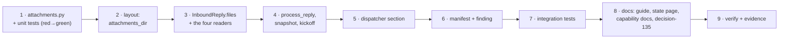

<!-- Authored per the the-loop:writing skill. -->

# Tasks: multi-modal messages are forwarded to the session, never parsed by the loop

> The last spec artifact. Derived from [design.md](design.md) and
> [testing-plan.md](testing-plan.md). Gate-less (issue-281): it advances on shape.

## Execution DAG

## Task list

- [x] 1. Write `cli/the_loop/channels/attachments.py` with its unit tests, red first
  - `Attachment`, the constants, `kind_of`, `safe_name`, `vtt_to_text`,
    `github_attachment_urls`, `fetch_url` (no auto-redirect, host check per hop, the
    cap), `slack_attachments` (with the transcript wait), `github_attachments`,
    `render_section`, `record_lines`.
  - `cli/tests/test_attachments.py` with the T1 and T8 scenarios; it fails on import
    before the module exists — that is the red.
  - _Depends on:_ none
  - _Requirements:_ R1.2, R1.4–R1.6, R2.1–R2.4, R3.1, R3.2, R4.1, R6.2; abuse cases 1–5
  - _Test:_ `T1 / T8 — pytest cli/tests/test_attachments.py`
- [x] 2. Declare the attachments directory in the state layout
  - `StateLayout.attachments_dir` → `<root>/local/attachments`; a `GENERATED_PATHS`
    entry (`portable=False`, its `why`); the tree line and the classification row on
    `docs/cli/state.md`, with the no-retention sentence.
  - _Depends on:_ 1
  - _Requirements:_ R6.1, R6.3
  - _Test:_ `T10 — pytest cli/tests/test_state_portability.py`
- [x] 3. Carry `files` on the normalized Slack message
  - `InboundReply.files: Tuple[Mapping, ...] = ()`; populated in `handle_socket_event`
    (both branches), `fetch_replies`, `fetch_kickoffs`, `fetch_channel_messages`.
  - _Depends on:_ 2
  - _Requirements:_ R1.1
  - _Test:_ `T2 — the poll-read and socket scenarios` (written in task 7; the readers are
    exercised by the existing channel suites meanwhile)
- [x] 4. Fetch and render in the pipeline; name files in the snapshot and the kickoff
  - `SlackBotChannel.fetch_attachments`; in `process_reply` the record text gains
    `record_lines`, the delivered text `render_section`, for the three relayed kinds;
    `snapshot_thread` appends 📎 per file; `process_kickoff` appends `record_lines` to the
    issue body.
  - _Depends on:_ 3
  - _Requirements:_ R1.2, R1.3, R1.7, R2.1, R2.2, R3.1–R3.4; abuse case 6
  - _Test:_ `T2 — pytest cli/tests/test_attachments_integration.py -k "slack or voice or only or gate or snapshot or kickoff or stranger"`
- [x] 5. Append the section to the GitHub prompt
  - `Dispatcher._attachments_section(routed, work_item)` after `_render_prompt`'s
    render: bodies from the four containers, the configured host, the token from
    `integrations.github.api.tokenEnv`, reuse from disk.
  - _Depends on:_ 4
  - _Requirements:_ R4.1–R4.5
  - _Test:_ `T2 — pytest cli/tests/test_attachments_integration.py -k github` and
    `T10 — pytest cli/tests/test_interaction_integration.py` (a prompt without attachments unchanged)
- [x] 6. Declare the scope and measure it
  - `files:read` in `slack-app-manifest.yaml` with its reason; `attachment_findings`
    beside `mention_findings`, appended in `probe_subscription`.
  - _Depends on:_ 5
  - _Requirements:_ R5.1–R5.3
  - _Test:_ `T1 — pytest cli/tests/test_attachments.py -k finding`; `T10 — the manifest suites`
- [x] 7. Write the integration scenarios
  - `cli/tests/test_attachments_integration.py`, Gherkin docstrings, every T2 row of the
    plan; fakes at the edges (`FakeSlackClient` + `files_info`, a fake fetch, `FakeTmux`).
  - _Depends on:_ 6
  - _Requirements:_ all
  - _Test:_ `T2 — pytest cli/tests/test_attachments_integration.py`
- [ ] 8. Documentation and the decision record
  - `docs/guide/slack.md`: the manifest copy gains `files:read`; a new _Images and voice
    notes_ section; a line under _Limits_. `docs/capabilities/channels.md` and
    `docs/capabilities/webhook-triggers.md`: current-behaviour clauses and history rows.
    `docs/decisions/decision-135.md` + its index row. `evidence/documentation.md`.
  - _Depends on:_ 7
  - _Requirements:_ the loop's rule — docs change in the same PR
  - _Test:_ `T12 — pytest cli/tests/test_docs_parity.py` and `make lint`
- [ ] 9. Verify and record
  - `make check`; fill `testing-plan.md` § Verification results; write
    `evidence/verification.md`, `self-review.md`, `security-review.md`,
    `pull-requests.md`; the T11 procedure written down and marked not executed here.
  - _Depends on:_ 8
  - _Requirements:_ all
  - _Test:_ `All — make check`

## Dependency graph (DAG)

Linear, as drawn above: each task builds on the seam the previous one opened, and the
integration scenarios (7) need every seam in place.

## Checkpoints

- After task 1: the module and its contract exist, offline-tested.
- After task 4: Slack end to end, provable with the existing fake client.
- After task 6: both channels and the scope; ready for the scenarios.
- After task 9: evidence recorded; ready for review.

## Out of scope for this DAG

No task calls a model on a file, adds a config key, changes the excerpt contract, or
touches the Cursor adapter. If one appears to need it, stop and raise it on the ticket.

## Review comments

> Appended by the-loop's `record-feedback` hook when a human gate approves with comments.
