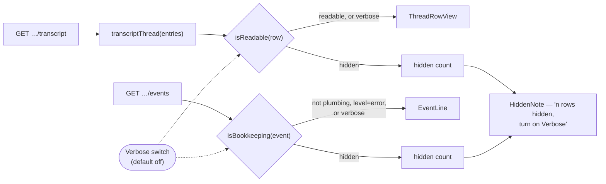

<!-- Authored per the the-loop:writing skill. -->

# Design: one verbosity switch over the whole trace, defaulting to quiet

> Phase 2 of 4 (bugfix → design → testing plan → tasks). Derives from
> [bugfix.md](bugfix.md). Source:
> [issue-419](https://github.com/MadaraUchiha-314/the-loop/issues/419).

## Overview

**Two predicates and a renamed switch.** `model.ts` gains the two questions the panel
cannot answer today — *is this stream row readable?* and *is this event plumbing?* — and
`Transcript.tsx` consults them before rendering. The `showTools` prop becomes `verbose`,
defaults `false`, and reaches every row type instead of one. Nothing moves in the
projection: `transcriptThread` still emits every row it emits today, because the trail a
reader can restore has to still exist.

The fallback trail's mapping moves out of `WorkItemDetail` into a new `EventTrail`
component, so that the filter, the 40-row budget and the hidden-count line live in one
place rather than three.



## Components & interfaces

### `ui/src/api/model.ts` — the two predicates

Both are pure functions over data the panel already holds, exported for their own unit
tests and for the components.

```ts
/** Whether a projected stream row carries something a human reads. */
export function isReadable(row: ThreadRow): boolean;

/** Whether an event is the loop talking to itself rather than to a person. */
export function isBookkeeping(event: EventRecord): boolean;
```

`isReadable` answers per row kind:

| Row kind | Readable when | Why |
|----------|---------------|-----|
| `malformed` | always | a drifted harness line is a finding, not noise |
| `tool result` | never | raw tool output — the same class as the tool groups the switch already hid |
| `meta` | it carries text | `summary` lines say what was compacted; the empty `system (system)` rows say nothing |
| `user` / `assistant` | it carries prose or thinking | a turn whose only content was tool calls has nothing left once the groups are hidden |

That last row is why the predicate is over the **projected row** rather than over the
entry: only after the projection is it known that a turn's whole content was tools. It
also removes the row the naive fix would leave behind — a bare `the-loop` header line with
an empty body.

`isBookkeeping` answers in two steps: `level === "error"` is never bookkeeping, then the
event's family — the segment before the first `.` — is looked up in one set.

| Hidden families | Why they are plumbing |
|-----------------|-----------------------|
| `webhook`, `routing`, `dispatch` | a delivery's route from GitHub to a pane |
| `poll`, `bus`, `reaction` | the poller's cycles, the bus's fan-out, an emoji ack |
| `control` | who typed a control command, and which were refused |
| `stream`, `api`, `mcp` | the dashboard's own SSE and request log |
| `config`, `service`, `server`, `poller`, `restart`, `ingress` | the daemon's lifecycle, not the work item's |
| `workspace`, `cleanup` | checkouts made and removed |

Everything else renders: `graph.*` (where the loop stands), `session.*` (including
`session.awaiting_input`, the agent's question), `channel.*`, `standing.*`, `work_item.*`,
`diagnosis.*` — and any family nobody has classified.

### `ui/src/components/Transcript.tsx` — the switch reaches every row

- `TranscriptView`'s `showTools` becomes `verbose`, **default `false`**, and is used
  twice: to filter the projected rows through `isReadable`, and, as today, to decide
  whether `ThreadRowView` renders the `ToolGroup`.
- A new `EventTrail` takes the work item's events, filters them through `isBookkeeping`,
  then applies the 40-row budget. **Filtering before slicing is the point**: today the
  budget is spent on whatever is newest, so 40 consecutive `poll.*` rows can bury the
  `graph.parked` behind them.
- A new `HiddenNote` renders the one line both views need, and the exported
  `VERBOSE_LABEL` constant is the switch's name in the header, in its `aria-label` and in
  that line — one string, so the copy cannot drift apart.

### `ui/src/views/WorkItemDetail.tsx` — the panel

`showTools` becomes `verbose`, initialised `false`. The switch's visible copy and
`aria-label` become `VERBOSE_LABEL` (`Verbose`), and it gains a `title` naming what it
does. The fallback branch hands its ref-filtered, reversed events to `EventTrail` and
keeps today's `No events recorded for this work item.` for the genuinely empty case, so
"nothing happened" and "nothing survived the filter" stay distinguishable.

## Error handling

Nothing here can fail: two pure predicates over in-memory data, no I/O, no parsing. An
event with no `event` string yields an empty family, matches nothing in the set, and
renders — the same fail-open the unclassified families get.

## What it costs

**A warning in a hidden family is hidden.** `poll.spawn_failed` and a `spawn-policy`
`dispatch.dropped` are `level=warning` and disappear with the switch off. That is the
issue's own choice — `dispatch.dropped` is named in it as noise — and widening the escape
hatch to `warning` would bring back the loudest offenders. The escape hatch stays
`error`; the switch brings back the rest.

**One list to maintain.** A new plumbing family is noisy until someone adds it to the set.
That is the deliberate direction of the failure: an unclassified event is seen, never
silently dropped. Classification is by family and stops there — a member-level list over
166 event types would rot faster than it would help, and no member of a kept family was
reported as noise.

**The switch is not remembered.** It is component state, reset on reload, like `showTools`
before it. Persisting it belongs with the other browser-stored preferences
(`the-loop:settings:v1`) and is not this fix.

## Testing strategy

The predicates are pure, so they carry the classification table as unit tests in
`model.test.ts`. `Transcript.test.tsx` covers the rendering both ways round, and
`App.test.tsx` covers the default and the switch end to end on demo data. See
[testing-plan.md](testing-plan.md).

## Security design

No new data reaches the browser, no request changes, and the two predicates read
`row.kind`, `row.text`, `row.thinking`, `event.event` and `event.level` — never rendered
content, never a payload field. React's escaping is untouched.

The one abuse case worth stating: **an event crafted to hide itself.** An emitter that
named an event `poll.something` would have it hidden by default — but emitters are the
loop's own processes writing to a local append-only log, and an attacker who can write
that log can already write anything. The bound that matters is the reader's: `error`
always renders, the switch restores everything, and a filtered-to-empty panel says so
instead of looking empty, so nobody concludes they have seen the whole trail when they
have not.
