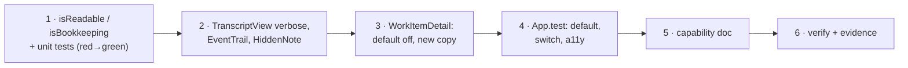

<!-- Authored per the the-loop:writing skill. -->

# Tasks: one verbosity switch over the whole trace, defaulting to quiet

> The last spec artifact. Derived from [design.md](design.md) and
> [testing-plan.md](testing-plan.md). Gate-less (issue-281): it advances on shape.

## Execution DAG

## Tasks

- [x] **1 · The two predicates.** In `ui/src/api/model.ts`, export `isReadable(row)` and
      `isBookkeeping(event)` per `design.md` § Components. Write the classification table
      as tests in `ui/src/api/model.test.ts` first, watch them fail, then implement.
      _Requirements:_ R1.2, R1.3, R1.4, R2.1, R2.2.
      _Test:_ testing-plan T1, T8.

- [x] **2 · The switch reaches every row.** In `ui/src/components/Transcript.tsx`, rename
      `TranscriptView`'s `showTools` to `verbose` with default `false`, filter the
      projected rows through `isReadable`, and add `EventTrail`, `HiddenNote` and the
      exported `VERBOSE_LABEL`. Extend `ui/src/components/Transcript.test.tsx` red-first.
      _Requirements:_ R1.1, R1.2, R3.1, R4.1, R4.2, R4.3.
      _Test:_ testing-plan T2.

- [x] **3 · The panel.** In `ui/src/views/WorkItemDetail.tsx`, initialise the state
      `false`, rename it, put `VERBOSE_LABEL` in the visible copy and the `aria-label`,
      add the explanatory `title`, and hand the fallback's events to `EventTrail`.
      _Requirements:_ R1.1, R3.2, R4.1.
      _Test:_ testing-plan T4, T9.

- [x] **4 · The dashboard tests.** Update `ui/src/App.test.tsx` for the new default, the
      new copy and the keyboard path, and assert that the quiet stream still carries the
      agent's prose and the malformed line.
      _Requirements:_ R1.1, R2.3, R3.1, R3.2, R3.3.
      _Test:_ testing-plan T4, T9, T10.

- [x] **5 · The capability doc.** Update `docs/capabilities/control-plane.md` so the trace
      panel's description names the switch by its new name and its whole-stream scope.
      _Requirements:_ R3.2.
      _Test:_ testing-plan T12.

- [x] **6 · Verify and record.** Run the matrix, capture the T5 browser pass or its
      reason, and write `evidence/verification.md`, `self-review.md`,
      `security-review.md` and `documentation.md`.
      _Requirements:_ all.
      _Test:_ testing-plan T1–T12.
