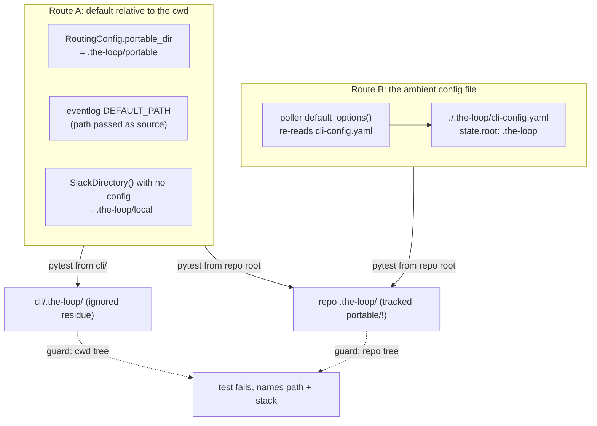

# The suite writes into the checked-in `.the-loop/` (issue-422): reviewer briefing

## TL;DR

Run from the repo root, **four** tests wrote into this checkout's `.the-loop/`, not one.
Only one of the four wrote a tracked file (`portable/github-octo-repo-15.json`, the
debris the ticket found). The other three wrote into ignored paths and never showed in
`git status`. Each now gets a `tmp_path` state root, the two debris records are deleted,
and a guard in `conftest.py` fails any test that writes into the repository's or the
cwd's `.the-loop/`. The guard also surfaced **one runtime defect**, fixed here: the Slack
subscription probe cached its directory under `./.the-loop/local/` rather than
`<state.root>/local/`.

The ticket placed the write at session shutdown. It is synchronous, in a test body.

## Where to focus (in this order)

1. **The runtime change**: `cli/the_loop/channels/slack.py`, `commands/channels_cmd.py`
   and `commands/diagnose_cmd.py`. One optional `cli_config` argument, passed by the
   three callers that already hold the config. This is the only change outside tests.
   It is why the PR is more than the ticket's scope, and the self-review argues keeping
   it here (`self-review.md` § Checked and left as is). If you would rather split it
   out, it reverts cleanly, but the doctor test would then trip the guard.
2. **The guard**: `cli/tests/conftest.py`, `_audit_state_writes` and
   `_no_protected_state_writes`. It is an audit hook, so it runs on every audited event
   in the suite, and it must never raise. Two false positives were found and fixed in
   self-review: `dir_fd`-relative names from `shutil.rmtree`, and symlink targets. Both
   have tests in `test_state_isolation.py`.
3. **Two tests that were weaker than they read.** The restart abuse case searched an
   event log that was never written, so it now asserts the log is non-empty. The health
   test watched a pidfile the poller never held. Both now assert against the real
   write. Skim to confirm nothing was loosened.
4. **The deletion**: `.the-loop/portable/*.json`. It is a sensitive path, which is why
   this is tier 3. Nothing reads the files.

## The two routes into the checkout

Guarding the **cwd's** tree as well as the repository's is what makes CI (which runs from
`cli/`) enforce this. Otherwise the guard would fire only in the directory CI never uses.

## Key decisions & why

- **Audit hook, not a before/after snapshot.** It names the test and the line, and it
  cannot be tripped by an operator's daemon running from this checkout (the checked-in
  `cli-config.yaml` exists so that it can be).
- **Record and fail at teardown, never raise in the hook.** Fail-open code would swallow
  a raise, and a raising hook breaks the audited call.
- **Leave the daemons' defaults alone.** `RoutingConfig.portable_dir` and
  `default_options()` resolve state the way an operator's daemon does. Changing them is
  a behaviour change nobody asked for. The guard is what keeps tests off them.

## Evidence

[`verification.md`](verification.md) (both working directories with both trees'
status, the negative control, timing, the tracer method) ·
[`self-review.md`](self-review.md) (five fixes found in review) ·
[`security-review.md`](security-review.md) (no findings) ·
[`documentation.md`](documentation.md)
