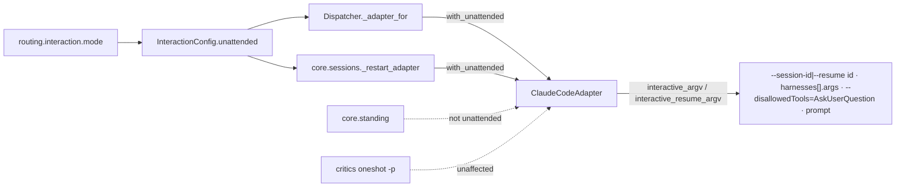

<!-- Authored per the the-loop:writing skill. -->

# Design: work-item mode launches Claude Code without its question menu

> Phase 2 of 4. Derived from [`bugfix.md`](bugfix.md).

## Overview

The interaction mode already reaches the prompt. This change also lets it reach the
argv. An adapter learns one fact, *nobody answers this pane* (`unattended`). Each
adapter owns the arguments that make that true for its harness. For Claude Code that is
one token, `--disallowedTools=AskUserQuestion`. The two places that launch a work
item's session set the fact from the mode just before the launch.

## Architecture

## Components & interfaces

| Component | Change |
|---|---|
| `interaction.py` `InteractionConfig` | new property `unattended`: `True` unless the mode is `cli` |
| `harness/base.py` `HarnessAdapter` | new class attribute `_UNATTENDED_ARGS: Tuple[str, ...] = ()`; instance attribute `unattended = False`; `with_unattended(flag)` returns a copy (or `self` when nothing would change); `_launch_args()` returns `extra_args` plus `_UNATTENDED_ARGS` when `unattended` |
| `harness/claude_code.py` | `_UNATTENDED_ARGS = ("--disallowedTools=AskUserQuestion",)`; both `interactive_*` methods build on `_launch_args()` |
| `webhook/dispatcher.py` `_adapter_for` | returns the resolved adapter `.with_unattended(self.config.interaction.unattended)`. Every work-item spawn and respawn already goes through it (four call sites) |
| `core/sessions.py` `_restart_adapter` | the same, from the `routing.interaction` block of the config it was handed |

`with_args` already uses `copy.copy`, so a copy keeps its `unattended` flag, and the
flag keeps the operator's arguments.

## Data models

None. `Session.harness_args` still records `extra_args`, the operator's arguments plus a
work item's model and effort. The unattended token is derived from the mode at every
launch and is never recorded. So `_choice_drifted`, which compares recorded against
resolved `extra_args`, sees no difference on upgrade and relaunches nothing (R2.4).
`session.spawned` already carries `interaction`, which says whether the token was
passed.

## Error handling

Nothing new can fail. `with_unattended` is a flag on a copy, and `_UNATTENDED_ARGS` is
a constant. An adapter with no such arguments (cursor-agent) returns itself.

## Security design

See [`bugfix.md` § Security considerations](bugfix.md#security-considerations). The
token is a constant and interpolates nothing. The mode is resolved fail-closed toward
`work-item` by the existing `InteractionConfig`, so a typo denies the tool rather than
leaving it on.

## Testing strategy

- Unit tests pin the argv for both Claude methods, in both states, with and without
  operator arguments, including the ticket's variadic workaround.
- Integration tests drive the real dispatcher over the stub tmux binary: a spawn and a
  resuming respawn in each mode, the recorded `harness_args`, and a reload that flips
  the mode.
- `sessions restart` is covered over its scripted runner.
- Manual evidence runs the real Claude Code CLI, both in `-p` mode (the parsing hazard)
  and as a real interactive TUI in tmux.

Detail in [`testing-plan.md`](testing-plan.md).

## Trade-offs & decisions

- **The mode is the opt-out; no new key.** The ticket asks for option 1, "with an
  opt-out for operators who really do sit in the pane". An operator who sits in the
  pane is exactly who `interaction.mode: cli` is for (issue-134). That mode tells the
  agent to ask interactively and keeps the tool. A second key could only produce the
  contradictory states: a prompt that says "ask on the ticket" with a menu that asks in
  the pane, or the reverse. `harnesses[].args` remains for anything more specific.
- **Applied at launch, not at adapter construction.** `build_adapters` has six callers:
  the webhook daemon, the poller, the dispatcher's reload, restart, standing sessions,
  critics and the models probe. Only two of them launch work-item sessions. Applying the
  flag in `_adapter_for` and `_restart_adapter` touches exactly those two. It also picks
  up a reloaded mode without rebuilding adapters, and covers adapters an embedder
  injects into `Dispatcher` directly.
- **Not recorded in `harness_args`.** Recording it would make every session launched
  before this change look drifted, so the first event to each one would relaunch it. The
  field exists to answer "which model and effort was it launched on", and the mode
  answers the rest.
- **`=` form, after the operator's arguments.** The one position where the variadic
  flag cannot consume the prompt is immediately before it, written as a single token
  (see the bugfix's reproduction). Being a `-`-prefixed token, it also ends any variadic
  flag the operator's own arguments leave open (R1.4).
- **Always appended, even when the operator already denies the tool.** A duplicate
  deny is harmless (verified: `--disallowedTools AskUserQuestion
  --disallowedTools=AskUserQuestion "…"` runs the prompt), and de-duplicating would
  bring back the swallowed-prompt defect for exactly the configs that carry the
  workaround.
- **Standing sessions are left alone.** Their directive tells the agent that its operator
  may be in an attached terminal, and they are not governed by `routing.interaction`.
