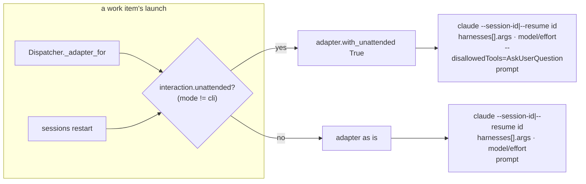

# A work-item session freezes on Claude Code's question menu (issue-426): reviewer briefing

## TL;DR

In `interaction.mode: work-item` the prompt said "never block on an interactive
prompt", and nothing enforced it. Claude Code's `AskUserQuestion` rendered a menu in a
tmux pane nobody watches and waited for a keypress. Every later message was then
recorded as delivered and never read.

Now every launch of a work item's Claude session in `work-item` mode carries
`--disallowedTools=AskUserQuestion`, right before the prompt. `cli` mode is unchanged,
and it is the opt-out.

**The `=` is load-bearing.** The flag is variadic. Written the ticket's way,
`--disallowedTools AskUserQuestion`, it swallows the prompt that follows as deny rules.
Operators already running the ticket's workaround are booting sessions with no prompt.
This fix repairs them too.

## Where to focus (in this order)

1. **`harness/claude_code.py` `_UNATTENDED_ARGS`, and its position in the argv.** The
   token must be one word and must sit immediately before the prompt. `verification.md`
   § T8 shows the real CLI's behaviour for each spelling.
2. **The two seams: `Dispatcher._adapter_for` and `core.sessions._restart_adapter`.**
   Every work-item launch goes through one of them: spawn, resume, fresh respawn, a
   PR's own session, and `sessions restart`. Standing sessions and critics do not, on
   purpose.
3. **No new config key.** The ticket asked for an opt-out. I made `cli` mode the opt-out
   rather than adding a key that could contradict the prompt. Please confirm this
   (`design.md` § Trade-offs).

## How the argv is built

## Key decisions & why

- **The mode is the switch.** A human in the pane is what `cli` means. A second key
  could only produce a prompt that says "ask on the ticket" alongside a tool that asks
  in the pane, or the reverse.
- **Applied per launch, not in `build_adapters`.** Only two of the six builders launch
  work-item sessions. Applying it per launch also picks up a reloaded mode with no
  adapter rebuild.
- **Never recorded in `harness_args`.** Recording it would make every existing session
  look drifted, and the next event to each would relaunch it.
- **Always appended, even if the operator already denies the tool.** A duplicate deny
  is harmless (T9b), and skipping it would leave the workaround's swallowed prompt in
  place.

## Not done here

- The ticket's option 3, an event for a session idle at a prompt, is a separate work
  item. It needs pane scraping or process watching, per harness.
- T9, a real interactive TUI in tmux, could not run in this environment: the TUI stops
  at its login screen. The reporter ran the treated half on 2.1.281, and T8 and T9b
  cover the parsing and the deny on the real binary. `verification.md` § T9 has the
  two commands to close it on a logged-in machine.

## Evidence

- [`verification.md`](verification.md): real-CLI parsing, the negative control
  (20 red → green), the targeted modules, the full suite (4706 passed) and the static
  checks.
- [`self-review.md`](self-review.md), [`security-review.md`](security-review.md),
  [`documentation.md`](documentation.md).
