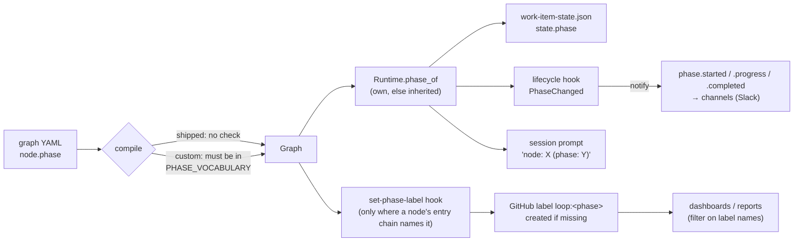

# Brainstorm: let an operator's graph declare phases of its own

> Phase 0, the root artifact for
> [issue #427](https://github.com/MadaraUchiha-314/the-loop/issues/427). The owner asked
> for a deep dive before implementation starts
> ([comment](https://github.com/MadaraUchiha-314/the-loop/issues/427#issuecomment-5894925496)):
> *what is a "phase" in the system today, does that model support extension, and if so
> how?* Sections 1–3 under *Context & constraints* answer those three questions from the
> code; *Ideas & options* and *Open questions* lay out what to do about it. Nothing here
> is a commitment.

## Problem / opportunity

An operator can write a graph of their own (issue-343), but every node's `phase` has to
come from the-loop's eleven shipped phases. A triage graph cannot say it is in `triage`.
It has to borrow `implementation` or `needs-review`, and its `loop:<phase>` label then
misreports what the item is doing. Or its nodes declare no phase at all, and the ticket
gets no label and the channels get no `phase.*` events.

The restriction is **one check** in the compiler of custom graphs
(`graph/catalog.py:362`). The runtime and every reader treat a phase as an opaque
string. So the cost of this change is mostly a policy question, not a code question:
what should a custom phase be allowed to be, and who tells the dashboards about it?

## Context & constraints

### 1. What a "phase" is today

**The word means three different things in this codebase, and only one of them is what
this ticket is about.**

| Meaning | Where it lives | Example | In scope? |
|---|---|---|---|
| **A node's `phase:`**: an optional label on a graph node, grouping one or more nodes under one `loop:<phase>` label | `Node.phase` (`graph/model.py:324`), a plain `str`, default `""` | `self-review` has `phase: needs-review`. `critic-review` and `security-review` have none, so they inherit it. | **Yes.** This is the thing a custom graph wants to extend. |
| **A "selectable phase"** on the phase-selection checklist | Node **ids** with `skippable`/`optIn` (`hooks/selection.py:448`) | `- [x] design-critic-review` | No. The gate lists node ids, not `phase:` values. It never reads `Node.phase`. |
| **An artifact's `phase:` front matter** | The spec templates (`skills/the-loop/templates/*.md`) | `phase: brainstorming` at the top of this file | No. It is documentary; no gate validates it against the vocabulary. |

The rest of this document means the first one.

**A node's phase is coarse on purpose.** A graph has more nodes than phases (the outer
loop has 21 nodes and 11 phases). Approval gates, the review chain after `self-review`,
`evidence` and `capability-docs` declare no phase and **inherit** the one before them
(`Runtime.phase_of`, `graph/runtime.py:401`). The label moves only when a node that
declares a phase is entered.

**The vocabulary is derived from the shipped graphs; it does not govern them.**
`PHASE_VOCABULARY` (`graph/model.py:111`) is a tuple of eleven names in walk order. The
shipped graphs are **not** checked against it. Instead, a test
(`test_the_phase_vocabulary_is_the_shipped_loops_phases`, `cli/tests/test_graph_catalog.py:297`)
pins it equal to the union of the phases the five shipped loops declare. The **only**
code that enforces it is the custom-graph compiler:

```python
# graph/catalog.py, compile_custom
for node in graph.ordered():
    if node.phase and node.phase not in PHASE_VOCABULARY:
        raise GraphConfigError(... "the loop:<phase> labels are one vocabulary for every graph")
```

**`loop:not-started` is a label with no phase behind it.** No graph node declares
`not-started`. `/the-loop:init` creates it as the label for "ticket exists, loop
hasn't begun" (`commands/init.md` step 7). So the labels in a repository are the
eleven phases plus that one.

### 2. Where a phase flows, and who reads it



What each reader does with the string:

| Reader | File | What it assumes |
|---|---|---|
| Compiler, custom graphs | `graph/catalog.py:362` | **Membership in the fixed list.** The one closed door. |
| Compiler, shipped graphs | `graph/model.py:580` | Nothing. Any string, no grammar. |
| Vocabulary test | `cli/tests/test_graph_catalog.py:297` | Vocabulary = union of shipped phases. Unaffected if custom phases live outside it. |
| `Runtime.phase_of` / `_current_phase` | `graph/runtime.py:401`, `:1317` | Opaque. Empty means "inherit". |
| `state.phase` | `graph/state.py:395` | Opaque. Persisted as-is. |
| `set-phase-label` | `graph/hooks/sideeffects.py:51` | Opaque. Builds `loop:<phase>`, removes every other `loop:*` label, and **creates the label and retries** when it is missing (issue-393). |
| `phase.*` lifecycle events | `graph/runtime.py:417`, `channels/events.py:64` | Opaque. The phase is interpolated into the Slack text (`started phase *<phase>*`) and the event fields. |
| `PhaseChanged` hook point | `lifecycle/contract.py:459` | Opaque. `from_phase` / `to_phase` strings handed to operator hooks. |
| Session prompt | `graphlink.py:377`, `hooks/assignment.py:84` | Opaque. `node: X (phase: Y)` is rendered into the agent's prompt. |
| Frozen graph record | `hooks/selection.py:699` | Opaque. Each node's `phase` recorded in the frozen graph. |
| Phase-selection gate | `hooks/selection.py:448` | **Does not read `phase` at all.** Works on node ids. |
| `/the-loop:init` label bootstrap | `commands/init.md` step 7 | **Hardcodes the shipped list.** Runs in a repository, and cannot see an operator's CLI config. |
| Dashboards and reports | `docs/reports/labels-and-dashboards.md` | **Hardcodes names.** "In progress" is `loop:requirements-definition` … `loop:implementation`, "needs input" is `loop:needs-review`, "done" is `loop:complete`. |

Outside `cli/the_loop/graph/`, a sweep of the CLI, UI, schemas, API spec and prose
turned up nothing that changes this picture:

- **No enum anywhere.**
  - `cli-config.schema.json` states the rule in prose on `graphs` ("every `phase` must be
    one of the-loop's phases") but has no enum.
  - `harness-config.schema.json` and the OpenAPI spec (`docs/api-specs/`) name no phase.
- **Code outside `graph/` treats the phase as opaque.**
  - The Slack channel keys its progress messages on it (`room_policy.py`,
    `channels/state.py`).
  - The UI renders it after `loop:` (`PhaseChip`, `ui/src/components/primitives.tsx`).
  - The `PhaseChanged` contract passes it through.
- **Every hardcoded copy of the list is prose or shipped-only data.**
  - `commands/init.md` step 7;
  - the phase sequences in `SKILL.md`, `reference/workflow.md`, `commands/work-on.md`
    and `CLAUDE.md`;
  - the granular commands that set one named label (`create-design.md` → `loop:design`, …);
  - the artifact `phase:` front matter in the templates and in `.the-loop/manifest.yaml`
    (checked against the shipped graph by `cli/tests/test_graph_parity.py`);
  - the `gh label create` script and dashboard queries in
    `docs/reports/labels-and-dashboards.md`;
  - `docs/config/cli/graphs-options.md`, which says a custom graph may use "the-loop's
    phases only".

  All of these describe the shipped loops. Only `graphs-options.md` becomes wrong with
  this ticket; the labels report gains a caveat.
- **A different implicit contract sits beside the phase one: node ids.** Three places
  key on a **node id**, not a phase:
  - `graphlink.py:910` forces a merged PR's item to the node `complete`;
  - `channels/room_policy.py:185` and `:325` treat nodes `complete` / `done` as the
    run's end;
  - the cleanup path assumes a node called `cleanup`.

  A custom graph already lives with these today. They are out of scope here, but worth
  a line in the operator docs.

Two stale spots in the labels report came up in passing:
- its `gh label create` script omits `loop:phase-selection`;
- it cites init "step 4" where the step is now 7.

Fixing them rides this work item's docs change.

### 3. Does the model support extension, and how?

**The mechanism already does; the policy does not.** Every runtime reader treats the
phase as an opaque string, and the one side effect that talks to GitHub already creates
a missing label. If `catalog.py:362` were deleted today, a custom graph with
`phase: triage` would put `loop:triage` on the ticket, write `"phase": "triage"` to the
state file, and publish `started phase *triage*` to the room. Nothing else would change.

What the model does **not** have, and what an extension design has to add:

1. **A declaration.** There is no place to say "this graph's phases are X, Y, Z". Today
   the phase list of any graph is only implied by its nodes. So a typo (`phase: desgin`)
   can only be caught by the fixed-vocabulary check, and deleting that check turns a
   typo into a new label on a live ticket.
2. **A grammar.** Shipped phases are never checked for shape, because the-loop wrote
   them. For custom graphs the vocabulary check is also the grammar check. The same
   string lands in three places where shape matters:
   - a GitHub label name: at most 50 characters, so at most 45 after `loop:`;
   - Slack mrkdwn, where `*`, `<` and `>` mean something;
   - the session prompt.

   The compiler already holds every graph's `command:` to a grammar for the third
   reason (`_COMMAND` in `graph/model.py`).
3. **A collision rule.** the-loop already has two precedents for keeping the operator's
   names apart from its own:
   - **hooks:** an operator's hook **must** carry `x-` (`EXTENSION_PREFIX`,
     `graph/registry.py:37`);
   - **graphs:** an operator's graph **must not** start with `pdlc-` (`RESERVED_PREFIX`,
     `graph/catalog.py`).

   Phases have neither. The shipped phases are bare words and cannot be renamed without
   breaking every existing label, so the `pdlc-` style (shipped names carry the prefix)
   is closed. That leaves the `x-` style, or accepting the risk.
4. **Metadata for readers that bucket phases.** A dashboard has to know whether a phase
   means "in progress", "waiting on a person" or "done". Today that knowledge is the
   hardcoded name lists above. A custom phase is in none of those buckets.

### Constraints any option keeps

- **Operator-declared only.** A custom phase comes from a graph in the operator's CLI
  config (decision-136 D1). A repository still cannot declare a graph or a phase, and a
  session cannot edit the graph it walks.
- **The shipped loops keep the fixed vocabulary.** `PHASE_VOCABULARY` and its pinning
  test stay as they are.
- **Fails at load.** A bad phase declaration stops `the-loop graph loops` and daemon
  start, naming what is wrong, like every other custom-graph mistake (decision-136).
- **One `loop:*` label per item.** `set-phase-label` already removes every other `loop:*`
  label, so a custom phase label must stay under `loop:` to be tidied like the rest.

## Ideas & options

### Option A: drop the check, add a grammar

Delete the vocabulary check for custom graphs and keep only a shape rule
(`^[a-z][a-z0-9-]*$`, at most 45 characters).

- **Pros:** smallest change (one check replaced by another).
- **Cons:** a typo mints a label on a live ticket. No list of a graph's phases exists
  for any tool to read, other than scanning nodes. There is no collision rule.
- **Verdict:** struck. This is option B without the part that catches mistakes.

### Option B: a top-level `phases:` list in the graph file (the ticket's suggestion)

```yaml
# the operator's acme-triage-loop.yaml
phases: [triage, awaiting-repro]
nodes:
  - id: triage
    phase: triage
  - id: repro
    phase: awaiting-repro
  - id: complete
    phase: complete        # a shipped phase: usable without declaring it
```

The compiler accepts a node phase that is either shipped or declared. Every declared
name must pass the grammar and must be used by at least one node, so a stale entry fails
at load.

- **Pros:**
  - typos fail at load;
  - `the-loop graph loops` can print the declared phases, and `/the-loop:init` could
    read them if it ever learned to;
  - the list is the natural place to put metadata later (option C).
- **Cons:** a second place to write a phase name. That is the point, not a bug.

### Option C: option B, with a bucket per declared phase

```yaml
phases:
  - name: triage
    kind: working          # working | waiting | done: the dashboard bucket
    description: Deciding whether the report is a bug.
```

A dashboard or report could then bucket an unknown phase by its `kind` rather than its
name.

- **Pros:** answers the dashboard problem instead of documenting it.
- **Cons:**
  - no reader consumes `kind` today. The dashboards are GitHub label queries written by
    hand, so a `kind` in the operator's YAML reaches none of them;
  - it adds vocabulary nobody has asked for yet.
- **Verdict:** defer, YAGNI (`reference/minimalism.md`). Option B's list-of-strings can
  grow into a list-of-mappings later without breaking anyone, the way `attach[]` gained
  `loops`.

### Option D: namespace custom phases with `x-` (orthogonal to B/C)

Require every declared phase to start with `x-`, so the label reads `loop:x-triage`.

- **Pros:**
  - the hooks precedent, applied to phases;
  - a future shipped phase can never collide with an operator's;
  - a reader of a ticket can tell a shipped phase from an operator's.
- **Cons:** `loop:x-triage` is uglier on a board, and the prefix leaks an
  implementation detail into a label people read.
- **Without it:** if the-loop later ships a phase called `triage`, an operator's
  existing `triage` starts failing to load (the declared name collides with a shipped
  one) and must be renamed, and the labels already on tickets with it.

## Sketches & notes

**What the change touches under option B (a sketch, not a design):**

- `graph/catalog.py`:
  - read `phases`, validate the grammar and collisions, and check that each declared
    name is used;
  - accept `node.phase ∈ PHASE_VOCABULARY ∪ declared`.
- `graph/model.py`: `compile_graph` ignores unknown top-level keys today, so `phases`
  needs no parser change there. Whether a *shipped* graph may carry it is a choice:
  refusing it keeps `PHASE_VOCABULARY` the shipped loops' only source.
- `the-loop graph loops`: print each custom graph's declared phases.
- Docs:
  - `docs/reports/labels-and-dashboards.md`: a paragraph saying custom phases exist and
    dashboards built on shipped names will not bucket them;
  - the config reference for `graphs`;
  - the `workflow.md` section on operator graphs;
  - the capability doc.
- Decision record: refines decision-123 D3 and decision-136 D5 for custom graphs.
- Tests: grammar, collision, unused declaration, the happy path through
  `set-phase-label` (the label is created) and `phase.*` events.

**Nothing changes in:**
- the runtime, the state file, `set-phase-label`, the lifecycle contract, the
  phase-selection gate, the Slack selection rows;
- the shipped graphs, `PHASE_VOCABULARY` and its test.

## Open questions

The ticket's four, each with what the code says and a proposed answer.

1. **May a declared phase collide with a shipped one?** Proposed: **no, reject it**.
   A custom graph may already *use* a shipped phase without declaring it, so declaring
   `design` adds nothing but a second meaning. The load error should say "already a
   shipped phase; use it without declaring it". The harder question is a **future**
   collision, which is option D.
2. **What naming grammar?** Proposed: the graph-name grammar the catalog already uses,
   `^[a-z][a-z0-9-]*$` (`_NAME`, `graph/catalog.py:79`), capped at 45 characters so that
   `loop:<phase>` fits GitHub's 50-character label limit. It excludes whitespace, Slack
   mrkdwn metacharacters and anything a prompt could read as a second instruction.
3. **How does `/the-loop:init` treat custom phases?** Proposed: **it doesn't**.
   - `init` runs in a repository and reads no CLI config. The graph is the operator's,
     on the operator's machine (decision-123, decision-136).
   - `set-phase-label` already creates a missing `loop:*` label on first use
     (issue-393), so a custom label appears the first time a work item enters that phase.
   - Cost: the label is created without a colour or description (`create-label` passes
     only a name). Document that, and optionally let `the-loop graph loops --create-labels
     <owner/repo>` pre-create them.
4. **Which readers assume the fixed vocabulary?** From section 2:
   - **only three:**
     - the custom-graph compiler check (the thing being changed);
     - `/the-loop:init`'s hardcoded list (answer 3);
     - the hand-written dashboard queries (a docs note);
   - **the phase-selection gate does not**: it works on node ids;
   - **neither does the `loop:<phase>` sync**: it creates what is missing.
5. **New: should custom phases carry `x-`?** (option D). This is the one question that
   is a real trade-off rather than a reading of the code. It decides how a board looks
   against how safe a future shipped phase is. It needs the owner's call.
6. **New: should a custom graph be allowed to declare no phase on every node?** It can
   today: the ticket then gets no label and the channels get no `phase.*` events. Leave
   as is, or warn at load?

## Leaning / working hypothesis

**Option B, without D unless the owner prefers safety over looks, and C deferred.** A
top-level `phases: [<name>, …]` in the operator's graph file:

- the grammar in Q2;
- rejected if it collides with a shipped phase;
- rejected if declared but unused.

The compiler accepts shipped ∪ declared. No runtime change: labels are created lazily by
the hook that already does so, and `init` stays shipped-only.

Documentation, and a decision record refining decision-123 D3 for operator graphs, carry
the remaining cost: a dashboard built on shipped names does not know a custom phase.

## Hand-off → requirements

Once the owner answers Q5 (and confirms or overrides Q1–Q3 and Q6), `requirements.md`
carries forward:

- **R1:** a custom graph may declare `phases`, with the grammar, collision and
  "used" rules as EARS criteria;
- **R2:** a custom node's `phase` must be shipped or declared;
- **R3:** the label, state and lifecycle behaviour for a custom phase (unchanged code,
  new tests);
- **R4:** `the-loop graph loops` shows declared phases;
- **R5:** documentation, dashboards caveat included.

Risk tier 3: operator-facing config grammar and a reversal of a recorded decision, with
no new attack surface beyond what the grammar closes.

## Review comments

> Appended by the-loop's `record-feedback` hook when a human gate approves with
> comments (issue-109). Append-only and attributed: an approval never silently
> discards a reviewer's suggestions, and the feedback travels with the document
> it concerns rather than living in a side-channel tracker.
