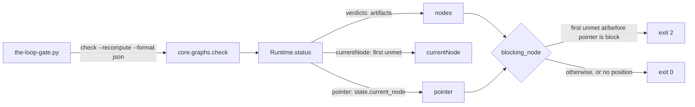

<!-- Authored per the the-loop:writing skill. -->

# Design: the stop gate is bounded by the pointer, and `check` reports it

> Phase 2 of 4. Derived from [`bugfix.md`](bugfix.md).

## Overview

The gate needs two answers `check --recompute` conflated: **what** is unmet (the
artifacts' answer, recomputed so it cannot be forged) and **where** the item is (the
recorded pointer). The report grows one field carrying the second answer, and the gate
uses each answer for its own question.

## Architecture

## Components & interfaces

| Component | Change |
|---|---|
| `graph/runtime.py` `StatusReport` | new `pointer: str`, set from `state.current_node` in both modes; `as_dict` emits `"pointer"` |
| `hooks/the-loop-gate.py` `blocking_node` | inconclusive (`None`) without a resolvable `currentNode` or `pointer`; otherwise walks the nodes in order up to the pointer and returns the first unsatisfied one if it is `block`. With no `pointer` key it bounds by `currentNode` (an older CLI) |
| `commands/graph_cmd.py` `_state_line` | under `--recompute`, a found state whose pointer differs from `currentNode` prints `(pointer at X; position derived from the artifacts)` |
| `api/routes.py`, `api/mcp.py`, the OpenAPI contract | describe `pointer` |

## Data models

`check`'s JSON gains `pointer` (string). `""` means no state file was found, or the
item was never entered. `core.graphs.check`'s position-unknown answer (issue-238) is
unchanged, and carries no `pointer`.

## Error handling

Every malformed or partial report degrades to "inconclusive, let the turn end". That
covers a null or unknown `currentNode`, an empty or unknown `pointer`, and no nodes.
This is the direction issue-109 already chose for a missing CLI or unparsable output: a
hook that can wedge a session is worse than one that gives up.

## Security design

See [`bugfix.md` § Security considerations](bugfix.md#security-considerations).
Verdicts stay recomputed. The pointer only narrows which nodes are asked about, and the
walk stops at the *first* unmet node, so a forward-moved pointer cannot skip a broken
node behind it. CI reads no pointer.

## Testing strategy

Unit tests for `blocking_node` over synthetic reports. Integration tests over real
checkouts through `core.graphs.check` on the shipped graph, including the ticket's
state. An end-to-end run of the gate script as a subprocess against the real CLI,
with service routing off. A negative control runs the same tests on the unfixed tree.
Detail in [`testing-plan.md`](testing-plan.md).

## Trade-offs & decisions

- **A new field, not a redefined `currentNode`.** The ticket's fix 1 reads as "recompute
  keeps the pointer as `currentNode`". That would change CI. `--fail-on` and `ok` are
  computed against `currentNode`, and CI's contract is "derived from the artifacts
  alone". A second field gives the gate the pointer without moving CI.
- **Bound by the pointer rather than drop `--recompute`.** Both modes evaluate every
  node the same way. What the flag changes is `currentNode`. Without it, `currentNode`
  *is* the pointer, and a gate that checked only that node would let a pointer moved
  forward, past a broken node, hide the broken node. Keeping the flag keeps the report's
  derived position for CI and for older gates, and the walk below does the bounding.
- **Walk to the pointer, not "is the pointer node `block`".** Taking the first unmet
  node at or before the pointer keeps R1.3: an earlier broken node is still reported.
  It also reproduces the old behaviour exactly when the pointer equals the derived
  position.
- **No pointer means inconclusive, not the old behaviour.** With no state file the only
  position is the graph's start-node default. In the shipped loops that is a human gate
  that `wait`s, so the gate was already inert there, and it is now inert by rule.
