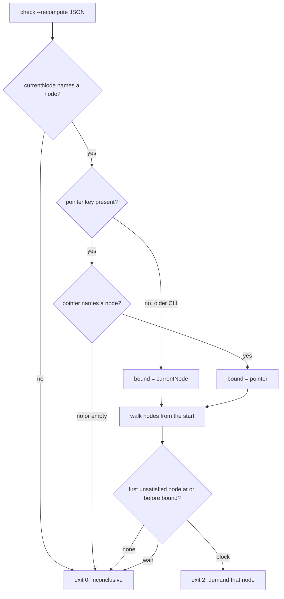

# The stop gate blocks on a node the work item never entered (issue-429): reviewer briefing

## TL;DR

The Stop gate runs `check --recompute`. Under `--recompute`, `currentNode` is the first
node the **artifacts** leave unmet, not where the item **is**. A work item parked at
`phase-selection` with its selection recorded was therefore told, on every turn, to
write `design.md`.

The fix has three parts:

- `check` now reports the recorded **`pointer`** beside `currentNode`.
- The gate blocks only on the first unmet node **at or before** the pointer.
- A report with no position is inconclusive, and the turn ends.

Verdicts and CI are unchanged.

The ticket blamed `current: null`. That does not happen on `main`, but its symptom and
both suggested fixes still apply. `bugfix.md` § Summary explains the difference.

## Where to focus (in this order)

1. **`hooks/the-loop-gate.py` `blocking_node`.** This is the behaviour change. Check
   the order of the early returns: an unresolvable `currentNode` or `pointer` returns
   `None` *before* the walk. Without that, an unknown pointer would walk the whole
   graph and reach the downstream blocks.
2. **The residual in `security-review.md`.** The gate now takes the position from
   agent-writable state. Moving the pointer forward hides nothing. Moving it backward
   lets an agent end turns early on nodes it has not entered. CI still gates the
   merge. Please confirm you accept this.
3. **`runtime.py` `StatusReport.pointer`.** One field, set in both modes. `currentNode`
   keeps its meaning, so `ok` and `--fail-on` are unchanged.

## How the gate decides

## Key decisions & why

- **A new field, not a redefined `currentNode`.** CI's `ok` and `--fail-on` are
  computed against `currentNode`, and CI must read the artifacts alone.
- **Walk to the pointer, not "is the pointer's node `block`".** Walking keeps an earlier
  broken node reported. When pointer and derived position agree, it gives exactly the
  old answer.
- **No pointer means inconclusive.** Without a state file, the shipped loops' start
  node is a human gate that `wait`s, so the gate was already inert there. It is now
  inert by rule instead of by accident.

## Operator note

A long-running control-plane service keeps serving the pre-change report, which has no
`pointer`, until it restarts. The gate then falls back to the old behaviour, without
crashing. Restart the service after upgrading to pick up the fix.

## Evidence

- [`verification.md`](verification.md): the reproduction before and after the fix, the
  negative control, the targeted modules, the full suite and the static checks.
- [`self-review.md`](self-review.md), [`security-review.md`](security-review.md),
  [`documentation.md`](documentation.md).
