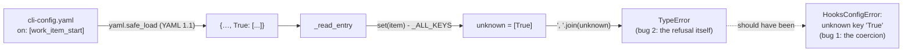

<!-- Authored per the the-loop:writing skill. -->

# Bugfix spec: two bugs in the `hooks[]` declaration loader

> Phases 1–2 of 4 (bugfix+design → testing plan → tasks). Source:
> [issue-433](https://github.com/MadaraUchiha-314/the-loop/issues/433), found on 19.14.0
> while declaring a first `path:` hook (issue-344, PR #432).

## Summary

A lifecycle hook declared **exactly as the documentation shows** cannot be loaded, and the
error the operator gets is a Python `TypeError` that names nothing. Two defects, the second
masking the first:

1. **The bare key `on:` arrives as the boolean `True`.** The CLI config is read with
   `yaml.safe_load`, which follows YAML 1.1, where the unquoted scalar `on` is a boolean.
   `_read_entry` then sees a key it does not know and refuses the entry. Every documented
   example, and the shipped commented example in `.the-loop/cli-config.yaml`, writes the
   key bare.
2. **The unknown-key refusal cannot render a non-string key.** It joins the keys with
   `', '.join(unknown)`, which raises `TypeError` on a `bool`, an `int` or `None` before
   the intended `HooksConfigError` is built. So the operator sees
   `TypeError: sequence item 0: expected str instance, bool found`, and any caller that
   distinguishes `HooksConfigError` from other failures sees the wrong class.

**The fix.** The loader maps a `True` key back to `on` before the unknown-key check, the
same allowance the graph loader already makes for an edge's `on`, and refuses an entry
that carries both spellings. The refusal renders every unknown key with `repr`, sorted by
`repr`, so it can never raise on its own input. Nothing in the docs or the shipped
example has to change: the spelling they teach now works.

## Steps to reproduce

1. The premise, in the loader the CLI config goes through:

   ```python
   >>> import yaml
   >>> yaml.safe_load("hooks:\n  - name: acme\n    path: hooks/acme.py\n    on: [work_item_start]\n")
   {'hooks': [{'name': 'acme', 'path': 'hooks/acme.py', True: ['work_item_start']}]}
   ```

2. With that entry in a `cli-config.yaml`:

   ```console
   $ the-loop --config ./cli-config.yaml hooks
   error: could not read ./cli-config.yaml: TypeError: sequence item 0: expected str instance, bool found
   ```

3. Bug 2 on its own, with the already-loaded mapping:

   ```python
   >>> from the_loop.lifecycle.declaration import read_declaration
   >>> read_declaration({"hooks": [{"name": "acme", "path": "hooks/acme.py", True: ["work_item_start"]}]})
   TypeError: sequence item 0: expected str instance, bool found
   ```

## Expected vs actual

| | Expected | Actual |
|---|---|---|
| a `hooks[]` entry with a bare `on:` key, as documented | loads; `Entry.on` names the points | refused as having an unknown key |
| the refusal for an unknown key that is not a string | `HooksConfigError` naming the entry and the key | `TypeError` from inside the refusal, naming nothing |
| `the-loop hooks` on the documented example | the declaration, exit 0 | `error: could not read …: TypeError …`, exit 1 |
| a daemon started on the documented example | starts, hooks loaded | refuses to start, on a message that does not say why |

## Root cause



- **Bug 1** is a property of the input format, not of the loader's logic: PyYAML resolves
  `on`, `off`, `yes`, `no`, `y`, `n` (in any case) to booleans under YAML 1.1. The graph
  loader met the same trap for an edge's `on` and undid it in
  `graph/model.py::_normalise_edge_keys`; the hooks loader, written later, did not.
- **Bug 2** is the refusal assuming its keys are strings. `sorted()` fails first when the
  keys mix types (`'<' not supported between instances of 'int' and 'str'`), and `join`
  fails when any key is not a `str`. Either way the exception is not the one the
  docstring promises: *every rule is a refusal that names the entry*.

## The fix (design)

The ticket offers three options for bug 1. The first is taken:

| Option | Why not / why |
|---|---|
| **1. Normalise the key** (taken) | PyYAML is the only loader, so the mapping `True → "on"` is deterministic; the docs and the shipped example stay correct as written; it is the precedent the graph loader set |
| 2. Rename the key (`points`, `at`) with `on` as an alias | a rename one release after the key shipped, for a defect the loader can absorb in one line |
| 3. Quote `"on"` in every example | teaches every operator a YAML trap instead of removing it, and edits `cli-config.schema.json`'s description, a sensitive path |

Two details of the normalisation:

- **It runs after the `name` check and before every other rule**, so the unknown-key,
  foreign-key and `_read_on` rules all see the entry the operator meant to write.
- **Both spellings on one entry are refused**, not silently merged: a mapping with `on:`
  and `"on":` has two values for one key, and the loader does not pick one.

For bug 2, the refusal renders `repr(k)` for each unknown key and sorts by `repr`, which
is total over any key type. A string key now reads `'bogus'` where it read `bogus`; the
existing test asserts substring containment and still holds. `repr` also makes a `True`
key visible as `True`, which points straight at bug 1 should the normalisation ever be
bypassed.

## Requirements

### Requirement 1 — the documented spelling loads

#### Acceptance criteria (EARS)

1. WHEN a `hooks[]` entry carries the key `True` (what `yaml.safe_load` produces for a
   bare `on:`) THEN the loader SHALL treat it as the key `on`, and `Entry.on` SHALL name
   the listed points.
2. WHEN the key is written quoted (`"on":`) THEN it SHALL load exactly as before.
3. WHEN one entry carries both `True` and `"on"` THEN the loader SHALL raise
   `HooksConfigError` naming the entry.
4. The first documented example (`docs/config/cli/hooks-options.md`) SHALL load through
   `yaml.safe_load` and `read_declaration` unchanged, and a test SHALL pin that, together
   with the YAML 1.1 premise it rests on.
5. `the-loop hooks` on a config carrying the documented example SHALL report the
   declaration and exit 0.

### Requirement 2 — a refusal never raises on its own input

#### Acceptance criteria (EARS)

1. WHEN a `hooks[]` entry carries an unknown key that is not a string (`1`, `null`,
   `false`) THEN the loader SHALL raise `HooksConfigError` naming the entry and the key.
2. WHEN the unknown keys mix types THEN the refusal SHALL name all of them.
3. The fix SHALL include regression tests that fail before the fix and pass after.

## Security considerations

- **Not security-relevant in itself.** Neither bug lets an entry load that should not:
  both fail closed, one of them merely on the wrong exception. The fix does not widen
  what an entry may declare; `on` still names only catalog points (`_read_on` is
  untouched), and the executable-config posture of decision-136/137 is unchanged.
- **The trust boundary is the same file.** The normalisation reads the operator's own
  CLI config, which already decides what code runs in the daemon's process. Mapping one
  key name does not let a checkout, a session or a ticket influence the declaration.
- **The refusal path gains no new failure mode.** `repr` and a `key=repr` sort are total
  over any hashable key, so the path that used to raise `TypeError` now always raises the
  documented class. A daemon that refused to start still refuses, with a message that
  says why.
- No new dependency, no schema change, no path under `.the-loop/**`,
  `.github/workflows/**`, `**/*schema*`, `**/auth/**`, `**/*secret*` or
  `**/*credential*` is touched. Risk tier 2, unchanged from the analysis above.

## What it costs

- One dictionary rebuild per entry at load time, once per process. Negligible.
- The unknown-key message now quotes string keys (`'bogus'` rather than `bogus`). Any
  operator tooling that matched the old exact wording would have to match the new one.
  None is known.

## Out of scope

- The other YAML 1.1 booleans (`yes`, `no`, `off`, `y`, `n`) as keys. None is a hooks
  key, and an operator who writes one gets the refusal, now with the key visible.
- A general "YAML 1.2" loader for the CLI config. That is a format decision for the whole
  config surface, not a bug fix in one loader.
- `cli-config.schema.json`. The JSON schema describes the key as `on`, which is what the
  operator writes and what the loader now reads.

## Open questions

None. The ticket names the fix it prefers and the loader has a precedent for it.
