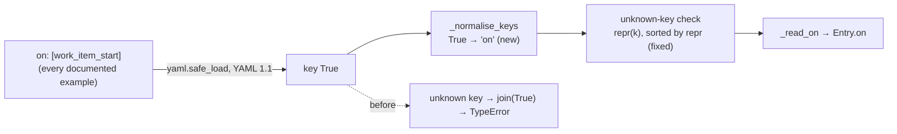

# A documented `hooks[]` entry cannot be loaded (issue-433) — reviewer briefing

## TL;DR

A lifecycle hook declared exactly as the docs show was refused, and the refusal was a
Python `TypeError` naming nothing. Two bugs in `cli/the_loop/lifecycle/declaration.py`:
`yaml.safe_load` follows YAML 1.1 and reads the bare key `on:` as the boolean `True`, so
the loader saw an unknown key; and the unknown-key refusal joined its keys as strings, so
it crashed on that `True` before the `HooksConfigError` was built. The loader now maps
`True` back to `on` before any rule runs (the graph loader already did this for an edge's
`on`), refuses an entry that spells the key both ways, and renders unknown keys with
`repr`. **Docs, shipped example and schema are unchanged**: the spelling they teach now
works.

## Where to focus (in this order)

1. **`_normalise_keys` and where it is called** — `declaration.py`. It must run after the
   `name` check (so a refusal can still name the entry) and before every other rule (so
   they all see `on`). It maps exactly one key and refuses the both-spellings case rather
   than merging it.
2. **The refusal wording** — `', '.join(repr(k) for k in unknown)`, sorted by `repr`. A
   string key now reads `'bogus'`, not `bogus`. The existing test asserts containment and
   still holds; the new tests pin the quoted form.
3. **The premise test** — `test_a_bare_on_key_loads_as_the_docs_write_it` first asserts
   `True in loaded["hooks"][0]`. If PyYAML ever moves to YAML 1.2, that assertion fails
   and tells you the normalisation is dead code, rather than the fix silently becoming a
   no-op.

## The bug in one picture

## Why option 1 of the ticket's three

| Option | Verdict |
|---|---|
| Normalise the key in the loader | **taken** — deterministic (PyYAML is the only loader), precedent in `graph/model.py`, docs stay right as written |
| Rename to `points`/`at` with `on` as alias | a rename one release after the key shipped, for a one-line defect |
| Quote `"on"` in every example | teaches the trap instead of removing it; edits the schema description (a sensitive path) |

## Evidence

- 7 new tests, all failing on the unfixed loader with the ticket's exact `TypeError`
  texts and passing with the fix (`evidence/verification.md` § T5, T1–T4).
- Full suite green from `cli/`; `ruff check`, `ruff format --check`, `pyright cli` clean.
- Risk tier 2: one parse function, tests, two doc pages; no sensitive path.

## Key decisions & why

- **Refuse both spellings, do not merge.** Two values for one key is malformed; the
  loader's rule is refuse-and-name, never pick-and-continue.
- **Map only `on`.** The other YAML 1.1 booleans are not hooks keys; mapping them would
  only change which unknown key the refusal names.
- **No schema, guide or shipped-example change.** They describe what the operator writes,
  which is now what the loader reads.
