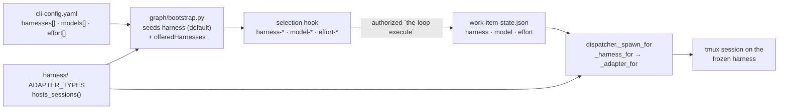
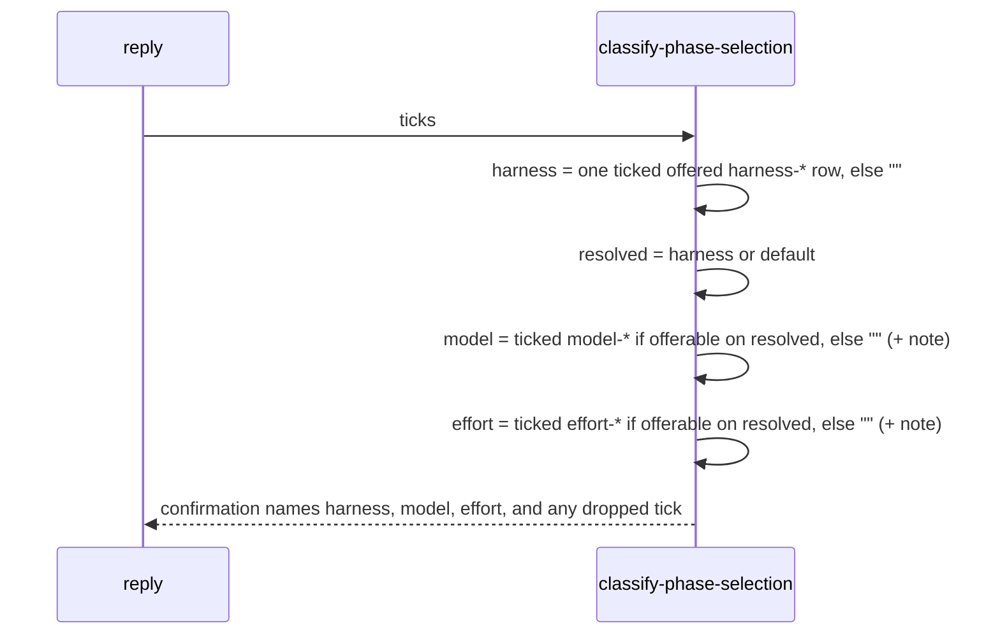

<!-- Authored per the the-loop:writing skill. -->

# Design: the harness is a per-work-item choice at `phase-selection`

## Overview

A third choice section joins `model-*` and `effort-*` on the `phase-selection` checklist:
`harness-<name>`. It reuses issue-358's machinery end to end — the operator's declared
list, the gate's per-section parse, the frozen record in `work-item-state.json`, and the
dispatcher's re-validation on read. Two things are new: which harnesses are *offerable*
(declared **and** able to host a session), and the order of resolution (harness first,
then model and effort against it). A single `default_harness` resolver also ends the
gate/daemon disagreement over which harness is the default.

## Architecture

The reply's parse runs in a fixed order, because the model and effort a work item may
run on depend on its harness:

## Components & interfaces

| Component | Change |
|---|---|
| `harness/base.py` | `hosts_sessions(adapter_or_type) -> bool`: true when the class overrides `interactive_argv`. Derived, not declared, so an adapter cannot claim hosting it does not implement. |
| `harness/__init__.py` | `ADAPTER_TYPES = {"claude": ClaudeCodeAdapter, "cursor": CursorAgentAdapter}`, which `build_adapters` already hard-codes; `hosting_harnesses()` lists the names whose type hosts. |
| `modelchoice.py` | `HARNESS_PREFIX`-free vocabulary: `offered_harnesses(config, hosts)` (declared ∩ hostable, declaration order) and `default_harness(config, routing_default, hosts)` (the `default: true` entry if hostable, else `routing_default`). `config_findings` warns when `default: true` names a harness that cannot host. |
| `graph/bootstrap.py` | Seeds `harness` from `default_harness(cli_cfg, routing.defaultHarness or "claude", hosting)` — the same rule and fallback the dispatcher uses — and `offeredHarnesses`. |
| `graph/hooks/selection.py` | `HARNESS_PREFIX = "harness-"`; `_harness_rows` (≥ 2 offered, else none); `_model_rows`/`_effort_rows` take an optional harness and, when a harness section is rendered, offer the union across offered harnesses; `classify` resolves in the order above; `_confirmation` names the harness and any dropped tick; `_frozen_graph` records `harness`. |
| `graph/runtime.py`, `graph/state.py`, `state.py` | `harness` frozen and persisted beside `model`/`effort`; registered as a `human-decision` repository attribute. |
| `webhook/dispatcher.py` | `_frozen_choices` reads `harness`; `_default_harness()`; `_harness_for(work_item, cwd)` re-validates the frozen harness (declared, adapter present, hosts) and falls back to the default; `_spawn_for` resolves the harness **after** `on_arm` (the reply that unparks the gate is what freezes it) and passes it to `_spawn_tmux`, which records and announces that harness. Respawns keep `session.harness`. |
| `channels/slack.py` | `harness-` joins the non-phase prefixes; the mirror's note names the harness among the choices made on GitHub. |

## Data models

`work-item-state.json` gains one additive key, `harness` (`""` = no choice). The frozen-graph
record and `decisions["phase-selection"]` gain the same key. No version bump: an older file
has no key and reads as `""` (R5.2).

## Error handling

Every fault shrinks to the default harness, never to another harness:

| Condition | Result |
|---|---|
| no tick, two ticks, an unoffered token | no choice → default |
| ticked model/effort not offerable on the resolved harness | that section records no choice; the confirmation names it |
| frozen harness undeclared, no adapter, or cannot host | spawn on the default; `WARNING` logged |
| `default: true` on a harness that cannot host | not the default; `models check`/`diagnose` warn |
| live session on another harness | kept; the frozen harness applies to the next fresh session |

## Security design

The threat is a comment choosing which binary an unattended agent runs. The design keeps it
a lookup: the gate accepts only tokens in `offeredHarnesses`, which bootstrap derived from
the operator's `harnesses[]` and the-loop's own adapter classes; the dispatcher re-checks the
same three conditions on read because `work-item-state.json` is agent-writable (abuse case
3); and the argv is `adapters[harness].extra_args` — that harness's own declared arguments —
so no other harness's arguments travel with the choice (abuse case 4). Nothing from a comment
reaches an argv or a path.

## Testing strategy

Unit tests for the vocabulary (`offered_harnesses`, `default_harness`, `hosts_sessions`),
the gate (rendering, parse order, dropped ticks, abuse tokens, byte-identical checklist
when fewer than two are offered), and the dispatcher (spawn on the frozen harness, forged
and non-hosting fallback, respawn keeps its harness). The existing issue-358 suites stay
green unchanged. See [`testing-plan.md`](testing-plan.md).

## Trade-offs & decisions

- **Derived hosting over a declared flag.** A class attribute `hosts_sessions = True`
  would be one line, but could drift from the method it describes; deriving it from whether
  `interactive_argv` is overridden cannot.
- **Union of model rows when a harness section is shown.** The alternative — one model
  section per harness — multiplies rows on a phone and couples the sections issue-358 kept
  independent. The cost is that a human can tick a pair that does not run; R2.3 catches it
  at parse and says so in the confirmation.
- **No adapter work here.** Only `claude` hosts today, so the section is dormant on current
  builds. Shipping the gate first means `codex`, `pi` and an interactive `cursor-agent`
  become selectable by landing their adapter alone.
