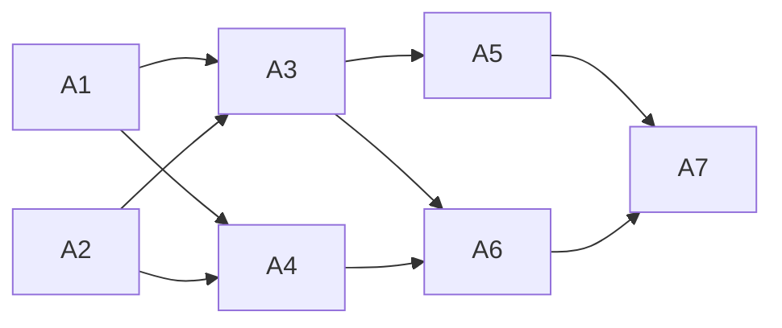

<!-- Authored per the the-loop:writing skill. -->

# Tasks: the harness is a per-work-item choice at `phase-selection`

> Each task names the requirement it satisfies and the testing-plan row that proves it.

## Task list

- [x] **A1: hosting and vocabulary.** `hosts_sessions`, `ADAPTER_TYPES`,
  `hosting_harnesses`, `offered_harnesses`, `default_harness`, the non-hosting-default
  finding. *Req:* R1.2, R4 · *Test:* T1 · *Depends:* —
- [x] **A2: state.** `harness` on `WorkItemState`, the repository-attribute registry and the
  runtime's freeze loop. *Req:* R1.6, R5.2 · *Test:* T5 · *Depends:* —
- [x] **A3: gate.** Bootstrap seeds `offeredHarnesses` and the shared default; the selection
  hook renders, parses, confirms and freezes the harness. *Req:* R1, R2, R5.1 ·
  *Test:* T2, T3, T4 · *Depends:* A1, A2
- [x] **A4: dispatcher.** `_harness_for`, `_default_harness`, spawn on the resolved harness.
  *Req:* R3, R4.1 · *Test:* T6 · *Depends:* A1, A2
- [x] **A5: Slack mirror.** `harness-` prefix and note. *Req:* R1 · *Test:* T7 ·
  *Depends:* A3
- [x] **A6: docs.** Config schema/template descriptions, `interactive-sessions.md`,
  `process-graph.md`, the skill's phase-selection text. *Req:* NFR · *Test:* T10 ·
  *Depends:* A3, A4
- [x] **A7: verify.** T8–T10, evidence. *Depends:* A1–A6

