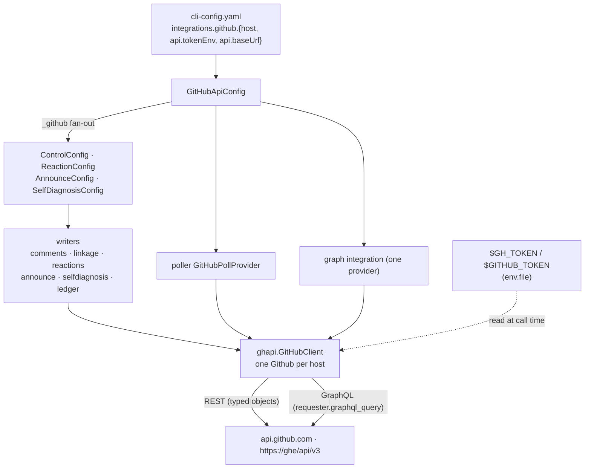

# Design: one GitHub client, on PyGithub, behind the seams that already exist

> Phase 2 of 3. Derived from [`requirements.md`](requirements.md); reviewed together with
> [`testing-plan.md`](testing-plan.md). Tier 4. Decisions in
> [decision-139](../../decisions/decision-139.md).

## Overview

The daemon's GitHub access collapses onto **one module**, `cli/the_loop/ghapi.py`, whose
`GitHubClient` is built on PyGithub and offers exactly the twelve operations of R3 as
named Python methods. Every module that used to compose a `gh` argv keeps its public
contract (never raises, best-effort, host-aware, injectable) and swaps its `runner` seam
for a `client` seam. The configuration loses the transport choice — there is one — and
the credential is the token `integrations.github.api.tokenEnv` already named.

Six moves, in the order a request meets them:

1. **The credential** — `GitHubApiConfig` (token variable names, base URL), read once from
   the CLI config and fanned out under a private `_github` key exactly where `_ghBinary`
   was fanned (`cli_config.apply_integrations` → `routing.control|reactions|announce`).
2. **The client** — `ghapi.GitHubClient`: one PyGithub `Github` per host, built with the
   base `ghhost.api_base_for(host)` derives (or the operator's `baseUrl`), a bounded
   retry and the caller's timeout; the twelve operations as methods; one exception type.
3. **The writers** — `comments`, `linkage`, `reactions`, `announce`, `core/selfdiagnosis`,
   `channels/github` call the client; their `gh_binary` fields become `github:
   GitHubApiConfig`; their tests inject a fake client.
4. **The readers** — the poller's provider holds a client instead of a `GhClient`;
   `channels records` reads through it; the graph's two transports become one provider.
5. **The configuration** — `transport` and `cli` retired behind config version `0.11.0`,
   migration, schema, template, docs, environment table.
6. **The proof** — the client is tested against PyGithub's own connection-injection hook
   with canned HTTP exchanges, so each test asserts the verb, path, body and headers
   PyGithub really sends; the callers are tested against a fake client.



## Components and interfaces

### 1. `ghapi.GitHubApiConfig` — the credential and the base

```python
@dataclass(frozen=True)
class GitHubApiConfig:
    token_envs: Tuple[str, ...] = ("GH_TOKEN", "GITHUB_TOKEN")
    base_url: str = PUBLIC_API_BASE           # integrations.github.api.baseUrl

    @classmethod
    def from_cli_config(cls, config) -> "GitHubApiConfig"   # integrations.github.api
    @classmethod
    def from_mapping(cls, data) -> "GitHubApiConfig"        # the private `_github` key
    def to_mapping(self) -> dict
    def token(self, env=None) -> str                        # first set variable, or ""
    def missing_token_reason(self) -> str                   # "no GitHub token: set GH_TOKEN or GITHUB_TOKEN"
```

Frozen and hashable, so it is the key of the process-wide client cache (§2) and can sit
on the frozen `ControlConfig`/`SelfDiagnosisConfig`. `cli_config.apply_integrations`
writes `to_mapping()` under `routing.<feature>._github` for `control`, `reactions` and
`announce`; the three `from_mapping` readers pick it up. The dispatcher's attachment fetch
keeps its own token read (already token-based) and is untouched.

### 2. `ghapi.GitHubClient` — one client, twelve operations

```python
class GitHubApiError(Exception):        # .status: Optional[int]; .not_found -> bool
class GitHubClient:
    def __init__(self, config: GitHubApiConfig = GitHubApiConfig(), *,
                 timeout: float = 30.0, factory: Callable[..., Github] | None = None)
    @classmethod
    def shared(cls, config, timeout=30.0) -> "GitHubClient"   # process-wide, per config
    def github(self, host: str = "") -> Github                 # cached per host; raises GitHubApiError when no token
    # writes
    def post_comment(owner, repo, number, body, host="") -> str                 # html_url  (O1)
    def create_issue(owner, repo, title, body, labels=(), host="") -> Tuple[int, str]  # (O2)
    def add_reaction(owner, repo, kind, id, content, host="") -> None            # kind: issue|issue-comment|review-comment (O4)
    def add_reaction_by_node(node_id, content, host="") -> None                  # GraphQL addReaction (O4)
    def add_labels(owner, repo, number, labels, host="") -> None                 # (O11 set-labels)
    def ensure_label(owner, repo, name, color="ededed", host="") -> None         # 422 = exists (O11)
    def remove_label(owner, repo, number, label, host="") -> None                # 404 = absent (O11)
    # reads
    def get_issue(owner, repo, number, host="") -> dict                          # raw issues document (O3, O10, O11 get-thread)
    def item_state(owner, repo, number, host="") -> GhItemState                  # (O10)
    def viewer_login(host="") -> str                                             # (O5)
    def list_labeled_issues(owner, repo, labels, host="") -> List[GhItem]        # (O6)
    def list_labeled_prs(owner, repo, labels, host="") -> List[GhItem]           # (O7)
    def list_issue_comments(owner, repo, number, host="") -> List[GhComment]     # (O8)
    def list_reviews(owner, repo, number, host="") -> List[GhComment]            # (O9)
    def list_review_comments(owner, repo, number, host="") -> List[GhComment]    # (O9)
    def list_comments(owner, repo, number, is_pr, host="") -> List[GhComment]    # O8 or O9, merged and sorted
    def labels_of(owner, repo, number, host="") -> List[str]                     # (O11 get-labels)
```

`GhItem`, `GhComment`, `GhItemState` move here from `poller/github.py` (which re-exports
them). Every method raises `GitHubApiError` and nothing else: `GithubException` (status,
GitHub's `message`), `requests` transport errors (no status) and a malformed GraphQL
document are all translated at the one boundary, so no caller imports PyGithub.

**How each operation maps.** Typed PyGithub objects where they cost no extra round trip,
the requester where they would:

| Op | PyGithub call | Note |
|----|---------------|------|
| O1 | `gh.get_repo(slug, lazy=True).get_issue(n)` … | `get_issue` fetches; a lazy `Issue(requester, url=…)` is used instead (PyGithub's own lazy-object idiom) so a comment is one `POST /repos/o/r/issues/n/comments` |
| O2 | `repo.create_issue(title, body=, labels=)` | one `POST /repos/o/r/issues`; number and `html_url` from the returned object |
| O3 | `get_issue` → `GitHubApiError.not_found` | `UnknownObjectException` is the one *missing*; `GithubException` with any other status, and any transport error, is *unknown* |
| O4 REST | lazy `Issue`/`IssueComment`/`PullRequestComment` `.create_reaction(content)` | one `POST …/reactions` with `{"content": …}` — the three endpoints the argv used |
| O4 node | `requester.graphql_query(ADD_REACTION, {subjectId, content})` | the same mutation text `gh api graphql` sent; `content` mapped through `REACTION_CONTENTS` |
| O5 | `gh.get_user().login` | `GET /user` |
| O6 | `requester.graphql_query(ISSUES_QUERY, {owner, name, labels, first, after})` paged to 200, with `hasIssuesEnabled` on the same document | *(As built: GraphQL, not REST — a typed REST list element completes itself with an extra GET for any field its page lacks (`pull_request` on a plain issue), and the GraphQL document is the one `gh issue list --json` ran, so the shapes and the label semantics (*all of*, issue-381) are unchanged; `hasIssuesEnabled: false` is raised as a 410 carrying GitHub's REST sentence, which is what issue-315 classifies.)* |
| O7 | `requester.graphql_query(PULLS_QUERY, {owner, name, labels, first, after})` paged to 200 | the one field REST does not have is `closingIssuesReferences`; `gh pr list --json` was this GraphQL query, so the shapes (`updatedAt`, `url`, `headRefName`, `author.login`) are unchanged |
| O8 | `requester.graphql_query(COMMENTS_QUERY, {owner, name, number, first, after})` over `issueOrPullRequest` | *(As built: the GraphQL read `gh … view --json comments` ran — `id` is the node id, `createdAt` the string, `url` the link — so no ledger is re-baselined; it answers for an issue and a pull request alike, which is what makes O12 one read.)* |
| O9 | PyGithub's `PaginatedList` over raw REST rows (`/pulls/{n}/reviews`, `/pulls/{n}/comments`) | every page (`--paginate`) through PyGithub's `Link` handling; the rows stay the dicts the parser already reads (a `NonCompletableGithubObject` row class, so no per-row fetch); PENDING and bodiless reviews dropped as before; `line` falls back to `original_line` |
| O10 | `get_issue` raw → `GhItemState` | `pull_request.merged_at`, `closed_by.login` |
| O11 | lazy `Issue.add_to_labels`, `repo.create_label` (422 → ok), `Issue.remove_from_labels` (404 → ok), raw `/labels` pages for `get-labels`, `get_issue` for `get-thread`, `list_issue_comments` for `list-comments` | one provider (`GitHubProvider`) replaces `GitHubApi` and `GitHubCli`; `list-comments` returns rows carrying both the REST (`user`, `created_at`, `html_url`) and the GraphQL (`author`, `createdAt`, `url`) spellings, which is what the two consumers ever read |

**Construction of a `Github`.** `Github(auth=Auth.Token(token), base_url=base,
timeout=int(timeout), per_page=100, retry=2, user_agent="the-loop",
seconds_between_requests=None, seconds_between_writes=None)`. `retry=2` is urllib3's
connection-level retry (a dropped socket), **not** PyGithub's default `GithubRetry`, which
sleeps until a rate-limit window resets — the design refuses that (R5.1, A5). *(As built:
PyGithub's courtesy pauses — 0.25 s between requests, 1 s between writes — are turned off
too: a dispatch thread must not sleep inside a write, and the daemon's volume is a handful
of requests a minute.)* The base is `config.base_url` when the operator set one, else
`ghhost.api_base_for(host)` — the same rule the old API transport applied (`_base_for`).

**Caching.** `github(host)` caches one `Github` per `(host, token)`; a rotated token
builds a new one. `GitHubClient.shared(config)` keeps one client per config for the
process, so the best-effort writers, which used to fork a `gh` per call, reuse one HTTP
session per host.

**Host on the ref.** Every method takes `host` (`""` for github.com) exactly where the
argv builders took it; a host reaches `api_base_for` only after `is_github_host`
(A3) — the `WorkItemRef`/`RepoSpec` parsers already guarantee it and the client asserts
it again.

### 3. The writers

| Module | Before | After |
|--------|--------|-------|
| `comments.py` | `gh_host_args`, `comment_argv`, `issue_argv`, `runner=`, `gh_binary=` | `post_issue_comment(item, body, *, api=None, client=None, timeout=30)`, `post_issue_comment_with_url(...)`, `create_issue(repo_slug, title, body, labels, *, api=None, client=None, timeout=30)`; the argv builders and `gh_host_args` are removed (no caller composes an argv any more); coordinate validation (`_NAME_RE`) kept before any request |
| `linkage.py` | `existence_argv`, `WorkItemVerifier(gh_binary, runner, timeout, cache_size)` | `WorkItemVerifier(api=None, client=None, timeout, cache_size)`; `is_missing` → `client.get_issue` → `not_found` is the one `True`; `looks_not_found` kept for the announcer's read of a 404 in a reason string |
| `reactions.py` | `ReactionConfig.gh_binary`, `GitHubReactor(config, runner, timeout)`, `_argv` | `ReactionConfig.github: GitHubApiConfig`, `GitHubReactor(config, client=None, timeout)`; `ReactionTarget` carries `kind` + `id` (`issue`, `issue-comment`, `review-comment`) or `node_id`; the REST path is composed by the client |
| `announce.py` | `AnnounceConfig.gh_binary`, `SessionAnnouncer(config, runner, …)` | `AnnounceConfig.github`, `SessionAnnouncer(config, client=None, …)`; the missing-token warning takes the place of the missing-`gh` one |
| `core/selfdiagnosis.py` | `SelfDiagnosisConfig.gh_binary`, `create_issue(config, title, body, runner=)` | `SelfDiagnosisConfig.github`, `create_issue(config, title, body, client=None)` through `comments.create_issue` |
| `channels/github.py` | `gh_binary(cli_config)`, writers called with `gh_binary=` | `github_api(cli_config) -> GitHubApiConfig`, writers called with `api=` |
| `control.py` | `ControlConfig.gh_binary` from `_ghBinary` | `ControlConfig.github` from `_github` |

Every caller that passed `gh_binary=` (`core/sessions`, `core/workchannels`,
`core/collaborators`, `channels/inbound`, `webhook/dispatcher`, `poller/poller`) passes
`api=` instead. The warn-once behaviour moves from "binary not on PATH" to "no token";
its trigger is the client raising `GitHubApiError` with `status is None` and
`missing_token=True`.

### 4. The readers

**Poller** (`poller/github.py`). `GhClient` and `check_gh_dependency` are removed;
`GitHubPollProvider(repos, labels, monitor_issues, monitor_prs, api: GitHubClient | None)`
holds a client (`from_source` builds `GitHubClient(GitHubApiConfig.from_cli_config(...),
timeout=60)`; the daemon passes the CLI config it already reads `polling` from).
`GhError(ProviderError)` stays as the provider's error type: every client call is wrapped
in one `_call()` that turns `GitHubApiError` into `GhError` carrying the status, and the
issues-disabled classification reads `status == 410` **or** the message text (belt and
braces, as issue-315 wanted). `check_dependencies()` returns the missing-token message when
the client has no token. The per-source `ghBinary` is no longer read. Poll-path comment
ids remain node ids (O8), so `reactions.target_from_event`'s node-id branch is unchanged.

**Graph** (`graph/integrations/`). `GitHubApi` and `GitHubCli` become one
`GitHubProvider(client)` (`transport = "api"` for anything that still reads the attribute).
`resolve("github", config)` builds it from `GitHubApiConfig.from_cli_config(config)`; a
config still naming `transport` or `cli` never reaches here (the migration gate refuses it
at start), but `resolve` also refuses `transport: cli` by name for a hand-built mapping,
and a missing token is `TransportUnavailable` naming the variables (R2.3). `_ref_parts`
stays.

**`channels records`** (`commands/channels_cmd.py`). `_ledger_comments` uses
`GitHubClient.shared(github_api(config)).list_issue_comments(...)` — one read, since the
GraphQL `issueOrPullRequest` answers for both kinds — catching `GitHubApiError`.

### 5. Configuration

- `cli-config.schema.json` (authored + packaged): `integrations.github` keeps `host` and
  `api {tokenEnv, baseUrl}`; `transport` and `cli` are removed; the descriptions of
  `integrations`, `routing.reactions.enabled`, `routing.announce.enabled`,
  `selfDiagnosis` and the kickoff `repo` stop saying "gh credentials" and say "the daemon's
  token". `additionalProperties: false` is what makes a leftover key fail validation.
- `migrations.py`: `CURRENT_CONFIG_VERSION = "0.11.0"`; `_retire_github_cli(data, report)`
  pops `integrations.github.transport` and `integrations.github.cli`, records one move
  per key, and notes the token requirement when the transport was `cli` or `tokenEnv` is
  unset; `needs_migration` and `assert_current` learn both keys. The existing
  `ghBinary → integrations.github.cli.binary` move (issue-109) still runs first and its
  result is retired in the same pass, so a very old file migrates in one step with both
  moves reported.
- `sdk/environment.py`: the `gh` requirement row goes; `docs/sdk/environment.md` gains a
  *Credentials* section naming the token and its scopes.
- Templates and this repository's config drop `transport`/`cli`; the comments around
  `reactions` and `announce` say "the daemon's token".

### 6. Test seams

- **Fake connection** (`cli/tests/ghreplay.py`): a class with PyGithub's connection
  interface (`request(verb, url, input, headers)`, `getresponse()` → `status`,
  `getheaders()`, `read()`), installed with `Requester.injectConnectionClasses` in a
  fixture and removed with `resetConnectionClasses`. It records every exchange and answers
  from routes keyed by `(verb, path)` — including `Link` headers, so pagination is
  exercised for real. This is how PyGithub tests itself, without a network.
- **Fake client** (`cli/tests/ghfakes.py`): `FakeGitHubClient` with the twelve methods,
  in-memory lists, per-method failure knobs (`raise GitHubApiError(status=…)`), and a call
  log. Callers' tests use it where they used a fake runner. *(As built, two more seams:
  `conftest.py` deletes `GH_TOKEN`/`GITHUB_TOKEN` for every test and installs a connection
  class that fails any HTTP PyGithub attempts, and gives every graph test a provider over
  the fake — two graph tests used to pass or fail with the machine's ambient token; and
  `cli/tests/ghstub.py` is a loopback GitHub the daemon integration tests point the child
  processes' `baseUrl` at, in place of the stub `gh` they kept on `PATH`.)*

## Data models

`GhItem`, `GhComment`, `GhItemState` unchanged in fields. `ReactionTarget` becomes:

```python
@dataclass(frozen=True)
class ReactionTarget:
    owner: str; repo: str
    kind: str = ""        # "issue" | "issue-comment" | "review-comment" — REST targets
    id: int = 0           # the numeric id for the kind above
    node_id: str = ""     # GraphQL subject when that is what the payload has
    description: str = "" # for logs
    host: str = ""
```

Config surface after the move:

```yaml
integrations:
  github:
    # host: ghe.corp.example
    api:
      tokenEnv: [GH_TOKEN, GITHUB_TOKEN]
      baseUrl: https://api.github.com
```

## Error handling

| Situation | Client | Writer | Poller | Graph |
|-----------|--------|--------|--------|-------|
| no token | `GitHubApiError(missing_token=True)` | `(False, "no GitHub token: set …")`, warn once | pre-flight lists the variables; listing fails per scope | `TransportUnavailable` naming them |
| 404 on the item | `.not_found` | `linkage` → missing; announcer → `session.work_item_missing` (via `looks_not_found` on the reason, which keeps the `HTTP 404` phrase) | closure question fails for that ref | `IntegrationError` |
| 401/403 | `GitHubApiError(status)` | `(False, "GitHub 401: Bad credentials")` | `GhError`, one scope failure | `IntegrationError` |
| 410 issues disabled | `GitHubApiError(410, "Issues are disabled for this repo")` | — | permanent scope condition (issue-315) | — |
| 422 label exists / 404 label absent | swallowed in `ensure_label` / `remove_label` | — | — | `{"result": "exists"/"absent"}` |
| transport error / timeout | `GitHubApiError(status=None)` | `(False, <exception text>)` | `GhError` | `IntegrationError` |
| GraphQL `errors` | PyGithub raises → `GitHubApiError` | — | listing fails for that scope | — |

Every reason string is composed from the status and GitHub's `message`; PyGithub's
exception `data` is not echoed wholesale (it can carry request URLs, never the token, but
brevity is the rule anyway).

## Security design

Mechanisms for the abuse cases of `requirements.md`:

- **A1** — the token is read inside `GitHubClient.github()` and handed to
  `Auth.Token`; no log line, event or reason string interpolates it; the debug log at
  `the-loop.ghapi` records verb, path and status only.
- **A2** — `comments`, `reactions`, `linkage` keep their `_NAME_RE`/`is_github_name`
  checks; the client re-validates `owner`/`repo` against the same shape and refuses a
  non-integer `number`/`id` and a node id outside `[A-Za-z0-9_=+/-]` before building a URL
  or a variable.
- **A3** — `github(host)` asserts `is_github_host(host)` and derives the base with
  `api_base_for`; a configured `baseUrl` is the operator's and is used verbatim.
- **A4** — no new operation; the docs state the minimum token scopes.
- **A5** — `retry=2` (connection-level), `timeout` on the `Github`, no rate-limit sleep.
- **A6** — the two GraphQL documents are module constants; values are variables.
- **A7** — unchanged marker on every body; `viewer_login` is the token's login.
- **A8** — warn-once per writer, the poller pre-flight, the graph refusal and the
  migration note.

## Testing strategy

Summarised here, detailed in [`testing-plan.md`](testing-plan.md): the client against the
replaying connection (every op, every error class, pagination, hosts); each writer and
reader against the fake client (the contracts they already test, re-expressed); the
migration both ways; docs and schema parity; the whole suite, lint, types and config
validation as CI runs them. No real network in any test.

## Trade-offs

| Chosen | Over | Because |
|--------|------|---------|
| PyGithub for everything, REST typed objects + `graphql_query` | keep the stdlib `urllib` API transport and extend it | the ticket asks for PyGithub; the hand-rolled client would have to grow pagination, retries and GraphQL that PyGithub already has and tests |
| GraphQL for the PR listing | REST `/pulls` + a second call per PR for closing references | one request per repository, and it is the very query `gh pr list --json closingIssuesReferences` ran, so shapes and semantics (issue-93) are unchanged |
| REST for the issue listing | GraphQL for symmetry | typed, paginated, one call, and it is the endpoint whose `410` names the issues-disabled condition issue-315 classifies |
| retire `transport`/`cli` with a migration | keep them accepted-and-ignored | a configured choice that quietly does nothing is the failure decision-041 forbids; `additionalProperties: false` would refuse them anyway |
| no `gh auth token` bridge | keep it as a convenience fallback | it re-introduces the binary the ticket removes, in the one place that would hide a missing token until production |
| the daemon holds one token | per-host tokens | nothing asked for it; the config can grow a per-host map later without touching the callers |
