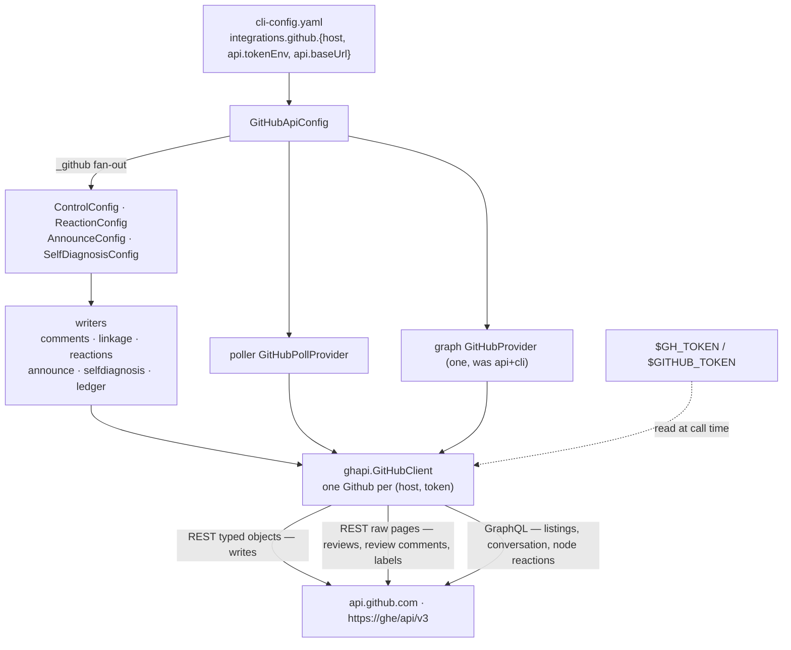

# feat(issue-442): the daemon reaches GitHub through PyGithub, never through `gh` — reviewer briefing

<!-- the-loop PR briefing (R10). This is the PR description of this work item's PR. -->

## TL;DR

Every GitHub read and write the-loop's own processes make — the paper trail, `ask`,
reactions, the session announcement, the existence check, the poller's listings and
comment reads, the process graph's labels and comments, the self-diagnosis issue, the
channel ledger, `channels records` — goes through **one client on PyGithub under one token**
(`integrations.github.api.tokenEnv`, default `GH_TOKEN` then `GITHUB_TOKEN`, read from the
daemon's environment at call time). Nothing in `cli/the_loop/` spawns `gh` any more, so
`pip install the-loopy-one` plus a token is a complete deployment. `integrations.github.transport`
and `.cli` are retired behind config `0.11.0` and a migration that names the token.
Closes [#442](https://github.com/MadaraUchiha-314/the-loop/issues/442).

Tier 4: the daemon now holds a credential, and two keys leave `cli-config.schema.json`.
**The tier-4 human security sign-off and the spec-set approval are the open items** (last
section).

## Where to focus (in this order)

1. **The credential boundary** — `cli/the_loop/ghapi.py` (`GitHubApiConfig.token`,
   `GitHubClient.github`, `_translate`, `_coordinates`, `_number`) — the token is read
   inside the client and handed to `Auth.Token`; a host reaches a base URL only after
   `is_github_host`; every coordinate is validated before a URL or a GraphQL variable;
   every reason string is the status plus GitHub's message. `test_ghapi.py` proves each
   against the real PyGithub over a replaying connection.
2. **No rate-limit sleep, bounded calls** — `GitHubClient._build`: `retry=2` (connection
   level), the caller's timeout, PyGithub's courtesy pauses off. `GithubRetry` would park a
   poll thread until the window resets.
3. **Shape stability across the upgrade** — the poller's listings and conversation reads
   are the GraphQL documents `gh` itself ran (node-id comment ids, `updatedAt`, `url`,
   `author.login`, `closingIssuesReferences`), so no `PollState` is re-baselined and no
   reaction target changes. Reviews and review comments stay REST, paged by PyGithub.
4. **The migration** — `migrations.py::_retire_github_cli`, `assert_current`,
   `needs_migration`: both keys removed, reported, the token noted when the file relied on
   `gh`; an un-migrated file refused by name.
5. **The hermetic suite** — `cli/tests/conftest.py`: no ambient token, no socket to GitHub,
   an in-memory provider for the graph hooks (two graph tests used to pass or fail with the
   machine's `GH_TOKEN`); `cli/tests/ghstub.py` is the loopback GitHub the daemon tests
   point child processes at.
6. **Skim** — the writers and readers keep their contracts; `gh_binary=` became `api=`
   everywhere; docs, template and this repository's config say the new truth.

## What changed (map)

## Key decisions & why (education)

- **The token is the credential; no `gh auth token` bridge** — the source the API
  transport, the attachment fetch and `env.file` already used; a bridge through `gh` hides
  a missing token until the one box without `gh`
  ([decision-139](../../../decisions/decision-139.md) D1).
- **One module, twelve operations, one exception** — the `runner=` seam every caller had
  became `client=`; no caller imports PyGithub, so a GitHub App auth can land later without
  touching them (D2).
- **GraphQL where `gh` used GraphQL** — the two listings and the conversation read are the
  queries `gh … --json` ran, which is what keeps issue-93's linkage and issue-246's
  baselined threads intact; REST typed objects for writes, raw REST pages where a typed
  list element would fetch itself per row (D3, D4).
- **Retire, don't ignore** — a `transport: cli` that quietly did nothing is the failure
  decision-041 forbids; `additionalProperties: false` would refuse it anyway (D6).
- **The agent's `gh` is untouched** — `integrations` has always governed the control plane
  only (D7).

## Evidence

- Full suite: `5020 passed, 1 skipped` (no `gh` on `PATH`, no token, no network); ruff,
  ruff format, pyright (0 errors), config validation, markdownlint (1475 files), `uv sync
  --locked` all green — `docs/specs/issue-442/evidence/verification.md`.
- One test per abuse case A1–A8 — `evidence/security-review.md`.
- The request count of a poll cycle is unchanged (`2 + 1 + 3`) — T8.
- Self-review: 8 findings, all fixed in this PR — `evidence/self-review.md`.

## Open questions for the reviewer

1. **Spec-set approval** — `requirements.md`, `design.md`, `testing-plan.md` are `status:
   draft` and were written in this cloud session; approving them on this PR is the gate
   (the issue-374 precedent). Nothing here sets `approved`.
2. **Tier-4 security sign-off** — a named human sign-off on the token model
   (`evidence/security-review.md`) is required and requested here.
3. **The live manual row** — `evidence/manual.md` steps 2, 3, 5 and 6 need a scratch
   repository and a real token the cloud session does not hold; they are recorded as not
   run by the agent.
