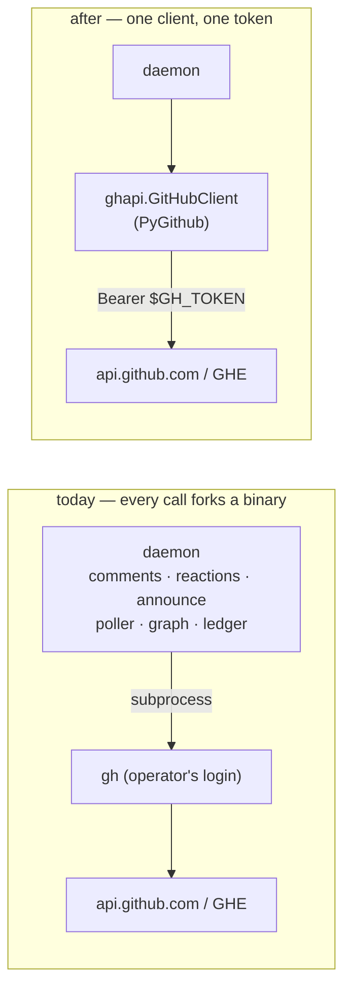

# Requirements: the daemon reaches GitHub through PyGithub, never through the `gh` CLI

> Phase 1 of 3 (requirements → design → tasks). Tier 4 (`human-approves-pr`, and a named
> human security sign-off): the change makes the-loop's own processes hold a GitHub
> credential instead of borrowing the operator's `gh` login, retires two keys from
> `cli-config.schema.json`, and re-plumbs every read and write the daemon makes to GitHub.

## Introduction

[Issue #442](https://github.com/MadaraUchiha-314/the-loop/issues/442) asks that the-loop
"move to PyGithub instead of using `gh` cli", because "using the CLI makes a lot of problems
with actually deploying this application" — and that every operation the-loop performs
today is supported after the move, with everything working post-migration.

Today the CLI daemon (`the-loopy-one`) is a Python wheel whose GitHub access is **not**
Python: eleven modules under `cli/the_loop/` spawn the operator's `gh` binary — comments
and the control paper trail (`comments.py`), the existence check (`linkage.py`), dispatch
reactions (`reactions.py`), the session announcement (`announce.py`), self-diagnosis
issues (`core/selfdiagnosis.py`), the channel ledger (`channels/github.py`), the poller's
whole read side (`poller/github.py::GhClient`), the process graph's `cli` transport
(`graph/integrations/github.py::GitHubCli`), and the `channels records` command. A
deployment therefore needs a `gh` binary *and* an interactive `gh auth login` on the box,
neither of which a container image, a CI runner or a `pip install` can carry — the
"problems with actually deploying" the ticket names. The one exception, the graph's
`api` transport, is a hand-rolled `urllib` client that still shells out to
`gh auth token` when no token is set.

[decision-023](../../decisions/decision-023.md) chose the operator's own credentials
through `gh`; [the vendor-SDK report](../../reports/vendor-sdk-analysis.md) (issue-212)
deferred PyGithub until "the credential question" was answered. This work item answers
it: **the daemon holds a token, named by configuration and read from its environment**,
exactly as the API transport and the attachment fetch already do
(`integrations.github.api.tokenEnv`, [issue-318](../issue-318/)'s env file), and the
library swap follows from that.

**Scope.** The daemon and CLI under `cli/the_loop/` — every process the-loop itself runs.
**Out of scope**: what the *agent* does inside a session. The skill, the slash commands and
the plugin hooks (`hooks/the-loop-link-pr.py`, `commands/create-ticket.md`) keep telling
the agent it may use `gh`, because that is the harness's tooling, not the-loop's
(`integrations` has always governed "the control plane only — what the AGENT does from
inside its session is unconstrained"). The release workflow's `gh release create` runs on
a GitHub Actions runner that ships `gh`; it is not a deployment of the-loop.

## Requirements

### Requirement 1 — no process of the-loop's spawns `gh`

**User story:** As an operator deploying the-loop as a container, a systemd unit or a
CI-hosted service, I want `pip install the-loopy-one` plus a token to be everything the
daemon needs to talk to GitHub, so that I do not have to bake a `gh` binary into the image
and complete an interactive login on every box.

#### Acceptance criteria (EARS)

1.1 WHEN the daemon, the control-plane service or any `the-loop` command reaches GitHub
THEN it SHALL do so through [PyGithub](https://github.com/pygithub/pygithub/) — a runtime
dependency of `the-loopy-one` (the no-extras rule, decision-038) — and no module under
`cli/the_loop/` SHALL spawn a `gh` binary, look one up on `PATH`, or run `gh auth token`.

1.2 WHEN the-loop is installed on a machine with no `gh` binary THEN every GitHub read and
write it performs SHALL work exactly as it does on a machine with one, and
`the_loop.sdk.check_environment` SHALL no longer list `gh` as a requirement.

### Requirement 2 — the credential is a token the configuration names and the environment holds

**User story:** As an operator, I want to say *which* environment variable holds the-loop's
GitHub token and never put the token itself in a file the-loop reads, so that the
credential is sourced, scoped and rotated by the machinery I already use for secrets.

#### Acceptance criteria (EARS)

2.1 The daemon SHALL read its token from the first set variable of
`integrations.github.api.tokenEnv` (default `[GH_TOKEN, GITHUB_TOKEN]`), at call time, from
the process environment — the same source the attachment fetch and the API transport read
today, and the one `env.file` (issue-318) populates. No other source SHALL be consulted:
no `gh auth token`, no keychain, no file of the-loop's own.

2.2 The token SHALL never be a configuration value, never be written to the event log, the
portable records or a comment, and never appear in an error string the-loop composes; an
error from GitHub SHALL be reported as its HTTP status and GitHub's own message.

2.3 WHEN no named variable is set THEN every **best-effort** writer (a comment, a reaction,
an announcement, a self-diagnosis issue, an existence check) SHALL degrade exactly as it
did for a missing `gh`: return `(False, <reason>)` or answer *unknown*, never raise, never
affect the action it describes, and warn **once per process** with a message that names
the variables to set. The poller's dependency pre-flight SHALL report the missing token as
its missing dependency, naming the variables, and the process graph's GitHub integration
SHALL refuse with `TransportUnavailable` naming them.

2.4 The one token SHALL serve every GitHub host the deployment addresses — github.com and
a GitHub Enterprise host alike — sent only to the host of the work item it concerns
(R4), never to another.

### Requirement 3 — every operation the-loop performs today is performed after the move

**User story:** As the owner, I want the migration to be a change of transport and
nothing else, so that a deployment upgraded across it observes the same comments,
reactions, labels, issues and poll behaviour as before.

#### Acceptance criteria (EARS)

3.1 The following operations SHALL be provided through PyGithub, each with the semantics
noted, and a test SHALL prove each against the exact HTTP request the old `gh` argv made:

| # | Operation (today's site) | Preserved semantics |
|---|--------------------------|---------------------|
| O1 | post a comment on an issue or pull request (`comments.post_issue_comment[_with_url]`) | the issues endpoint serves both kinds; the created comment's `html_url` comes back |
| O2 | open an issue with labels (`comments.create_issue`, `selfdiagnosis.create_issue`) | number and `html_url` in one call; labels silently dropped by GitHub for a caller without triage rights stay a documented degradation |
| O3 | does this work item exist? (`linkage.WorkItemVerifier`) | only a definitive HTTP 404 means *missing*; every other outcome means *unknown, keep the ref* |
| O4 | dispatch reactions (`reactions.GitHubReactor`) | REST on an issue/PR, an issue comment or a review comment by numeric id; GraphQL `addReaction` on a node id (webhook `node_id`, poll-path comment ids) |
| O5 | the ledger credential's own login (`GhClient.viewer_login`) | `""` when unreadable; callers fail closed |
| O6 | labelled open issues per repository (`list_labeled_issues`) | server-side label filter, open only, capped at 200, pull requests excluded, author login carried |
| O7 | labelled open pull requests with GitHub's own linkage (`list_labeled_prs`) | head branch, body, author, labels and `closingIssuesReferences` (issue-93) in one listing; capped at 200 |
| O8 | every comment on an issue (`list_comments`, issue) | ids are GraphQL node ids so every operator's baselined thread survives the upgrade unchanged (issue-246's constraint) |
| O9 | every comment on a pull request across its three surfaces (`list_comments`, PR) | conversation + submitted reviews with a body + inline review comments with file and line, one chronological list, every page |
| O10 | the closure question (`fetch_item_state`) | open/closed, is-PR, merged, title, url, `closed_by.login` from the one issues endpoint |
| O11 | the graph's operations (`add-comment`, `set-labels`, `create-label`, `remove-label`, `get-labels`, `list-comments`, `get-thread`) | one provider replaces both transports; `create-label` and `remove-label` stay idempotent (422 / 404 are success); `set-labels` **adds** the named labels (the semantics the shipped hooks rely on — they remove the previous phase label themselves) |
| O12 | the `channels records` read of a ticket's comments | one conversation read that answers for an issue and a pull request alike (*as built:* the old two-try was `gh issue view` refusing a pull request's number; the GraphQL `issueOrPullRequest` read has no such refusal) |

3.2 Comment `id`s, `created_at` strings (ISO-8601, `Z`), `url`s and author logins SHALL
have the shapes the poller's ledger and `reactions.target_from_event` already read, so no
`PollState` is re-baselined and no reaction target changes on upgrade.

3.3 The GitHub Enterprise semantics of issue-311 SHALL hold unchanged: a ref on a host is
addressed at `https://<host>/api/v3` unless `integrations.github.api.baseUrl` names another
base, github.com stays unwritten, and `ghhost.github_host`'s resolution order (including
`$GH_HOST`, kept as a plain environment convention) is untouched.

3.4 WHEN a repository has Issues disabled THEN the poller SHALL classify GitHub's answer
(`410 Gone`, *Issues are disabled for this repo* — raised by the client from the GraphQL
listing's `hasIssuesEnabled: false`, in GitHub's REST words) exactly as it classified
`gh`'s *has disabled issues* (issue-315): a permanent, per-scope condition, re-probed on
schedule, pull requests still polled.

### Requirement 4 — the configuration says only what is left to say

**User story:** As an operator, I want `integrations.github` to describe the one way
the-loop now talks to GitHub, so that a `transport: cli` I set last year does not sit in my
file promising something that no longer exists.

#### Acceptance criteria (EARS)

4.1 `integrations.github.transport` and `integrations.github.cli` SHALL be **retired**
from `cli-config.schema.json` (both the authored and the packaged copy, byte-identical), and
the config version SHALL become `0.11.0`.

4.2 `the-loop migrate-config` SHALL remove both keys, report each removal, and — WHEN the
retired transport was `cli`, or no `tokenEnv` is declared — add a note that the daemon now
needs a token in one of the named variables. A config still carrying either key SHALL be
**refused** at start, naming the key and the command (the migration contract of
[decision-041](../../decisions/decision-041.md)).

4.3 `integrations.github.host`, `integrations.github.api.tokenEnv` and
`integrations.github.api.baseUrl` SHALL keep their names, defaults and meanings; the
per-source `ghBinary` a github poll source could carry SHALL no longer be read.

4.4 The shipped template (`skills/the-loop/templates/cli-config.yaml`), this repository's
`.the-loop/cli-config.yaml`, the config option pages and the environment page SHALL say
the new truth, and the docs↔schema parity tests SHALL pass.

### Requirement 5 — the best-effort and timeout contracts of every writer hold

5.1 Every writer that never raised SHALL still never raise; every call SHALL still be
bounded by its caller's timeout (30 s for a write, 10 s for the existence check, 60 s for
a poll read); and no call SHALL sleep until a rate-limit window resets — a rate-limited
call fails and is reported, exactly as a failed `gh` was.

5.2 The poller's request count per cycle SHALL be no greater than today's: two listings
per repository, one comment read per polled issue, three per polled pull request, one
state read per closure question.

## Non-functional requirements

- **Footprint.** PyGithub and its transitive dependencies (`requests`, `urllib3`, `pynacl`,
  `pyjwt`, `typing-extensions`, `Deprecated`) join the wheel; nothing else does. The
  no-extras rule holds.
- **Testability.** Every module keeps an injectable seam so tests run without a network:
  the writers and readers take a client, and the client itself is tested against PyGithub's
  own connection-injection hook with canned responses — so the tests prove the requests
  PyGithub sends, not a fake of them.
- **Performance.** No subprocess per call; one HTTP session per host per process.

## Security considerations

The threat model changes in one respect — **the daemon holds a credential** — and this
section names what that means; the design's security section carries the mechanisms and
the testing plan's T8 row the negative tests.

| # | Abuse case | Required outcome |
|---|------------|------------------|
| A1 | the token leaks through a log line, an event, a comment body or an error string | never: the token is read at call time and handed to PyGithub only; every message the-loop composes carries the status and GitHub's message, never the header |
| A2 | payload-derived coordinates (owner, repo, number, comment id, node id) reach a URL path or a GraphQL variable unvalidated | every coordinate passes the same shape check it passed before it reached a `gh` argv; a failing one is refused before any request |
| A3 | a hostile host inside a ref points the client at an attacker's API base, receiving the token | a host reaches a base URL only after `is_github_host`; the base is derived by `ghhost.api_base_for` or is the operator's configured `baseUrl`, never payload text |
| A4 | an over-scoped token widens what a prompt-injected comment can make the-loop do | nothing the daemon does gains a capability: the operations are the same twelve; the docs name the minimum scopes (`repo`, or fine-grained *Issues: read/write*, *Pull requests: read*, *Metadata: read*) |
| A5 | a rate-limited or slow GitHub stalls a poll cycle or a dispatch thread | bounded connection retries, no reset-window sleep, the caller's timeout on every request |
| A6 | GraphQL text built from payload data | queries are fixed strings; every value travels as a variable |
| A7 | a comment the-loop posts is read back as human input | unchanged: every body still carries the self-authored marker (issue-104); the token's login is what the ledger reads as its own author (O5) |
| A8 | an upgraded deployment silently posts as nobody | a missing token is loud: one warning per process per writer, the poller's pre-flight, the graph's refusal, and the migration's note |

Tier 4 requires a **named human security sign-off** at the PR, distinct from the PR
approval.

## Out of scope

- The agent's in-session use of `gh` (skill references, slash commands, plugin hooks).
- GitHub App authentication (installation tokens) — PyGithub supports it and nothing in
  the client precludes it; a follow-up can add `integrations.github.app` without touching
  the callers.
- The Jira integration block, which is reserved and unimplemented.
- The `docs/reports/gh-queries.md` point-in-time report, which stays as written (it
  documents the state at v0.11.0).
