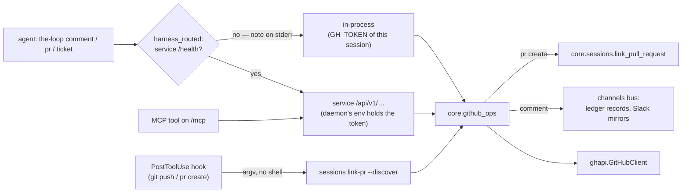

# Design: the harness's GitHub verbs, over the client the daemon already has

> Phase 2 of 3. Derived from [`requirements.md`](requirements.md), and reviewed together
> with [`testing-plan.md`](testing-plan.md). Tier 3. The decisions are recorded in
> [decision-140](../../decisions/decision-140.md).

## Overview

Every new verb follows the shape `sessions link-pr` already has. A **core function**
returns data plus `exitCode` and `messages`, and never prints. A **facade method** and a
**route** serve it over HTTP, and an **MCP tool** serves it to a harness. A **CLI
command** renders the result. The difference is routing: the verbs prefer the service,
and fall back to in-process when no service answers, instead of auto-starting one.



## Components and interfaces

### 1. `ghapi.GitHubClient` — seven new methods

Each method validates its coordinates with the existing `_coordinates` and `_number`,
goes through `_call` (one exception type, no token in any message), and takes `host`.

| Method | GitHub request | Returns |
|---|---|---|
| `repository(owner, repo)` | `GET /repos/{o}/{r}` | the raw document (`default_branch`) |
| `create_pull(owner, repo, title, body, head, base, draft)` | `POST /repos/{o}/{r}/pulls` | `(number, html_url)` |
| `get_pull(owner, repo, number)` | `GET /repos/{o}/{r}/pulls/{n}` | the raw document |
| `commit_checks(owner, repo, sha)` | `GET …/commits/{sha}/check-runs?per_page=100` and `GET …/commits/{sha}/status` | `(check_runs, statuses)` |
| `merge_pull(owner, repo, number, method)` | `PUT /repos/{o}/{r}/pulls/{n}/merge` | the raw document (`sha`, `merged`) |
| `review_threads(owner, repo, number)` | GraphQL `reviewThreads`, paged by 100 | list of thread dicts |
| `open_pulls_for_head(owner, repo, head_owner, branch)` | `GET /repos/{o}/{r}/pulls?state=open&head={owner}:{branch}` | list of raw documents |

A branch name is validated against `_BRANCH_RE`, a conservative subset of git's ref
grammar: `[A-Za-z0-9._/-]`, no `..`, no leading `-` or `/`, at most 255 characters. It is
checked before it reaches a query string or a JSON body. A SHA must be 7–40 hex
characters. The merge method must be one of `merge`, `squash` or `rebase`.

### 2. `core.github_ops` — the operations

One module, one function per operation. Each takes `config` (the CLI config dict) and an
injectable `client`, and returns a dict with `exitCode` and `messages`.

| Function | Data fields | Notes |
|---|---|---|
| `comment(ref, body)` | `workItem`, `url`, `posted`, `channelsPosted` | builds a `comment.agent` event (`source="cli"`) and publishes it with `record=True` over a `GitHubLedger` whose writer uses the operator's `api` config, as `ask_session` does. The ledger stamps the marker and the envelope. If the bus raises, the verb posts `mark_self_authored(body)` directly |
| `show_ticket(ref)` | `ref`, `number`, `title`, `body`, `state`, `isPullRequest`, `labels`, `author`, `url`, `comments[]`, `attachments[]` | `get_issue` + `list_comments`, and `github_attachment_urls` over the body and every comment (links only) |
| `create_ticket(repository, title, body, labels)` | `ref`, `url` | `comments.create_issue`, the writer the ledger's kickoff and self-diagnosis already use |
| `create_pull_request(ref, title, body, head, base, repository, draft)` | `workItem`, `pullRequest`, `url`, `linked` | `repository` defaults to the work item's. `base` defaults to `repository().default_branch`. It then calls `core.sessions.link_pull_request`, and a link failure becomes a stderr message with exit 0 (R1.5) |
| `pull_request_status(pr, work_item)` | `pullRequest`, `state`, `merged`, `mergeable`, `mergeableState`, `draft`, `headSha`, `checks{conclusion, failing[], pending[], total}`, `url` | three requests (NFR) |
| `pull_request_threads(pr, work_item, include_resolved)` | `pullRequest`, `threads[]` | unresolved only unless `include_resolved` |
| `merge_pull_request(pr, work_item, method)` | `pullRequest`, `merged`, `sha` | refused with exit 1 when `routing.mergeOnApproval` is `false` (R1.8) |
| `discover_pull_requests(ref, branch, repository)` | `workItem`, `branch`, `repository`, `found[]`, `linked[]` | lists the open PRs for the head, then `link_pull_request` for each |

**How the PR argument resolves** (R1.9): `resolve_pull_request(pr, work_item)` accepts a
ref, a URL (via `sessions.parse_github_url` shapes) or a bare number with a work item.
The bare-number case reuses `core.sessions._pull_request_ref`, which is renamed to a
public `pull_request_ref`. An unusable argument is a `ValueError`, so exit 2 or HTTP 400.

**The checks roll-up** (R1.6): `failure` if any check run concluded `failure`,
`cancelled`, `timed_out` or `action_required`, or any status is `failure` or `error`.
Otherwise `pending` if any run is not `completed` or any status is `pending`. Otherwise
`success` when there is at least one check. `none` when there are none.

**The merge gate** (R1.8, A2): `merge_on_approval(config)` reads
`routing.mergeOnApproval`, with `True` as the default, the same default the graph's
`notify` hook uses. It is lifted out of `graph/hooks/sideeffects.py` into
`cli_config.merge_on_approval` so the hook and the verb share one reader. Routed through
the service, `config` is the **service's**, so the session cannot bring its own.

**A GitHub failure** (`GitHubApiError`) is a result, not an exception: `exitCode: 1` and
an `err` message carrying the client's text. A missing token is the same, with the
message naming the variables (R2.3). A caller mistake is a `ValueError`, so exit 2 or
HTTP 400.

### 3. `client.routing.harness_routed` — service first, in-process otherwise

```python
def harness_routed(remote, local, config=None):
    if not via_service():          # the test seam, unchanged
        return local()
    resolved = client.resolved_config(config)
    if client.healthy(resolved):
        return remote(client.Client(resolved))
    print(IN_PROCESS_NOTE, file=sys.stderr)   # R2.2: never silent
    return local()
```

The difference from `routed` is deliberate (decision-140 D2). `routed` auto-starts a
service and otherwise fails closed, because a core verb's state lives with the service.
A GitHub verb's only state is on GitHub, and the one thing the service adds is the
daemon's token. In a cloud checkout there is no daemon to hold one, and auto-starting a
service there would only move the session's own `GH_TOKEN` into a second process. `ask`
set the precedent by running in-process always. These verbs improve on it where a
service exists.

The in-process path reads the operator's CLI config the way every other command does
(`_cli_config()`), so `integrations.github.api.tokenEnv` and `baseUrl` apply.

### 4. The CLI commands

All three live in `commands/github_cmd.py`, which shares the body reading, the
routing and the rendering between them.

| Command | Output |
|---|---|
| `comment --work-item R (--body T \| --body-file P)` | the URL line |
| `ticket show R` · `ticket create --repository S --title T (--body \| --body-file) [--label L]…` | JSON · the ref and URL |
| `pr create …` · `pr status P [--work-item R]` · `pr threads P [--work-item R] [--all]` · `pr merge P [--work-item R] [--method M]` | the ref and URL · JSON · JSON · the merge line |

`--body-file -` reads stdin, as `ask --question-file` does. `pr create` resolves
`--head` on the **CLI side** from `git symbolic-ref --short HEAD` in the working
directory, because the service's working directory is not the checkout. A detached HEAD
(`HEAD`) with no `--head` is exit 2.

### 5. Routes, facades and MCP tools (R3)

The routes are work-item and pull-request scoped, and follow the existing flat
convention (the ref is a query or body parameter, as in `/work-items/one` and
`/sessions/link-pr`):

| Route | operationId | MCP tool |
|---|---|---|
| `POST /work-items/comments` | `postWorkItemComment` | `post_comment` |
| `GET /work-items/ticket?ref=` | `getTicket` | `get_ticket` |
| `POST /work-items/tickets` | `createTicket` | `create_ticket` |
| `POST /work-items/pull-requests` | `createPullRequest` | `create_pull_request` |
| `GET /pull-requests/status?ref=&workItem=` | `getPullRequestStatus` | `pull_request_status` |
| `GET /pull-requests/threads?ref=&workItem=&all=` | `listPullRequestThreads` | `pull_request_threads` |
| `POST /pull-requests/merge` | `mergePullRequest` | `merge_pull_request` |
| `POST /sessions/link-pr` gains optional `branch`, `repository`, `discover` | `linkSessionPullRequest` (unchanged) | `link_pull_request` gains `discover`, `branch` |

A generic `/github` proxy route was rejected (the ticket's design question). It would
make the contract say nothing, grant the agent every call the token can make, and put
the merge gate out of reach.

`CoreFacade` gets one method per row, keyed by `instance` like every other.
`ManagerFacade` uses the **by-instance** shape (`_target(instance)`): its own core
unless `instance` names a member, otherwise proxied. A GitHub operation needs a token,
not the member that manages the work item, and `ticket show` or `ticket create` may name
an item no member manages.

### 6. `sessions link-pr --discover` and the hook (R4)

`sessions link-pr` gains `--discover`, `--branch` and `--repository`. `--pull-request`
and `--discover` form a required, mutually exclusive group. With `--discover`, the CLI
resolves the branch (`git symbolic-ref --short HEAD`) and the repository
(`ghhost.origin_repo(cwd)`, falling back to the work item's repository when the origin
is not a GitHub remote). It then routes `{ref, discover: true, branch, repository}` to
the same route with `routed`, like the existing link. This is a core verb, and its
record lives in the service's registry.

`hooks/the-loop-link-pr.py` becomes trigger-agnostic:

- **Trigger:** a `Bash` command matching `\bgit\b[^\n|;&]*\bpush\b` or
  `\bpr\b[^\n|;&]*\bcreate\b`, unless it is `the-loop pr create` (R4.4). Or any tool
  whose name ends in `create_pull_request`. An interrupted call triggers nothing.
- **Action:** `the-loop sessions link-pr --work-item <ref> --discover`, in the payload's
  `cwd`. No URL is read from the response, and no PR argument is composed.
- The work-item resolution (`THE_LOOP_WORK_ITEM`, then the registry by session id, then
  by working directory), stdlib-only, and exit 0 on every path are unchanged.

`hooks/hooks.json`'s matcher stays `Bash|.*create_pull_request`. Its description names
the new trigger.

## Data models

```jsonc
// pull_request_status
{ "pullRequest": "github:o/r#12", "url": "https://github.com/o/r/pull/12",
  "state": "open", "merged": false, "mergeable": true, "mergeableState": "clean",
  "draft": false, "headSha": "abc123…",
  "checks": { "conclusion": "failure", "total": 4,
              "failing": ["test (3.11)"], "pending": [] },
  "exitCode": 0, "messages": [] }

// pull_request_threads
{ "pullRequest": "github:o/r#12",
  "threads": [ { "id": "PRRT_…", "isResolved": false, "isOutdated": false,
                 "path": "cli/x.py", "line": 40,
                 "comments": [ { "id": "PRRC_…", "author": "alice", "body": "…",
                                 "createdAt": "2026-09-30T10:00:00Z", "url": "…" } ] } ],
  "exitCode": 0, "messages": [] }
```

## Error handling

| Condition | Local (CLI) | Routed (HTTP) |
|---|---|---|
| malformed ref, PR, branch, repository or empty body | `ValueError` → exit 2 | 400 → exit 2 |
| no token (in-process) | exit 1, message names the variables | n/a (the service's token) |
| GitHub refuses (404, 405 not mergeable, 409 conflict, 422 duplicate PR) | exit 1, the status and GitHub's message | 200 with `exitCode: 1` → exit 1 |
| merge gated off | exit 1, names `routing.mergeOnApproval` | same |
| PR created, link failed | exit 0, stderr note | same |
| no service reachable | in-process, stderr note | n/a |

## Security design

| # | Mechanism |
|---|---|
| A1 | Every client call goes through `_call` and `_translate`, and every result message is composed from `GitHubApiError.__str__` (status plus GitHub's message). T7 asserts the token is absent from the output of a failing verb |
| A2 | `merge_on_approval(config)` is read inside core from the **executing process's** config. The CLI sends no policy field, the route body has none, and the MCP tool calls the same facade method |
| A3 | Coordinates go through `_coordinates`, `_number`, `_BRANCH_RE` and the SHA and method checks before any request. `create_issue`'s slug parse and `is_github_host` apply to `--repository`. The GraphQL document is a constant, with values passed only as variables |
| A4 | The ledger's default branch stamps `mark_self_authored` and an envelope. `publish_comment` drops enveloped comments at ingress, so the comment is never re-published or re-forwarded |
| A5 | `harness_routed` prints `IN_PROCESS_NOTE` on every fallback, and never auto-starts |
| A6 | The hook's argv is `["the-loop", "sessions", "link-pr", "--work-item", ref, "--discover"]`, where `ref` has already matched `_REF_RE`. No shell, and nothing taken from the tool's response |
| A7 | `ticket show` returns text as JSON fields. The skill labels ticket text as untrusted data (collaboration.md), and attachment URLs are listed, never fetched |

No new attack surface on the service beyond the routes above, which are loopback-only,
like every other route. The `/mcp` tools add the same operations and nothing more.

## Testing strategy

TDD per task. The client methods are tested against `ghreplay` (the exact verb, path and
body). Core is tested against `FakeGitHubClient`, extended with the new methods. The
commands are tested in-process (`THE_LOOP_SERVICE_LOCAL=1`), and `harness_routed` both
ways with `healthy` patched. The routes and MCP tools are tested through the contract
parity tests and one `TestClient` round trip. The hook is tested by loading it by path,
as today. See [`testing-plan.md`](testing-plan.md).

## Trade-offs

- **A fallback, against issue-161's "never silently fall back".** Accepted and
  documented (decision-140 D2). The fallback is loud, and it applies only to verbs whose
  state is GitHub's. `routed` keeps its rule for every core verb.
- **`comment.agent` from the CLI, not a new event type.** A channel that subscribes to
  the agent's comments already means "what the agent wrote on the ticket". A new type
  would split one stream into two that every subscriber must learn.
- **No approval check in `pr merge`.** The gate that decides approval is the graph's
  `human-approval` node, which reads comments as well as reviews. GitHub's
  `reviewDecision` is a different fact, and checking it would refuse merges this
  repository's own owner approves by comment. The verb enforces the operator's policy
  knob. GitHub enforces branch protection.
