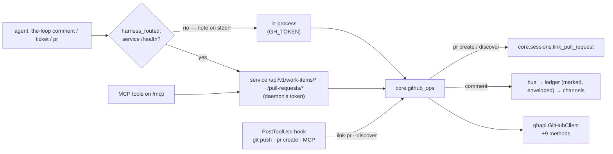

# feat(issue-447): the coding harness reaches GitHub through the-loop's verbs — reviewer briefing

## TL;DR

The agent in its session no longer needs `gh` or a GitHub token of its own. These
`the-loop` verbs cover every GitHub act the loop asks of it:

- `comment`
- `ticket show`, `ticket create` and `ticket close`
- `pr create`, `pr status`, `pr threads`, `pr resolve-thread` and `pr merge`
- `sessions link-pr --discover`, forks included

Every lifecycle act (open, merge, resolve, close) needs a work item registered on the
instance that runs it, with an ad-hoc `the-loop do` work item as the one exception. This
is your rule from the review.

They run on the client #442 built, `ghapi.GitHubClient`. When a daemon is running they
execute in the control-plane service, which holds the token. Without one they run
in-process on `GH_TOKEN` and say so on stderr. `pr create` records the PR it opens. The
`PostToolUse` hook stops parsing `gh` output: after a push or any PR-creating call it
runs `link-pr --discover`. The skill and the slash commands now name the verbs, with
`gh` kept only as the fallback.

Closes #447. Tier 3 (`human-approves-pr`). No new credential, config key or dependency.

## Where to focus (in this order)

1. **The registered-work-item rule:** `github_ops._authority`, applied to `pr create`,
   `pr merge`, `pr resolve-thread` and `ticket close` before any request. It reads the
   executing instance's registry and control records (the `do` exception), and the
   manager routes these acts to the member that manages the work item
   (`ManagerFacade._acting_member`).
2. **The merge gate:** `cli/the_loop/core/github_ops.py::merge_pull_request` and
   `cli_config.merge_on_approval`. The verb refuses when `routing.mergeOnApproval` is
   `false`. The value comes from the **executing process's** config, which is the
   daemon's when routed, so no flag, route field or MCP argument can override it. The
   `merge_pull_request` MCP tool is registered, and gated below the facade.
3. **The routing exception:** `client/routing.py::harness_routed`. It uses a running
   service, and otherwise runs in-process with a stderr note. It never auto-starts a
   service. This is the second exception to "the service is the only path", after `ask`
   ([decision-140](../../../decisions/decision-140.md) D2). Check that you agree with
   the trade.
4. **The comment path:** `github_ops.comment` publishes `comment.agent` with
   `record: true` over a `GitHubLedger`. The ledger stamps the marker and the envelope,
   the room hears the comment once, and the ingress drops the enveloped copy.
5. **The host allow-list and input validation before any request:**
   `github_ops.trusted_hosts`/`_trusted` (github.com plus the operator's own host), so a
   ref or URL naming another host never receives the token. Also
   `ghapi.is_branch_name`, `_sha`, the merge-method allow-list, and
   `github_ops._slug`/`_repository`/`resolve_pull_request`.
6. **The hook:** `hooks/the-loop-link-pr.py`. It triggers on `git push`, `pr create`,
   `pull-request` and MCP `create_pull_request`, skips `the-loop pr create`, and runs a
   fixed argv in the session's `cwd`.
7. **Skim:** the routes, the facades (the manager serves reads by instance, and lifecycle acts by the work item's member), the
   OpenAPI entries, the docs.

## What changed (map)

## Key decisions & why (education)

- **Service first, in-process otherwise, never auto-start** (D2). These verbs keep no
  state of their own, so all a service adds is the daemon's token. In a cloud checkout
  an auto-started service would only copy `GH_TOKEN` into a second process. `routed`
  keeps its fail-closed rule for every core verb.
- **Scoped routes, no `/github` proxy** (D3). This settles the ticket's design question.
  A proxy would grant everything the token can do, and put the merge gate out of reach.
- **No approval check inside `pr merge`** (D4). The graph's `human-approval` node
  decides approval. This repository's owner approves by comment, which GitHub's
  `reviewDecision` would not see. The verb enforces the operator's knob, and GitHub
  enforces branch protection.
- **`comment.agent`, not a new event type** (D5). Subscribers already read it as "what
  the agent wrote".
- **`pr create` links what it opens, and the hook discovers** (D6, the owner's
  addition). A PR opened by the verb needs no hook, and the hook no longer knows `gh`.
- **`git symbolic-ref --short HEAD`** is used for the head branch. It answers on a
  branch with no commits yet, and stays silent on a detached HEAD.

## Evidence

- Full suite `5211 passed, 1 skipped`; ruff, ruff format, pyright (0 errors), config
  validation, markdownlint (1491 files, 0 errors). See
  [`verification.md`](verification.md).
- One negative test per abuse case A1–A7:
  [`security-review.md`](security-review.md).
- `pr status` is bounded at three GitHub requests (T8).
- Self-review: two rounds, 13 findings, plus your two asks. All are fixed: [`self-review.md`](self-review.md).
- Spec chain: [`docs/specs/issue-447/`](../).

## Open questions for the reviewer

1. **Spec-set approval.** `requirements.md`, `design.md` and `testing-plan.md` are
   `status: draft` and were written in this cloud session. Approving them on this PR is
   the gate (the issue-374/issue-442 precedent). Nothing here sets `approved`.
2. **No live GitHub run.** T9/T10 are `n/a`: the cloud session holds no token or
   scratch repository. `the-loop pr status github:MadaraUchiha-314/the-loop#<this PR>`
   on a box with the daemon is a one-line check.
3. **Answered on the PR, and done here:** closing a ticket, resolving a review thread
   and fork discovery are verbs now. Merging and every other lifecycle act need a
   registered work item, with `the-loop do` as the exception.
