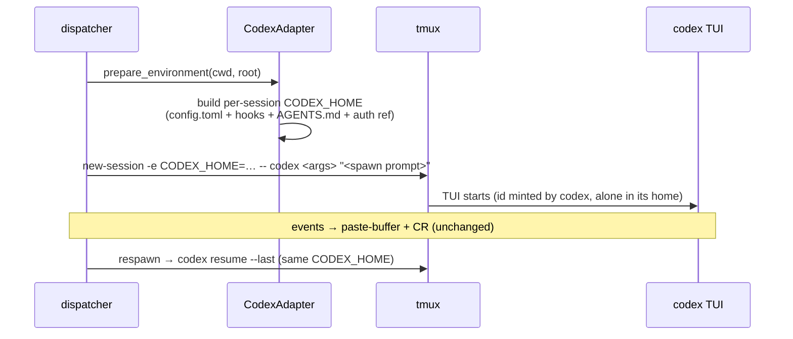

# Brainstorm: Add support for codex CLI

> Phase 0 scratchpad for issue-449. Nothing here is a commitment; it converges on the
> ticket and then becomes `requirements.md`.

## Problem / opportunity

the-loop today can **host a work-item session on exactly one harness: Claude Code**.
`cursor` exists only as a critic (one-shot reviews). Issue-440 built the whole
per-work-item harness choice gate — the `harness-*` rows at `phase-selection`, the
frozen choice in `work-item-state.json`, the adapter registry — precisely so that new
harnesses could land "by adapter alone" (`docs/specs/issue-440/design.md:112`), and its
requirements explicitly name **codex** as the first follow-up
(`docs/specs/issue-440/requirements.md:158`). This work item cashes that cheque: an
operator who declares `codex` in `cli-config.yaml` should be able to tick `harness-codex`
on a ticket and have the loop run on OpenAI's codex CLI end-to-end, proven against the
test repository https://github.com/MadaraUchiha-314/the-loop-testing.

Why it matters: multi-harness is the-loop's credibility claim (it is a PDLC harness, not
a Claude wrapper), codex becomes a second *hosting* harness and a critic for free, and
the exercise flushes out every place "harness" still secretly means "claude".

## Context & constraints

**What already exists (the designed extension point):**

- `cli/the_loop/harness/` — `HarnessAdapter` base (`base.py:79`) with the registry
  `ADAPTER_TYPES = {"claude": …, "cursor": …}` (`harness/__init__.py:24`). An adapter
  that overrides `interactive_argv` is *derived* to be session-hosting
  (`hosts_sessions`, `base.py:234`); one that only implements `_oneshot_argv` is
  critic-only.
- Sessions are **always tmux** (decision-021): `TmuxRunner.spawn_in` builds
  `tmux new-session … -- <binary> <interactive_argv(prompt, session_id)>`
  (`runner.py:420-432`); events are delivered into the live TUI by
  `load-buffer`/`paste-buffer` + CR (`runner.py:974`) — harness-agnostic, assumes a TUI
  that accepts bracketed paste.
- Respawn uses `interactive_resume_argv(prompt, session_id)` (claude: `--resume <id>`).
- Model/effort vocabulary already anticipates codex: `EFFORT_LEVELS` is documented as
  the union of Claude Code and Codex levels (`modelchoice.py:73-82`;
  `docs/decisions/decision-124.md:47`), and `usage_from_output` already parses
  OpenAI-style `prompt_tokens`/`completion_tokens` (`base.py:248`).
- `cli/tests/test_dispatcher_harness.py:30-48` already stubs a `_Codex` adapter — a
  ready-made test scaffold.
- `critics[].harness` and `harnesses[].name` are free-form; only three schema enums pin
  `claude|cursor`: `routing.defaultHarness`, `standingSessions.sessions[].harness`,
  `selfDiagnosis.harness` (× two identical schema copies).

**What the codex CLI offers (verified against current docs):**

- Interactive TUI `codex`, non-interactive `codex exec "<prompt>"` with `--json` (JSONL
  events incl. `thread.started` with the session/thread id), `--output-last-message`,
  `--output-schema`.
- Resume: interactive `codex resume <SESSION_ID>` / `codex resume --last`;
  non-interactive `codex exec resume <SESSION_ID>`.
- **No pre-assignable session id at launch** — Claude's `--session-id` has no codex
  equivalent; it is an open upstream feature request
  ([openai/codex#13242](https://github.com/openai/codex/issues/13242)). The id exists
  only *after* launch (rollout files under `$CODEX_HOME/sessions/`, or the `--json`
  event stream in exec mode).
- Instructions: `AGENTS.md` (global `~/.codex/AGENTS.md`, repo root, cwd) — no plugin /
  skill / marketplace system. Custom prompts: `~/.codex/prompts/*.md` become
  `/prompt-name` slash commands.
- Unattended knobs: `--full-auto`, `--sandbox workspace-write|danger-full-access`,
  `--ask-for-approval never`, `-c` config overrides; effort via
  `model_reasoning_effort` config.
- Lifecycle hooks exist (pre/post turn, pre/post tool) — the possible carrier of the
  loop's stop-gate; protocol differs from both Claude (exit 2 + stderr) and Cursor
  (`followup_message` JSON), which `hooks/the-loop-gate.py` already parameterises by
  harness name (`emit()`, `:137-150`).

**Constraints / non-negotiables:**

- tmux-only hosting stands (decision-021) — no bespoke runner for codex.
- CLI-as-programmatic-surface stands (decision-016) — drive the `codex` binary, no SDK.
- The adapter contract is the boundary: the dispatcher, selection gate, model probing
  and telemetry must not grow codex special-cases; whatever cannot fit the contract is
  a contract change, argued in `design.md`.
- A codex session must still run *the loop*: read the skill, honour the gates, use the
  `the-loop` CLI verbs. Claude gets that via the plugin (skills/commands/hooks
  pre-seeded by `harness_plugins.py`); codex has no plugin system, so an equivalent
  instruction surface must be prepared per-spawn.

## Ideas & options

### A — Scope: critic-only codex (like cursor today)

Just `_oneshot_argv` (`codex exec --json <prompt>`), registry entry, schema enums.

- Pros: tiny; immediate value (cross-vendor critic reviews); zero session-identity risk.
- Cons: **does not meet the ticket** — "test by creating an issue in the-loop-testing"
  means hosting a work-item session, and issue-440's gate only offers hosting
  harnesses. *Kept only as the fallback landing if hosting proves blocked upstream —
  and as the natural first milestone of option B, not a rival direction.*

### B — Scope: full hosting adapter (the intent)

`CodexAdapter` with `_oneshot_argv` **and** `interactive_argv`/`interactive_resume_argv`
plus the environment preparation that makes a codex session loop-capable. Milestoned:
critic first (it is the adapter's smallest proof), then hosting. **This is the working
direction.** The sub-problems below are all about B.

### B1 — Session identity without `--session-id`

The contract passes the-loop's chosen `session_id` into `interactive_argv`; codex cannot
accept one. Options:

- **B1a — discover-after-spawn:** launch plain `codex "<prompt>"`, then have the runner
  (or a small adapter hook, e.g. `discover_session_id(cwd, since)`) find the newest
  rollout file under `$CODEX_HOME/sessions/` for that cwd and record *codex's* id as
  `harness_session_id` in the registry (field already exists). Resume becomes
  `codex resume <discovered-id>`. Pros: honest ids, resume-by-id works. Cons: a new
  adapter-contract hook + a race-prone "newest file" heuristic; polling after spawn.
- **B1b — per-session `CODEX_HOME`:** spawn with `CODEX_HOME=<state-dir>/<session>` so
  the session store contains exactly one conversation; resume is then unambiguous
  (`codex resume --last`). Pros: no id discovery at all, no race, isolation between
  work items for free; `tmux new-session -e` already injects env (`runner.py`,
  `_env_flags`). Cons: hides the operator's global `~/.codex` config unless the
  prepared home links/copies `config.toml` + `AGENTS.md` + auth; auth material in a
  copied home needs care.
- **B1c — wait upstream** for openai/codex#13242. Rejected as the plan of record
  (unbounded wait), but the adapter should be written so that a future `--session-id`
  collapses the workaround.

Leaning: **B1b**, with `prepare_environment` building the per-session home from the
operator's real one (auth by reference where possible); B1a as fallback if the
home-indirection breaks codex auth/update flows.

### B2 — Instruction surface: how a codex session learns the loop

- **B2a — render into `AGENTS.md`:** `prepare_environment` writes/refreshes a
  cwd-level `AGENTS.md` (or appends a managed block) pointing at the repo's
  `CLAUDE.md`-equivalent rules and the installed skill path; spawn prompt stays
  prose ("run the loop on <ref>") instead of a `/the-loop:work-on` slash command —
  `routing.spawnPromptTemplate` already allows a per-operator override, but shipping a
  codex-flavoured default template is cleaner.
- **B2b — custom prompts dir:** also render the 16 `commands/*.md` into
  `~/.codex/prompts/the-loop-*.md` so `/the-loop-work-on` exists in codex. Nice-to-have;
  not load-bearing if B2a's prose prompt names the CLI verbs.
- The skill text itself is harness-neutral already (markdown + `the-loop` CLI verbs);
  `${CLAUDE_PLUGIN_ROOT}` references are the only wrinkle.

Leaning: B2a mandatory, B2b optional/follow-up.

### B3 — The stop-gate

`hooks/the-loop-gate.py` keeps a codex session from ending a turn with gate debt. Claude
wires it via plugin `hooks.json` (Stop), Cursor via `.cursor/hooks.json`. Codex has
lifecycle hooks configured in `config.toml` — the per-session home (B1b) is exactly
where a managed `config.toml` can declare a post-turn hook calling
`the-loop-gate.py codex`, plus a third output-protocol branch in `emit()`. Open
question below on what codex's hook protocol can actually *do* (can it inject a
follow-up message, or only observe?). If codex hooks cannot steer the session, the
gate degrades to the daemon-side checks (`the-loop check`) — acceptable for a first
landing, stated honestly in the capability doc.

### B4 — Unattended, model and effort mapping

- `_UNATTENDED_ARGS`: likely `--full-auto` (or `--sandbox workspace-write
  --ask-for-approval never`); exact choice is a design-phase measurement against a real
  codex install, including how it composes with the operator's `harnesses[].args`.
- `model_flag = "--model"`; `_EFFORT_ARGS` maps the shared `EFFORT_LEVELS` onto
  `-c model_reasoning_effort=<level>`, returning `()` for levels codex cannot express
  (decision-124 already fixes this semantics: an inexpressible level is not offered).

### B5 — Known claude-only edges (surveyed; decide fix-now vs declared-gap)

| Spot | Today | For codex |
|---|---|---|
| 3 schema enums × 2 copies (`routing.defaultHarness`, `standingSessions`, `selfDiagnosis`) | `claude\|cursor` | widen — trivial, in scope |
| `core/sessions.py:57` `HARNESS_BINARIES` + `--harness` choices | claude/cursor | add codex — in scope |
| `core/sessions.py:323` transcript derivation (UI "Harness trace") | hard-refuses non-claude | likely **declared gap** first landing; codex rollout JSONL could back it later |
| `graph/hooks/mcp.py:41-65` argv fork bypassing adapters | claude/cursor inline | refactor onto `oneshot_argv` or add branch — decide in design |
| `install.py` (`BINARIES`, `plan_claude`) | claude-only | `plan_codex` (binary check; no plugin surface) — probably in scope, small |
| `harness_plugins.py` / `trust.py` pre-spawn stores | Claude-specific | codex equivalent folds into B1b's prepared home |

## Sketches & notes

Spawn-path shape under B1b (names illustrative):

- Token telemetry: `codex exec --json` usage events should flow through
  `usage_from_output` untouched (OpenAI key aliases already handled) — verify, don't
  assume.
- Proof per the ticket: operator declares `harnesses: [{name: claude…}, {name: codex…}]`,
  files an issue in `the-loop-testing`, ticks `harness-codex`, and the loop delivers a
  trivial change end-to-end on codex. That e2e run is the verification centrepiece.

## Open questions

1. **(human)** Scope confirmation: full hosting harness (option B) and not just a codex
   critic (option A)? The ticket's test instruction implies B; confirming before
   requirements. *(raised on the ticket)*
2. **(human)** Is a real codex install + OpenAI/ChatGPT credential available on the
   operator machine that runs the e2e proof against `the-loop-testing`? Without one,
   verification caps at stubbed adapter tests. *(raised on the ticket)*
3. **(design-phase measurement)** Exact codex flags of record — `--full-auto` vs
   sandbox/approval pair, `--model`, `-c model_reasoning_effort`, hook configuration
   keys and their protocol (can a hook inject a follow-up message?). Measured against
   the installed CLI, per decision-124's "measure, don't declare".
4. **(design-phase)** Does per-session `CODEX_HOME` (B1b) break codex auth (does login
   state live in `CODEX_HOME` and can it be shared by symlink/copy safely)? Decides
   B1b vs B1a.
5. **(design-phase)** Does the codex TUI accept tmux `paste-buffer` + CR delivery
   cleanly (bracketed paste)? If not, event delivery needs an adapter-side knob.

## Leaning / working hypothesis

Build **option B via B1b + B2a + B4**, milestones in order: (1) `CodexAdapter`
critic-capable (`codex exec --json`) + registry + schema enums + `HARNESS_BINARIES` —
codex becomes a critic and `the-loop models check`-probeable; (2) hosting:
`interactive_argv`/`interactive_resume_argv` on a per-session `CODEX_HOME` prepared by
`prepare_environment` (config, AGENTS.md, gate hook, auth by reference), codex-flavoured
spawn-prompt default; (3) e2e proof on `the-loop-testing` per the ticket. Transcript-tab
support and `~/.codex/prompts` slash commands are declared follow-ups, not silent gaps.
A future upstream `--session-id` (openai/codex#13242) should delete the B1b indirection
without touching callers.

## Hand-off → requirements

Carries forward when converged: the B scope with its three milestones; EARS criteria
around — adapter registration & availability refusal, phase-selection offering
`harness-codex` only when hosting+declared, frozen-choice spawn/respawn on codex,
critic one-shot parity, effort/model mapping semantics (inexpressible ⇒ not offered),
per-session home preparation, gate-hook behaviour (or its honest degradation), schema
enum widening in both copies, and the e2e proof on `the-loop-testing`. Security
considerations seeded here: auth material handling in prepared homes, argument bleed
between harnesses (issue-440's review), `--full-auto`/sandbox blast radius, AGENTS.md
as an injection surface in untrusted repos. Stays behind: B1a/B1c mechanics, option A
as an endpoint.

## Review comments

> Appended by the-loop's `record-feedback` hook when a human gate approves with
> comments (issue-109). Append-only and attributed.
