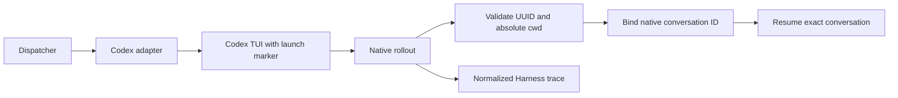

# Codex hosting and completion fixes — reviewer briefing

Codex can host a work item, resume its identified conversation, supply the
Harness trace and run one-shot reviews through the shared adapter. The latest
completion review tightens malformed rollout directory handling, packages the
required writing skill and updates the installation instructions.

## Where to focus

1. **Conversation recovery:** `cli/the_loop/codex_support.py` and
   `cli/the_loop/harness/codex_agent.py`. Recovery requires a native UUID,
   explicit absolute directory metadata and either the matching native ID or
   one unique launch marker. Check refusal paths for malformed metadata,
   ambiguity and escaping symlinks.
2. **Instructions and hooks:** `cli/hatch_build.py`, `cli/pyproject.toml` and
   `prepare_instructions`. Both operating and writing skills must survive a
   source-distribution rebuild. Existing instructions and hooks are preserved;
   native hook trust remains the operator's action through `/hooks`.
3. **Operator behavior:** the JSONL output/usage helper, MCP adapter selection,
   legacy argument migration, label diagnostics and read-only connection retry.
   Existing label ALL-of semantics and explicit modern arguments remain authoritative.

## Behavior and decisions

Codex keeps the operator's normal home and authentication. A unique launch
marker connects the loop's launch identity to Codex's native UUID; an unrelated
chat cannot change which conversation is resumed. No authentication is copied
into a separate home and no conversation is selected by recency.

The Stop hook uses Codex's continuation protocol and the existing bounded
retry cap. Installation preserves sandbox and approval policy and reports
the native hook trust step. Shared instruction resources include the sibling
writing skill so an installed wheel can follow the same procedures as a checkout.

## Evidence and limits

[Completion verification](completion-verification.md) records the six directory
regressions failing before the fix, **140 passing focused tests**, clean static
checks, and resource checks on the checkout wheel, source distribution and
rebuilt wheel. A wheel consumer prepares instructions and hooks idempotently.
[Earlier verification](codex-verification.md) records the broader full-suite
comparison and its environment failures.

**The requested fresh live test must run before merge.** The corrected wheel
was installed into a temporary target and invoked from the user's devbox cwd,
but the service did not become healthy and the poller could not write its log.
Machine installation, GitHub credentials and network access are blocked in
this session. No new test issue or successful end-to-end run is claimed.

## Completion still pending

Refresh the live issue, review threads, CI and frozen phase selections; publish
this briefing; install the corrected source and complete a new Codex issue-to-PR
run in the-loop-testing. Then complete the selected review and approval gates.
This briefing is prepared locally and has not been posted to GitHub.
