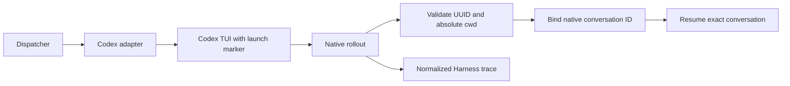

# Codex hosting and completion fixes — reviewer briefing

Codex can host a work item, resume its identified conversation, supply the
Harness trace and run one-shot reviews through the shared adapter. The latest
completion review tightens malformed rollout directory handling, packages the
required writing skill, preserves tracked project instructions and keeps CLI
start requests armed while the graph waits for phase selection.

## Where to focus

1. **Conversation recovery:** `cli/the_loop/codex_support.py` and
   `cli/the_loop/harness/codex_agent.py`. Recovery requires a native UUID,
   explicit absolute directory metadata and either the matching native ID or
   one unique launch marker. Check refusal paths for malformed metadata,
   ambiguity and escaping symlinks.
2. **Instructions and hooks:** `cli/hatch_build.py`, `cli/pyproject.toml` and
   `prepare_instructions`. Both operating and writing skills must survive a
   source-distribution rebuild. Tracked project instructions stay unchanged; the
   managed block uses Codex's global instruction file instead. Existing hooks are preserved;
   native hook trust remains the operator's action through `/hooks`.
3. **Operator behavior:** the JSONL output/usage helper, MCP adapter selection,
   legacy argument migration, label diagnostics and read-only connection retry.
   Existing label ALL-of semantics and explicit modern arguments remain authoritative.
4. **Start lifecycle:** `core/sessions.py` and `webhook/dispatcher.py`. An
   accepted start parked at a human gate reports `waiting` successfully and keeps
   its request; a genuine spawn failure still clears it. No gate is bypassed.

## Behavior and decisions

Codex keeps the operator's normal home and authentication. A unique launch
marker connects the loop's launch identity to Codex's native UUID; an unrelated
chat cannot change which conversation is resumed. No authentication is copied
into a separate home and no conversation is selected by recency.

The Stop hook uses Codex's continuation protocol and the existing bounded
retry cap. Installation preserves sandbox and approval policy and reports
the native hook trust step. Shared instruction resources include the sibling
writing skill so an installed wheel can follow the same procedures as a checkout.

## Evidence and limits

The installed branch ran Codex from the configured devbox cwd to complete
[the-loop-testing issue #3](https://github.com/MadaraUchiha-314/the-loop-testing/issues/3).
[PR #4](https://github.com/MadaraUchiha-314/the-loop-testing/pull/4) merged and
closed the issue. The real native conversation appeared in the service's Harness
trace. A later unrelated real Codex chat in the same worktree did not change
which conversation the installed adapter resolved.

[Completion verification](completion-verification.md) records the live IDs,
merge commit, hook trust review, source installation and regression evidence.
The latest startup/Codex/routing tests report **672 passed**; lint, formatting,
type checking and Markdownlint pass. Earlier wheel, source-distribution and
rebuilt-wheel resource checks and the 153-test instruction-preservation run are
recorded there too. GitHub checks were green on `fdf8261`; check the current
head's CI before merging.

The local full-suite runs retain an unrelated macOS session-ID assertion
failure; they are not reported as green. Interrupted TUI respawn and a blocking
Stop continuation were not exercised in the live smoke. Native hook review and
trust, normal issue-to-PR completion, rendered trace and recovery in the presence
of an unrelated chat were exercised.

## Remaining gate

The requested fresh live test is complete. PR #450 remains open; any selected
human approval and security sign-off still need an authorized human response.
No artifact approval or main-PR merge is inferred from running the smoke test.
