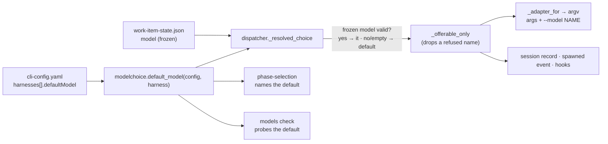

<!-- Authored per the the-loop:writing skill. -->

# Design: a default model per harness in `cli-config.yaml`

## Overview

`harnesses[].defaultModel` is read in one place, `modelchoice.default_model`, and applied
in one place, the dispatcher's `_resolved_choice` — the function every work-item launch
already calls to turn a frozen choice into `(model, effort)`. Because the default joins
the result there, it reaches the argv, the session record, the spawn event and the
lifecycle hooks through code that already exists, for every arming command (`start`,
`do`, `contribute`, `review`, an operator's own graph).



## Components

### `modelchoice.default_model(config, harness) -> str`

Returns the `defaultModel` of the `harnesses[]` entry named `harness`, stripped, when it
matches `NAME_RE`; otherwise `""`. No entry, a non-mapping entry, a non-string value or a
value outside the grammar all answer `""` (R1.3) — the module's fail-closed-by-shrinking
rule. It never consults `models[]` (R1.2): the default exists precisely for the install
that offers no choice.

### `modelchoice.config_findings`

One new warning: a harness that declares a `defaultModel` but whose adapter has no model
flag — "cannot be applied" (R2.5). It sits beside the existing "no model flag" warning,
which only fires when `models[]` is non-empty.

### Dispatcher: `_resolved_choice`

Today it returns `("", "")` early when nothing was frozen. The change:

1. Validate the frozen model as today (declared; candidate for this harness).
2. If the model is empty after that, take `default_model(config, harness)` (R2.1, R2.3).
3. Validate the effort as today.
4. Pass the pair through `_offerable_only`, unchanged, so a refused default is dropped
   and announced like a refused choice (R2.6).

The early return moves below step 2, so a work item that chose nothing still gets the
default. Everything downstream — `_adapter_for`'s `effective_args(base, model, effort)`,
`_spawn_tmux`'s record and `_before_launch` — already consumes the pair (R2.4).
`_adapter_for`'s no-choice path (the shared adapter, untouched) still holds whenever the
resolved pair is empty, so R5.1 holds by construction.

### The gate: `graph/hooks/selection.py`

The bootstrap already seeds `harnesses` into the hook's config, so the gate reads the
default with the same function.

- **Checklist tail** (R3.1): when the default harness declares a default model, the model
  section ends *"Leave them alone and this work item runs on `<model>`, the `<harness>`
  harness's default model."*; otherwise the current text.
- **Confirmation** (R3.2): with no model resolved and a default on the resolved harness,
  *"Model: **`<model>`**, the `<harness>` harness's default — no single row was ticked."*;
  otherwise the current text. The dropped-choice line names the default the same way.

The gate does **not** freeze the default into `work-item-state.json`. The state file
records a human's choice; the default is the operator's, read at launch, so changing it
moves every work item that did not choose — the same rule as `harnesses[].args`.

### `the-loop models check`

`_combinations` adds `(harness, "model", defaultModel)` for each declared harness with a
default, unless that pair is already in the list (R4.1).

## Data model

```yaml
harnesses:
  - name: claude
    default: true
    defaultModel: opus-5     # NEW — optional; same grammar as models[] names
    args: [--dangerously-skip-permissions]
```

Both schema copies (`.the-loop/` and `cli/the_loop/schemas/`) gain the property with the
`NAME_RE` pattern. `additionalProperties: false` stays.

## Decisions

- **On the harness, not on `models[]`.** A `models[].default: true` would be one default
  for every harness, and a model one harness refuses would then be the default for it
  too. The issue asks for a default *per harness*, and the harness entry is where the
  operator already says how that harness is launched.
- **Not required to be in `models[]`.** Requiring it would force an operator who wants a
  fixed model to also offer a choice on every checklist.
- **Read at launch, not frozen.** See the gate section. It also means a later
  `defaultModel` change re-launches a live session that resolves differently, through the
  existing drift rule (`_choice_drifted`), resuming its conversation.

## Error handling

| Fault | Result |
|-------|--------|
| `defaultModel` outside the grammar | ignored; no model flag (schema validation also rejects it) |
| harness has no model flag | ignored; `models list\|check` warns |
| default refused in the verdict cache | dropped at launch, `session.choice_refused` emitted |
| frozen model invalid | default model used instead |

## Testing strategy

Unit tests for `default_model` and the new finding; dispatcher tests over the fake tmux
for every R2 criterion and the abuse cases; gate tests for the two rendered lines; a
`models check` combination test. Details in [`testing-plan.md`](testing-plan.md).

## Security design

- The default is **operator-only**: read from `cli-config.yaml`, never from a reply, a
  label or `work-item-state.json`. A forged state file can at most fail validation, which
  now lands on the operator's default rather than on no flag.
- **Grammar at the read** (`NAME_RE`) as well as in the schema, because the daemon reads
  configs the schema did not validate (a hand-edited file after a reload). A value that
  could be a flag never reaches the argv (abuse 1).
- **Placement**: the value is always the operand of the adapter's own model flag,
  appended after the operator's `args` by `effective_args`; it cannot add, remove or
  reorder another argument.
- **Per harness**: looked up by the launch's harness name only (abuse 3).

No new endpoint, credential, file or network call is introduced.
