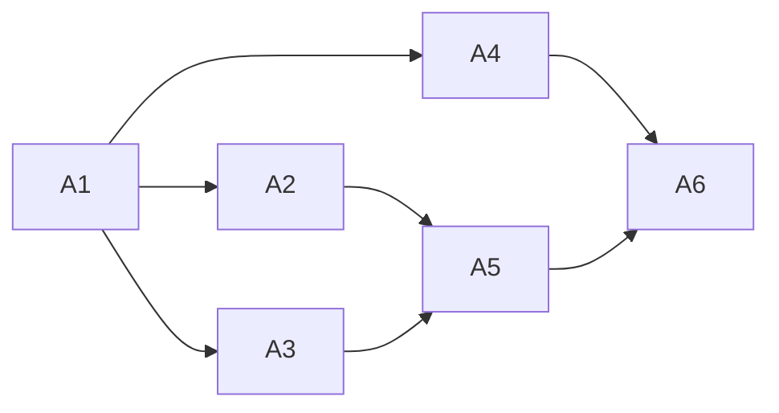

<!-- Authored per the the-loop:writing skill. -->

# Tasks: a default model per harness in `cli-config.yaml`

> Each task names the requirement it satisfies and the testing-plan row that proves it.

## Task list

- [x] **A1: vocabulary.** `modelchoice.default_model`, the no-model-flag finding, schema
  property in both copies. *Req:* R1, R2.5 · *Test:* T1, T5 · *Depends:* —
- [x] **A2: dispatcher.** `_resolved_choice` falls back to the harness's default.
  *Req:* R2, R5 · *Test:* T2 · *Depends:* A1
- [x] **A3: gate.** Checklist tail and confirmation name the default. *Req:* R3 ·
  *Test:* T3 · *Depends:* A1
- [x] **A4: probe.** `models check` combinations include the default. *Req:* R4 ·
  *Test:* T4 · *Depends:* A1
- [x] **A5: docs.** Config reference, template, `interactive-sessions.md`, skill text.
  *Req:* NFR · *Test:* T8 · *Depends:* A2, A3
- [x] **A6: verify.** T6–T8, evidence. *Depends:* A1–A5

