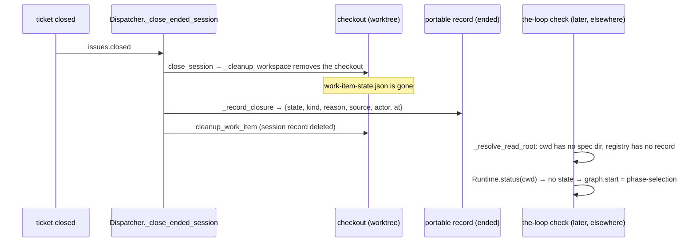

<!-- Authored per the the-loop:writing skill. -->

# Bugfix spec: a completed work item reads as unstarted once its checkout is cleaned up

> Phase 1 of 4 (bugfix → design → testing plan → tasks). Source:
> [issue-452](https://github.com/MadaraUchiha-314/the-loop/issues/452), observed during
> PR #450's Codex source-install run (the-loop 19.19.0, `keepCheckoutOnClose: false`).

## Summary

**The closure deletes the only copy of where the work item ended, and then `check`
guesses.** When a work item's ticket closes, the daemon removes the session's checkout
*before* it stamps the closure, and the stamp it writes says only "closed" or "merged".
The work item's `work-item-state.json` — the record of its graph, its frozen selections
and its pull requests — lived in that checkout. A later `the-loop check <ref>` from any
other directory finds no state file, falls back to the graph's start node and evaluates
the caller's directory: `phase-selection`, `ok: false`, and a list of "missing"
artifacts for phases the item never selected. A successful delivery reads as never
started.

## Steps to reproduce

1. Complete a work item in a managed worktree (`routing.workspace`,
   `keepCheckoutOnClose: false`); merge its pull request and close the issue as an
   authorized user.
2. Let the closure run: the session closes, the checkout and the session record are
   removed.
3. From an unrelated directory (the daemon's deployment directory):
   `the-loop check github:<owner>/<repo>#<n> --format json --fail-on block`.

## Expected vs actual

- **Expected:** the report says the work item is archived, with its completion outcome
  and time, the phases it selected and the pull request that delivered it — or says
  plainly that the archived detail is unavailable.
- **Actual** (from the issue):
  `{"currentNode": "phase-selection", "ok": false, "stateFound": false, "pointer": ""}`,
  a `statePath` under the caller's nonexistent `docs/specs/issue-3/`, and node findings
  for the full process.

## Root cause (confirmed)

- `Dispatcher._close_ended_session` calls `close_session` (which removes the checkout
  unless `keepCheckoutOnClose`) and only then `_record_closure`. Nothing reads the
  state file between the two.
- The `ended` section (issue-329) holds the closure's facts only. It is the one record
  that survives cleanup by design (`cleanup.py`: "the portable half … is kept on
  purpose"), but it carries nothing about the graph.
- `core.graphs.check` knows only the repository it is pointed at. With no state file it
  reports the start node and evaluates every node against that directory (issue-396 made
  the miss *visible* through `stateFound`, not *answerable*).
- A closure delivered by the poller carries no `state_reason`, so even the event that
  could tell a cancellation from a completion loses that fact on one of its two paths.

## Requirements

### Requirement 1 — the closure keeps a durable terminal record

**User story:** As an operator, I want the end of a work item to be recorded somewhere
that outlives its checkout, so that what it delivered is still answerable after normal
cleanup.

#### Acceptance criteria (EARS)

1. WHEN the dispatcher closes a work item's session on that work item's upstream closure
   THEN it SHALL read the work item's `work-item-state.json` from the session's checkout
   **before** removing the checkout, and SHALL write a `terminal` record into the
   portable `ended` section naming: the spec id, the loop, the last node and phase,
   whether the loop's completion node was claimed and when, the frozen selections
   (declared skips, selected opt-ins, surface, harness, model, effort, PR-session mode,
   contributing repositories), the delivering pull requests (ref, URL, upstream state),
   the spec directory and the evidence files present.
2. The `ended` stamp SHALL carry an `outcome`: `completed` WHEN the terminal record shows
   the completion node claimed; otherwise `cancelled` WHEN the closure is an issue
   closed as not planned or as a duplicate, or a pull request closed without merging; otherwise
   `closed-externally` WHEN a terminal record was read; otherwise `unknown`.
3. The system SHALL NOT infer `completed` from the closure alone: a closed or merged
   ticket whose recorded graph did not claim its completion node SHALL NOT be
   `completed`.
4. WHEN a tracked work item with no live session closes AND the session registry still
   records a checkout that is a directory THEN the terminal record SHALL be read from
   it; otherwise the stamp SHALL be written without one.
5. WHEN an authorized `cleanup` runs on an ended work item whose stamp has no terminal
   record AND its checkout is still on disk THEN the system SHALL add the terminal
   record before the checkout is removed.
6. WHEN the poller synthesizes a closure THEN the event SHALL carry the provider's
   `state_reason`, so a polled not-planned closure is classified exactly as a pushed one.
7. Recording SHALL NOT write into the checkout or the ticket, and SHALL NOT change the
   work item's frozen selections; normal checkout cleanup SHALL be unchanged.

### Requirement 2 — `check` reports an archived work item as archived

**User story:** As an operator checking a finished work item from any directory, I want
the report to say it is archived and how it ended, so that a delivered item never reads
as unstarted.

#### Acceptance criteria (EARS)

1. WHEN `check` is given a work-item **ref** AND no `work-item-state.json` is found at
   the resolved repository AND the portable record for that ref carries an `ended` stamp
   THEN the report SHALL carry `archived` (`outcome`, `state`, `reason`, `at`, `actor`,
   `detail`, and the `terminal` record when there is one), SHALL list **no** node
   findings, SHALL set `currentNode` and `pointer` to the recorded node (`""` when none),
   and SHALL set `ok` true only for `completed`.
2. WHEN the stamp has no terminal record THEN `archived.detail` SHALL be `unavailable`
   and the CLI SHALL say that the archived detail is unavailable — never a start-node
   position.
3. WHEN the state file is found THEN the report SHALL be unchanged. WHEN `--recompute` is
   given AND the work item's spec directory exists at the resolved repository THEN the
   artifacts SHALL be evaluated as today.
4. A bare id SHALL NOT consult the archive; the portable record is keyed by ref.
5. The table output SHALL print `ARCHIVED — <outcome>` with the closure, the selections,
   the pull requests and the evidence; `--fail-on block` SHALL exit 0 for an archived
   item and `--fail-on unmet` SHALL exit 0 only for `completed`. `graph status <ref>`
   SHALL render the same.
6. The answer SHALL come from the portable record alone, so a fresh process after a
   daemon restart SHALL give it; `check` SHALL stay pure (no network, no subprocess, no
   write) and SHALL NOT relaunch the item or replay an approval.
7. The fix SHALL include regression tests that fail before it and pass after: closure
   with checkout removal followed by `check` from an unrelated directory, from a fresh
   store (daemon restart); the three outcomes; the unavailable detail.

## Security considerations

- **Actors & trust:** the closure's facts (`state`, `reason`, `state_reason`, `actor`)
  come from the provider's event, as today. The terminal record is copied from
  `work-item-state.json`, which is **agent-writable** (issue-109): a session could edit
  its own file to claim completion. The record is therefore a report, never an
  authority: nothing reads it back into routing, a gate, a spawn or a cleanup, and it
  grants nothing. Every field is filtered on the way in exactly as the runtime filters
  it on read — the node must exist in the compiled graph, skips go through
  `declared_skips`, opt-ins through `selected`, a pull request's URL is re-derived from
  its parsed ref.
- **Abuse cases:** (a) a forged state file claims `complete` → the archive says
  `completed`, which `check` already would have said from the same file; no gate moves.
  (b) Hostile evidence filenames (control characters, very many files) → names outside
  a plain-path character set are dropped and the list is capped, so a terminal escape
  cannot reach the CLI's output. (c) A close event for an untracked ref → no record is
  created (issue-329's rule, unchanged).
- **Fail closed:** an unreadable or foreign checkout yields no terminal record and an
  `unknown` outcome — never `completed`.
- No new endpoint, scope, credential or network call; the poller reads `state_reason`
  from the response it already fetches.

## Out of scope

- Recovery after machine loss (issue-363): this record is the operator's portable file,
  and carrying it to another machine is that issue's subject.
- Reading the delivering repository's committed state over the network.
- `check --all`, which discovers spec directories in a checkout and has no refs.
- Recording a terminal record for a work item that is cleaned up while still open.
- A closed item **re-armed without being reopened** keeps its `ended` stamp (issue-329's
  rule: only a reopen clears it), so until its new session writes a state file `check
  <ref>` from another directory still answers from the archive. Reopening the ticket is
  the supported way to resume closed work.

## Open questions

None.
