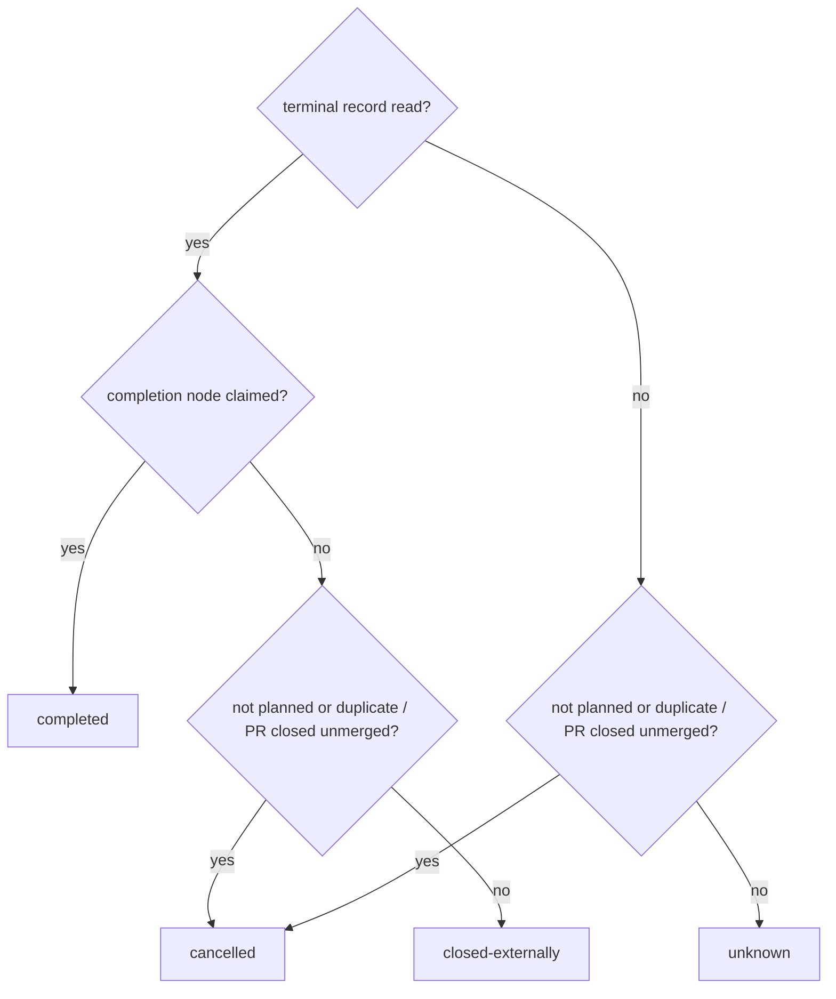

<!-- Authored per the the-loop:writing skill. -->

# Design: a work item's terminal record outlives its checkout

> Derived from [`bugfix.md`](bugfix.md). Phase 2 of 4.

## Overview

**Copy the ending into the record that already survives cleanup, then let `check` read
it.** The portable `ended` section (issue-329) is written on the dispatcher's one close
path and is kept by cleanup on purpose. It gains two fields: an `outcome` and a
`terminal` record copied from `work-item-state.json` **before** the checkout goes. When
`check <ref>` finds no state file where it looked, it reads that section and answers
"archived" instead of evaluating the caller's directory from the start node.

Three changes, one per side, plus a field the poller was dropping:

1. **Write.** `Dispatcher._close_ended_session` reads the terminal record while the
   checkout still exists and hands it to `_record_closure`, which classifies the outcome
   and stamps both. The explicit `cleanup` verb backfills a stamp that lacks one.
2. **Read.** `core.graphs.check` returns an archived report when the state file is
   missing, the work item was named by ref, and the ref's portable record says it ended.
3. **Render.** `the-loop check` and `the-loop graph status` print `ARCHIVED — <outcome>`
   and the record; JSON, the API and the MCP tool carry `archived`.
4. **Poller.** The synthesized closure event carries the issue's `state_reason`, which
   the REST response it already fetches has.

## Architecture

```mermaid
sequenceDiagram
  participant GH as closure (webhook or poll)
  participant D as Dispatcher._close_ended_session
  participant GL as GraphLink.terminal_record
  participant W as checkout
  participant P as portable/&lt;slug&gt;.json · ended
  participant C as core.graphs.check (any cwd, any process)
  GH->>D: closed (state_reason)
  D->>GL: read, before anything is removed
  GL->>W: work-item-state.json + evidence/ listing
  GL-->>D: terminal record (or None)
  D->>W: close_session → checkout removed (unchanged)
  D->>P: ended = {state, kind, reason, source, actor, at, outcome, terminal}
  C->>C: state file not found at the resolved repo
  C->>P: ended for this ref?
  P-->>C: stamp
  C-->>C: archived report — no node findings
```

## Components & interfaces

| Component | Change |
|-----------|--------|
| `the_loop/archive.py` *(new)* | Pure helpers, no I/O beyond what the caller hands in: `terminal_record(rt, item_id)` builds the record from a runtime's state and graph; `closure_outcome(terminal, cancelled)`; `cancelled(event, payload, reason)`; `ended_for(ref, config)` reads one portable section; `archived_report(work_item, stamp, state_path)` shapes the check answer. |
| `GraphLink.terminal_record(work_item, cwd)` | A guarded **read** (`action="archive"`) behind the same ownership and containment gates as `context`, outside the state lock, with `require_started=False` (the closure is about to disarm the item) and no `no-spec-dir` skip event (a ticket with no spec directory has no record to copy). |
| `Dispatcher._close_ended_session` | Reads the terminal record before `close_session` and passes it to `_record_closure`. |
| `Dispatcher._record_closure(…, terminal=None)` | When no record was handed in, reads one from the checkout the registry still records, if that is a directory. Adds `outcome` and `terminal` to the stamp. |
| `Dispatcher.cleanup_work_item` | Before `on_cleanup`: if the item's stamp exists and has no `terminal`, reads one from the checkout and re-stamps. |
| `core.graphs.check` | After evaluating, if `stateFound` is false, the argument was a ref, the ref has an `ended` stamp, and not (`recompute` and the spec directory exists): return the archived report instead. |
| `commands/graph_cmd.py` | `_render_archived(report)` used by `check` and `graph status`; `_state_line` names the archive; `_fails` unchanged (an archived report has no nodes and `ok` set by outcome). |
| `ghapi.GhItemState`, `poller.base.Closure`, `GitHubSource.closure_event` | `state_reason` read from the issue document and written into the synthesized `issue` entity. |

## Data models

The `ended` section, additive (the six keys of issue-329 are unchanged):

```json
{
  "state": "closed", "kind": "issue", "reason": "issue-closed",
  "source": "webhook", "actor": "octocat", "at": "2026-10-02T22:30:00Z",
  "outcome": "completed",
  "terminal": {
    "workItem": "issue-3",
    "loop": "pdlc-work-item-loop",
    "node": "complete",
    "phase": "complete",
    "completed": true,
    "completedAt": "2026-10-02T22:29:41+00:00",
    "selections": {
      "skipped": ["brainstorming", "requirements-definition", "…"],
      "optedIn": [],
      "surface": "", "harness": "codex", "model": "", "effort": "",
      "sessionPerPr": "", "repos": []
    },
    "pullRequests": [
      {"ref": "github:o/r#4", "url": "https://github.com/o/r/pull/4", "state": "merged"}
    ],
    "specDir": "docs/specs/issue-3",
    "evidence": ["verification.md"],
    "recordedAt": "2026-10-02T22:30:00+00:00"
  }
}
```

`outcome` is one of `completed | cancelled | closed-externally | unknown`:



The **completion node** is the loop's terminal node whose stage or id is `complete`;
"claimed" means its record carries an outcome, which only `the-loop graph complete`
at that node writes. `cleanup` and `escalated` are terminal but are not completion.

The archived check report (`archived` is the only new key; the rest keep their types):

```json
{
  "workItem": "issue-3", "currentNode": "complete", "pointer": "complete",
  "ok": true, "parked": null, "nodes": [],
  "statePath": "/srv/devbox/docs/specs/issue-3/work-item-state.json",
  "stateFound": false,
  "archived": {
    "ref": "github:o/r#3", "outcome": "completed", "detail": "recorded",
    "state": "closed", "reason": "issue-closed", "at": "…", "actor": "octocat",
    "terminal": { "…": "as above" }
  }
}
```

`detail` is `recorded` with a terminal record and `unavailable` without one; with
`unavailable`, `currentNode` and `pointer` are `""`.

## Error handling

- **Every read on the write side is advisory.** A checkout that is gone, foreign or
  unreadable, a graph that fails to load, a corrupt state file: `terminal_record`
  returns `None` and the closure is stamped exactly as before plus `outcome: unknown`
  (or `cancelled`). A closure never fails because the record could not be read.
- **A stamp that is not a mapping** reads as "not ended" (existing `ControlStore.ended`
  rule), so `check` falls through to today's report.
- **No CLI config / no portable directory:** `ended_for` returns `None`; `check` is
  unchanged. This is what keeps `check` working in CI.
- **A malformed `terminal` value** (not a mapping) is treated as absent: `detail:
  unavailable`.
- **A second delivery of the same closure** (the webhook and the poller both see it)
  finds the checkout gone. `_record_closure` keeps the record the first stamp holds
  rather than replacing it with nothing, and a prior `cancelled` stays cancelled.
- **An operator closes the session during the endgame hold** (issue-405): `close_session`
  and `cleanup` read the record onto the held entry before removing the checkout, and
  the sweeper stamps it from there.
- **Any exception from the read** — an injected coupling, the ownership probe — is
  `None`: the closure still closes and stamps.
- **The cleanup backfill races a reopen:** it re-reads the stamp under the portable
  store's lock and writes only if it is unchanged, so a reopen in the window wins.

## Security design

- **The terminal record is a copy of an agent-writable file and is used as a report
  only.** Nothing reads `ended.terminal` or `ended.outcome` back into routing, a gate, a
  spawn, a cleanup or the attention surfaces. Restating issue-109's rule: a session
  that edits its own state file can change what `check` prints, which it already can;
  it cannot move a gate.
- **Filtered on write, as the runtime filters on read.** The node is kept only if the
  compiled graph has it; skips are `Runtime.declared_skips` (graph-validated, so a forged
  skip of `security-review` is not recorded as a selection); opt-ins are
  `Runtime.selected`; a pull request is kept only if its ref parses, and its URL is
  re-derived from the parsed ref rather than copied; scalar choices are kept only when
  they are short printable strings.
- **Terminal-safe output.** Evidence names are kept only when they match a plain
  relative-path character set (`[A-Za-z0-9._/-]`, no `..`), at most 50 of them, so a
  filename carrying an escape sequence cannot reach the operator's terminal through
  `check`. `completedAt` must be ISO-8601 shaped. A symlinked `evidence/` (or one that
  resolves outside the spec directory) is not listed, links inside are not followed,
  and the walk stops after 1,000 entries — it runs on the close path, and
  `evidence -> /` must not hold a closure up or list another directory.
- **Same trust boundary for the closure facts.** `state_reason` comes from the provider
  event or the REST document the poller already fetches; an unrecognized value is not
  "not planned".
- **No new surface.** No endpoint, scope, credential or outbound call. `check` stays pure.

## Testing strategy

Tests first, red against the current tree (see `testing-plan.md`):

- unit: `archive.terminal_record` against a real runtime and state file (completed, mid-
  flight, forged fields filtered, hostile evidence names); `closure_outcome` truth table;
  `core.graphs.check` archived branch (ref vs id, found vs not, recompute);
- dispatcher: the closure stamps `terminal` + `outcome` before the checkout is removed;
  the session-less path; the cleanup backfill; a not-planned close; the poller's
  `state_reason`;
- integration: a real dispatcher, a real git worktree removed on closure
  (`keepCheckoutOnClose: false`), then `the-loop check <ref> --format json --fail-on
  block` from an unrelated directory and through a freshly built store (daemon restart).

## Trade-offs & decisions

- **The portable `ended` section, not a new file or the checked-in state.** The record
  that survives cleanup already exists, is written by the one close path and is cleared
  by a reopen; a second file would need its own lifecycle. The checked-in state in the
  delivering repository is the authority, but reading it needs the network, which
  `check` must not use.
- **Snapshot at closure, not at `graph complete`.** The closure is the only moment the
  work item is known to be over, and the completion claim may never come (a cancelled or
  externally closed item still deserves a record).
- **`ok` only for `completed`.** `check`'s `ok` means "satisfied"; a cancelled item is
  not, and `--fail-on block` already exits 0 for it because nothing is agent-fixable.
- **A ref is required.** The portable record is keyed by ref; guessing which repository
  a bare `issue-3` belongs to across several would be a wrong answer some of the time.

## Open questions

None.
