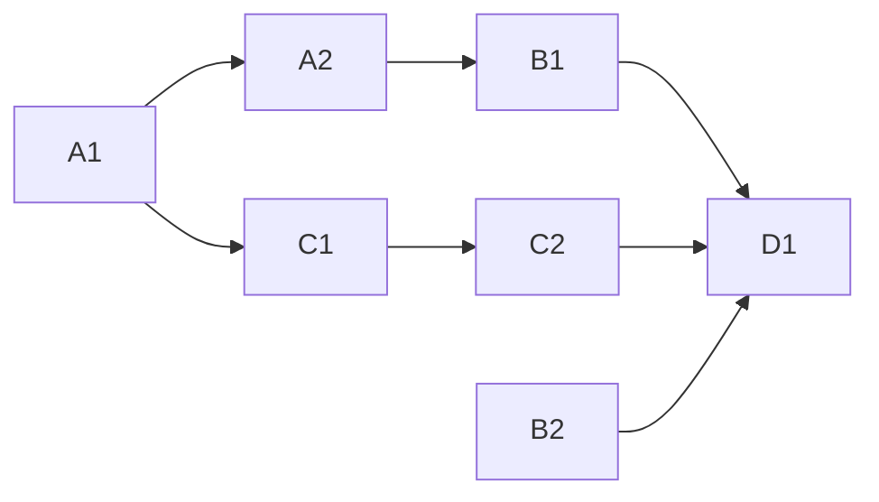

<!-- Authored per the the-loop:writing skill. -->

# Tasks: a work item's terminal record outlives its checkout

> Phase 4 of 4. Each task names the requirement it satisfies and the testing-plan row
> that proves it; the test lands with the change (red first).

## Task list

- [x] **A1 — `the_loop/archive.py`.** `terminal_record`, `closure_outcome`, `cancelled`,
      `ended_for`, `archived_report`. *Req:* R1.1–R1.3, R2.1, R2.2 · *Test:* T1, T7.
- [x] **A2 — `GraphLink.terminal_record`.** The guarded read. *Req:* R1.1 · *Test:* T3.
      *Deps:* A1.
- [x] **B1 — the close path.** `_close_ended_session` reads before `close_session`;
      `_record_closure` stamps `outcome` + `terminal`; `cleanup_work_item` backfills.
      *Req:* R1.1, R1.2, R1.4, R1.5, R1.7 · *Test:* T3. *Deps:* A2.
- [x] **B2 — the poller's `state_reason`.** `GhItemState`, `Closure`, `closure_event`.
      *Req:* R1.6 · *Test:* T4.
- [x] **C1 — `core.graphs.check` archived branch.** *Req:* R2.1–R2.4, R2.6 · *Test:* T2,
      T10. *Deps:* A1.
- [x] **C2 — CLI rendering.** `check` and `graph status` print the archive. *Req:* R2.5 ·
      *Test:* T5. *Deps:* C1.
- [x] **D1 — docs and evidence.** API/MCP descriptions and the authored OpenAPI text,
      `docs/cli/commands/check.md`, capability docs, evidence files. *Deps:* B1–C2.

## Dependency graph (DAG)

## Checkpoints

- After A1 + C1: `tests/test_archive.py` green.
- After B1 + B2: `tests/test_archive_dispatch.py` and the existing closure/cleanup suites
  green.
- After C2: `tests/test_archive_integration.py` green.
- After D1: full suite, ruff, pyright, markdownlint.

## Review comments

*None yet.*
