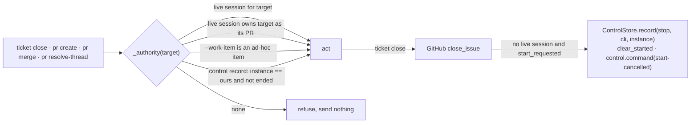

<!-- Authored per the the-loop:writing skill. -->

# Design: ownership read off the control record

> Phase 2 of 3. Derived from [`requirements.md`](requirements.md) and reviewed with
> [`testing-plan.md`](testing-plan.md). The decision is
> [decision-141](../../decisions/decision-141.md), refining decision-140 D8.

## Overview

The lifecycle guard, `core.github_ops._authority`, answers "may this instance act on this
ref?" for `pr create`, `pr merge`, `pr resolve-thread` and `ticket close`. Today it has
three sources of yes, all from the session registry. This adds a fourth from the store the
instance already keeps for arming: the work item's control record, when this instance
wrote it and the item has not ended. `close_ticket` then finishes a parked item's close
by recording the stop a human would otherwise type.



## Components

### `core.github_ops._accepted_here(target, config) -> bool`

The new source. It reads the control store the module already builds for `_is_adhoc`:

1. `record = store.get(target)`; `None` or unreadable → `False` (R3.4).
2. `record.instance != instance_config(config).name` → `False` (R3.2). The name comes from
   the config the call was given, through `core.instance.instance_config`, which is the
   one reading of the `instance` block (decision-109 D1). An unnamed instance owns only
   unnamed records.
3. `store.ended(target) is not None` → `False` (R3.3).
4. Otherwise `True` (R1.1).

The command is not inspected. The record is the instance's claim on the item, whichever
verb wrote it last; a stopped-but-not-ended item is still tracked here, which is also how
`describe_instance` and `_managed_here` already count the managed set (issue-322). That
keeps a second `ticket close` after the first one's stop authorized (R2.4).

### `core.github_ops._authority`

One more clause before the refusal: `if _accepted_here(target, config): return ""`. It
reads the control record for `target` only (R1.3); the pull-request scan over live
sessions is unchanged.

### `core.github_ops.close_ticket`

After GitHub accepts the close:

```python
cancelled = _cancel_pending_start(target, config, registry_dir)
data["startCancelled"] = cancelled
```

`_cancel_pending_start` returns `False` at once when the registry has a live session for
the target (R2.6) or the store does not say `start_requested` (R2.4). Otherwise it
records `stop` with `source="cli"`, the local actor and this instance's name — the same
record `sessions stop` writes — clears the `work_item_start` mark, emits
`control.command` (`command=stop, source=cli, effect=start-cancelled`) and returns
`True`. The output gains the line `cancelled the pending start for <ref>` (R2.3).

The spawn gate (`Dispatcher._spawn_gate`, `control.require_start_command`) reads
`start_requested`, which is false once the last command is `stop`; so a later labelled
or control-start event answers `awaiting-start` and spawns nothing (R2.5). The daemon's
own `closed`-event path later clears the record and stamps `ended`, as for any close.

### Surfaces

The route, facade and MCP tool call `close_ticket` and return its data; the new field
travels with it. The CLI prints the messages. No signature changes.

## Data model

No new file or section. `startCancelled` joins the close result. The control record's
`stop` is the existing shape.

## Error handling

| Case | Outcome |
|---|---|
| no source of ownership | exit 1, the existing refusal text, nothing sent |
| GitHub refuses the close | exit 1 as today; no stop is recorded (the ticket is still open and armed) |
| the stop record cannot be written | the close already happened: exit 0, `startCancelled: false`, a stderr line saying the start could not be cancelled and `sessions stop` is the remedy |

## Security design

| Boundary (requirements) | Enforcement |
|---|---|
| a planted record for an unrelated ref | the record must carry this instance's name as the **config** declares it; a named record on an unnamed instance, or vice versa, is not ours (R3.2, abuse 1–2) |
| a record outliving the item | `ended` wins over `control` (R3.3, abuse 3) |
| closure becoming a launch | the stop is recorded through `ControlStore.record`, the one writer the gate reads; no path arms an item on close (R2.5, abuse 4) |
| unreadable store | `ControlStore.get` already returns `None` on a bad record; `_accepted_here` catches the rest (R3.4) |

Nothing from GitHub, a comment or a label is read by the guard.

## Testing strategy

Unit tests over `FakeGitHubClient` in `test_github_ops.py` for the guard and the close;
an integration module with the real dispatcher for parked closure, a denied planted
record and the session-backed path. See [`testing-plan.md`](testing-plan.md).
