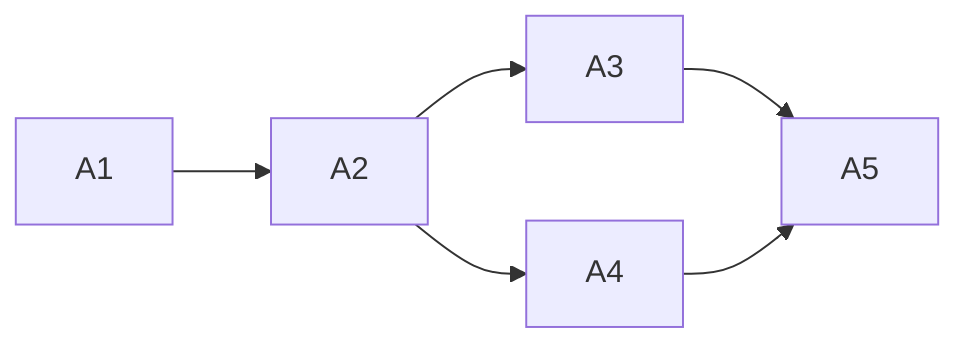

<!-- Authored per the the-loop:writing skill. -->

# Tasks: a parked work item is owned by the instance that accepted it

> Each task names the requirement it satisfies and the testing-plan row that proves it.

## Task list

- [x] **A1: guard.** `_accepted_here` and its clause in `_authority`. *Req:* R1, R3 ·
  *Test:* T1, T3 · *Depends:* —
- [x] **A2: cancellation.** `_cancel_pending_start` in `close_ticket`; `startCancelled`
  in the result. *Req:* R2 · *Test:* T2 · *Depends:* A1
- [x] **A3: integration.** `test_parked_closure_integration.py` over the real
  dispatcher. *Req:* R2.5, R2.6, R3.2 · *Test:* T4 · *Depends:* A2
- [x] **A4: docs.** `ticket.md`, `capabilities/cli.md`, decision-141, the MCP tool's
  docstring. *Req:* NFR · *Test:* T7 · *Depends:* A2
- [x] **A5: verify.** T5–T7, evidence. *Depends:* A1–A4

