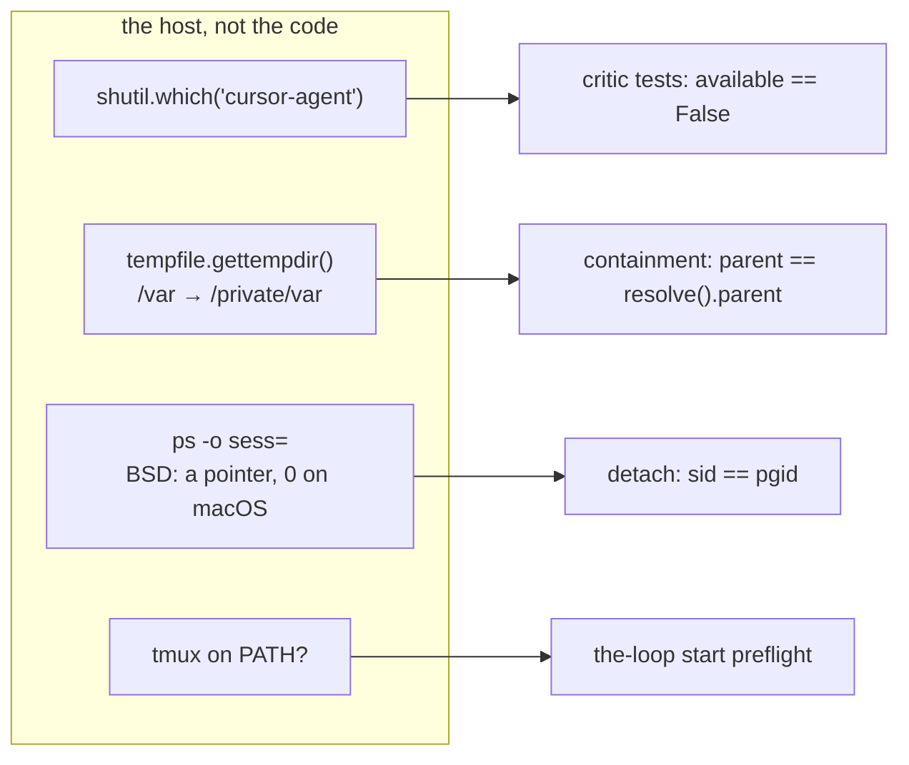

<!-- Authored per the the-loop:writing skill. -->

# Bugfix spec: the CLI suite reads the machine it runs on

> Phases 1–2 of 4 (bugfix+design → testing plan → tasks). Source:
> [issue-454](https://github.com/MadaraUchiha-314/the-loop/issues/454), observed on macOS
> during [#450](https://github.com/MadaraUchiha-314/the-loop/pull/450) (issue-449).

## Summary

On a developer's Mac the suite reported four failures that Linux CI never sees. None was a
product regression. Each was a test asserting something about **the host** instead of the
code:

1. **Two critic-availability tests assume `cursor-agent` is not installed.**
   `Critic.available` is `shutil.which(binary) is not None`, and the tests hard-code
   `False`. A developer who has the Cursor CLI gets `True` and a red suite.
2. **The gate's temp-dir containment test compares a resolved path with an unresolved
   one.** On macOS `tempfile.gettempdir()` is `/var/folders/…`, an alias of
   `/private/var/folders/…`. `path.parent == path.resolve().parent` is false there even
   though nothing escaped.
3. **The daemon detachment test reads the session ID from BSD `ps -o sess=`.** Where
   there is no `/proc`, `_stat()` falls back to `ps`. On BSD `sess` is a kernel session
   *pointer*, not the numeric SID, and macOS prints `0`. The assertion
   `sid == pgid != getpgid(0)` then fails on a correctly detached daemon.
4. **Eight daemon and ingress tests need `tmux` to exist, without saying so.**
   `the-loop start` refuses to run without tmux on PATH (`runner.check_dependencies`).
   None of these tests runs tmux, but each fails if the host lacks it. That is why the
   operator's isolated-PATH rerun "produced unrelated ingress failures".

**The fix.** Each test now controls what it asserts on:

- The critic tests fix the result of `shutil.which` themselves. They check both answers,
  installed and not installed.
- The containment test compares canonical paths on both sides. A new test recreates the
  macOS alias on any POSIX host, using a temp dir that is a symlink.
- `_stat()` reads the session and group from `os.getsid` and `os.getpgid`. These POSIX
  calls return numeric IDs on Linux and macOS alike. Only the parent PID still comes from
  `/proc` or `ps -o ppid=`, a column every `ps` agrees on.
- A `preflight_tmux` fixture puts a stub `tmux` on the daemon's PATH. The stub satisfies
  the preflight. If anything actually runs it, the test fails.

No production code changes.

## Steps to reproduce (on Linux, no Mac needed)

1. **Installed harness.** Put a stub `cursor-agent` on PATH:

   ```console
   $ mkdir stub && printf '#!/bin/sh\n' > stub/cursor-agent && chmod +x stub/cursor-agent
   $ PATH=$PWD/stub:$PATH uv run python -m pytest -q tests/test_core_repo.py tests/test_critics.py
   FAILED tests/test_core_repo.py::test_critics_lists_the_cli_configs_entries_without_argv
   FAILED tests/test_critics.py::test_list_reports_availability
   ```

2. **Aliased temp dir.** Point `TMPDIR` at a symlink to a real directory. This is the
   shape of macOS's `/var` → `/private/var`.
3. **BSD `ps`.** Run `_stat()` with `/proc` hidden. `ps -o sess=` on Linux returns the SID,
   so the defect only shows on BSD. The design below removes the column instead of
   emulating it.
4. **No tmux.** Run the daemon tests with a PATH that holds no `tmux`. Seven fail in
   `test_poll_daemon_integration.py`, and one in `test_hosted_ingress_integration.py`. The
   log says: `missing dependency: tmux — install it (…)`.

## Expected vs actual

| | Expected | Actual |
|---|---|---|
| the critic tests on a host with `cursor-agent` installed | pass; the same verdict as CI | fail: `available` is `True` |
| the containment test where the temp dir is an alias (macOS) | pass; nothing escaped | fail: `/var/…` ≠ `/private/var/…` |
| the detachment test on macOS | pass; the daemon is in its own session | fail: `sid` reads `0` from `ps -o sess=` |
| the daemon/ingress tests on a host without tmux | pass; they never run tmux | fail: the preflight refuses to start the poller |

## Root cause



Each assertion read a fact that differs between machines. CI passed only because its
host matched what the tests assumed: no Cursor CLI, a canonical `/tmp`, a `/proc`, and
tmux installed.

## The fix (design)

| Defect | Change | Why this and not the alternative |
|---|---|---|
| 1. critic availability | `monkeypatch` `critics.shutil.which` in both tests; `test_core_repo` is parametrised over installed / not installed, and `test_critics` adds a `claude` critic that resolves | Skipping on an installed CLI would drop coverage on exactly the machines that have one. Isolating PATH is the broad workaround the ticket rules out. The tests now assert both branches of `available` on every host |
| 2. path containment | assert `path.parent == gettempdir()` (built where it should be) **and** `path.resolve().parent == gettempdir().resolve()` (still there after symlinks), parametrised over four hostile refs; plus a symlinked-temp-dir test | A plain `resolve()` on both sides keeps the escape check: an id embedded raw would resolve outside the temp dir. The symlink test runs the macOS alias on Linux CI, and it first asserts that the alias is in play, so the old comparison would fail there |
| 3. process metadata | `sid = os.getsid(pid)`, `pgid = os.getpgid(pid)`; `ppid` from `/proc/<pid>/stat`, else `ps -o ppid=` | `getsid(2)` is POSIX and numeric on Linux and macOS (XNU returns the session leader's PID). The detachment assertion is unchanged: it still fails for a child that shares the test's session (checked, see `evidence/verification.md`) |
| 4. tmux | `preflight_tmux` fixture in `conftest.py`, used by every test in the two daemon modules: a stub `tmux` first on the daemon's PATH that records any call and exits 1, and fails the test at teardown if it was called | A recording run showed **zero** tmux calls across all 11 tests in those modules, so they need the preflight only. A `skipif(no tmux)` would hide them on such hosts. The stub also keeps them off the developer's real tmux server. The tripwire turns "this test now really uses tmux" into a failure that says so |

No test that runs real tmux exists today. In the no-tmux run, the only failures were these
eight. The tmux runner tests already use their own stub binary.

## Requirements

### Requirement 1 — availability tests control executable discovery

#### Acceptance criteria (EARS)

1. WHEN a critic-availability test runs THEN it SHALL fix what `shutil.which` resolves, so
   the result SHALL be the same on a host with or without any harness CLI installed.
2. The tests SHALL cover both an available and an unavailable critic.

### Requirement 2 — path containment is compared canonically

#### Acceptance criteria (EARS)

1. WHEN the gate's attempts path is checked for containment THEN both sides SHALL be
   compared canonically (`resolve()`), so an aliased temp dir SHALL NOT read as an escape.
2. The negative coverage SHALL remain: a work-item id containing `..`, `/` or an absolute
   path SHALL still be asserted to land directly inside the temp dir.
3. A test SHALL recreate an aliased temp dir (a symlink) on any POSIX host and SHALL
   assert both that the alias is in effect and that containment holds through it.

### Requirement 3 — detachment is proved with platform-appropriate process metadata

1. WHEN a daemon test reads a process's session and process group THEN it SHALL use
   `os.getsid` and `os.getpgid`, and SHALL NOT read the BSD `ps` `sess` column.
2. The detachment assertion (own session, its own group leader, not the test's group) and
   the pidfile-ownership and log assertions SHALL be kept unchanged.

### Requirement 4 — the tmux dependency is explicit

1. WHEN a daemon test needs tmux only to pass `the-loop start`'s preflight THEN it SHALL
   get it from an explicit fixture, not from the host's PATH.
2. IF such a test invokes tmux THEN the fixture SHALL fail the test and name the call.

### Requirement 5 — the normal command works on supported hosts

1. `make test` (`cd cli && uv run python -m pytest -q`) SHALL pass on a supported Linux or
   macOS host without a bespoke `TMPDIR` or `PATH`, whether or not tmux or any harness CLI
   is installed.
2. No test SHALL be skipped for the conditions above.

## Security considerations

- **No runtime surface changes.** Only `cli/tests/**` and docs are touched. The
  preflight in `runner.check_dependencies`, the critic resolution in `critics.py` and the
  gate's `attempts_path` are unchanged.
- **The tmux stub is scoped to the subprocess environment of the test that asks for it.**
  It lives under that test's `tmp_path`. It is prepended only to the `environ` dict passed
  to the daemon subprocess, never to the test process's own `PATH`. It cannot reach the
  developer's tmux server, and it reduces risk: before, a test daemon resolved the
  host's real tmux.
- **The path-escape check is kept, not weakened.** It is now parametrised over four
  hostile refs, and the symlink test adds a case the old one could not see.
- No new dependency. No path under `.the-loop/**`, `.github/workflows/**`, `**/*schema*`,
  `**/auth/**`, `**/*secret*` or `**/*credential*` is touched. Risk tier 2.

## What it costs

- The detachment tests now read `ppid` and the IDs from different sources. They are
  read microseconds apart from a long-running daemon, so they cannot disagree in a way the
  assertions care about.
- A daemon test that starts to genuinely use tmux will fail on the tripwire until it
  declares a real dependency. That failure is intended.

## Out of scope

- A macOS CI job. The ticket asks for portability, not a new platform matrix. The
  symlink test and the `getsid` change make the macOS-specific causes run on Linux CI.
- The other host-dependent tests the operator did not hit. A run with stub `claude`,
  `codex`, `cursor-agent`, `aider` and `ttyd` on PATH found no others; see
  `evidence/verification.md`.

## Open questions

None.
