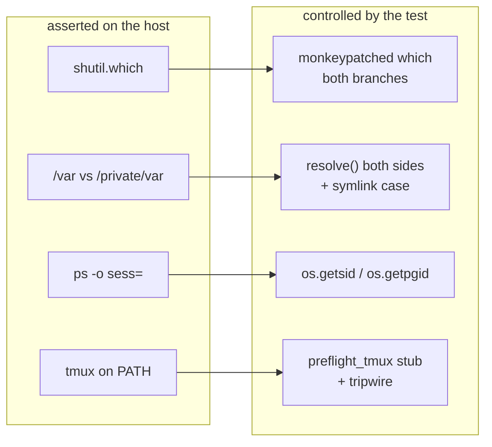

# The CLI suite reads the machine it runs on (issue-454) — reviewer briefing

## TL;DR

On the operator's Mac, four CLI tests failed that Linux CI never sees. Eight more fail on
any host without tmux. Each one asserted on the host instead of the code:

- whether `cursor-agent` is installed;
- whether the temp dir is a symlink (`/var` → `/private/var`);
- what BSD `ps -o sess=` prints (a pointer; `0` on macOS);
- whether tmux is on PATH.

The tests now control each of these. **Test code and docs only: no runtime module
changes.** Risk tier 2.

## Where to focus (in this order)

1. **`preflight_tmux`** in `cli/tests/conftest.py` — the one judgement call. The daemon
   tests get a stub `tmux` instead of a `skipif`. A recording run showed they never run
   tmux; the preflight only checks that it resolves. The stub records any call and exits 1,
   and the fixture fails the test at teardown if a call happened. Check that you agree
   these tests don't "genuinely exercise" tmux, in the ticket's words.
2. **`_stat()`** in `cli/tests/test_poll_daemon_integration.py`. The session and group
   now come from `os.getsid`/`os.getpgid`; `ppid` from `/proc` or `ps -o ppid=`. The
   detachment assertions are unchanged.
3. **The containment tests** in `cli/tests/test_harness_gate.py`. They assert lexical
   **and** canonical containment over four hostile refs, plus a symlinked-temp-dir case
   that runs the macOS alias on Linux CI.
4. **Skim:** the critic tests (`shutil.which` fixed by the test, both branches covered)
   and the capability doc section.

## What changed (map)

## Key decisions & why (education)

- **Stub tmux rather than skip.** A skip would hide the eight daemon tests on any host
  without tmux, which is the ticket's complaint in reverse. The stub also keeps test
  daemons away from the developer's real tmux server. The tripwire keeps it honest.
- **Compare containment lexically and canonically.** Canonical alone could pass a path
  built elsewhere that happens to resolve into the temp dir. The lexical check pins where
  it is built. The mutation run (raw id embedded) fails all five cases.
- **Use `getsid(2)` instead of emulating BSD `ps`.** It is POSIX and numeric on both
  platforms, so there is no per-OS parsing. The ticket rules out equating BSD `sess` with
  a SID, or dropping the check. Neither is done here.
- **No macOS CI job.** Out of scope. Every macOS cause is reproduced on Linux instead.

## Evidence

[`evidence/verification.md`](verification.md):

- **Red.** The original five modules under stub harness CLIs + symlinked `TMPDIR` + no
  tmux: 11 failed. That is the ticket's failures plus the tmux preflight ones.
- **Green.** The full suite under the same conditions: `5301 passed, 1 skipped`. The skip
  existed before (root container).
- **Normal host.** `make test`'s command: `5301 passed, 1 skipped`.
- **Probes.** The escape-check mutation, `_stat` without `/proc` on attached and detached
  children, and the tripwire.
- **Static.** ruff, ruff format, pyright and markdownlint are clean.

## Open questions for the reviewer

- **A macOS run.** There is no Mac in this checkout. Running `make test` on the
  operator's machine, without a bespoke `TMPDIR` or `PATH`, is the remaining confirmation
  of the ticket's last acceptance criterion.
