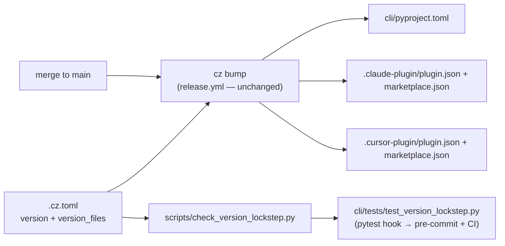

# Design: semantic-release based updates for the plugin manifests

> Phase 2 of 3, derived from [`requirements.md`](requirements.md). Records the
> "extend commitizen, don't add a release tool" decision in
> [decision-028](../../decisions/decision-028.md). No UI artifacts: release/infra work.

## Overview

The whole feature is configuration plus a guard — no new release machinery. commitizen
already owns the canonical version in `.cz.toml` and rewrites `version_files` on every
`cz bump` (decision-019); the four plugin manifests simply join that list. A
stdlib-only checker mirrors commitizen's replacement semantics and runs inside the
existing CLI test suite, so the pytest pre-commit hook and CI gate every PR on
lockstep.



## 1. `version_files` extension (`.cz.toml`)

commitizen updates a `path:pattern` entry by scanning the file's lines, and on each
line matching `pattern` it **replaces the current version string with the new one**
(`partition(":")` — the first colon splits path from pattern). The new entries:

```toml
version_files = [
    "cli/pyproject.toml:^version = ",
    ".claude-plugin/plugin.json:\"version\"",
    ".claude-plugin/marketplace.json:\"version\"",
    ".cursor-plugin/plugin.json:\"version\"",
    ".cursor-plugin/marketplace.json:\"version\"",
]
```

- The `"version"` pattern matches exactly the JSON version lines in each manifest; in
  the marketplace manifests it matches **both** version lines (marketplace
  `metadata.version` and the plugin entry's `version`), and commitizen rewrites every
  matching line — so one entry covers both fields.
- Because replacement is string-substitution of the *current* version, the manifests
  are synced from the stale `0.1.0` to the release-current version; from then
  on every bump keeps them current.

## 2. Lockstep guard

`scripts/check_version_lockstep.py` (stdlib-only, like `scripts/validate_config.py`):

- Reads `version` and `version_files` from `.cz.toml` with targeted regexes (not
  `tomllib`, which is Python ≥ 3.11 while the workspace supports ≥ 3.9).
- For each `path:pattern` entry: the file must exist, at least one line must match the
  pattern, and **every** matching line must contain the current version — stricter
  than commitizen's own `--check-consistency` (found-at-least-once), so a
  half-updated marketplace manifest fails too.
- Exit 0 prints `LOCKSTEP …`; drift prints one `DRIFT file:line …` per offence and
  exits 1.

`cli/tests/test_version_lockstep.py` runs the script as a subprocess and asserts exit
0 (Gherkin docstring per testing config). Riding the existing pytest hook means
pre-commit and CI both enforce it with **zero pipeline changes** — no edits to
`.pre-commit-config.yaml` or workflows.

## 3. What deliberately does not change

- **`release.yml`** — `cz bump --yes --changelog` picks the new targets up from
  `.cz.toml`; the workflow (a `sensitivePaths` entry) is untouched. Its
  `--check-consistency` flag was considered and skipped: the PR-time guard makes a
  release-time failure unreachable in the normal flow, and a red release run is the
  worse place to discover drift.
- **Tool choice** — `python-semantic-release` was already rejected in decision-019;
  issue #46's "python based tools" constraint is satisfied by commitizen, which the
  repo has used since decision-008. See decision-028.

## Failure modes considered

| Failure | Where it's caught |
|---------|-------------------|
| Manifest edited to a different version (or a new manifest added stale) | lockstep test fails on that PR (pytest hook, CI) |
| Only one of a marketplace's two version fields updated | every-matching-line rule fails the test |
| `version_files` entry pointing at a missing/renamed file | test fails: `file not found` |
| Pattern matching no lines after a manifest refactor | test fails: `no line matches pattern` |
| `cz bump` no-op (nothing releasable) | manifests untouched, still consistent |
