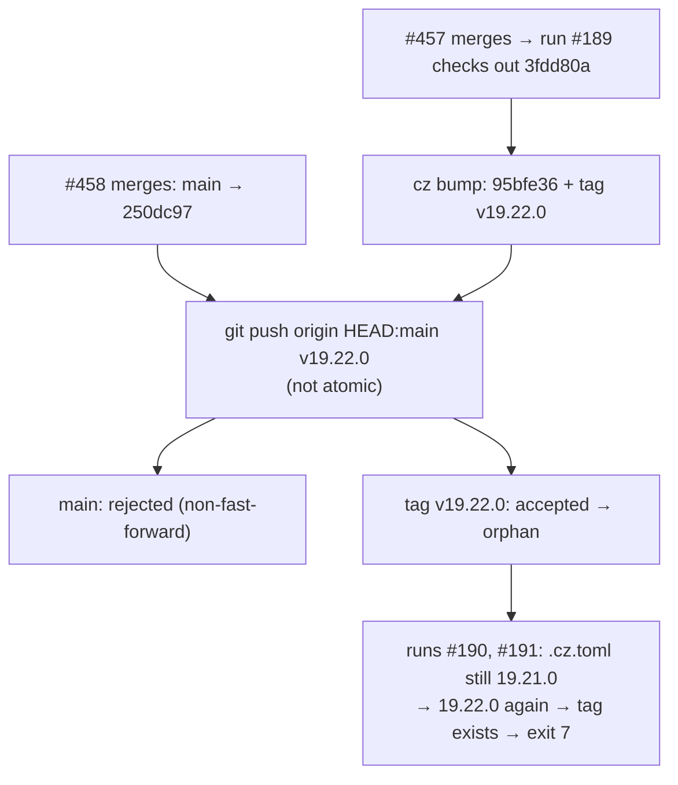

<!-- Authored per the the-loop:writing skill. -->

# Bugfix spec: an orphan `v19.22.0` tag blocks every release

> Phase 1 of 4 (bugfix → design → testing plan → tasks). The design is short enough to
> live in this file, under § The fix. Source:
> [issue-460](https://github.com/MadaraUchiha-314/the-loop/issues/460).

## Summary

PRs #457, #458 and #459 merged within about ten minutes of each other. All three release runs
failed, so none of their changes reached PyPI. PyPI's `the-loopy-one` stays at
**19.21.0**, which is still the version on `main`. The remote, though, has a
**`v19.22.0`** tag on `95bfe36`, a bump commit that is not on `main`. That tag has no
GitHub Release and no PyPI upload.

## Steps to reproduce

1. Merge PR A. The release run for A starts and checks out A's SHA.
2. Merge PR B before run A pushes.
3. Run A runs `cz bump` (19.21.0 → 19.22.0, tag `v19.22.0`), then
   `git push origin HEAD:refs/heads/main refs/tags/v19.22.0`.
4. Run B, and every run after it, computes 19.22.0 again.

## Expected vs actual

| | Expected | Actual |
|---|---|---|
| Step 3 | Either both refs land or neither does | `main` is rejected (non-fast-forward), but **the tag is accepted** |
| Step 4 | The next run releases A and B from `main`'s tip | `fatal: tag 'v19.22.0' already exists`, so `cz bump` exits 7 and nothing is published |

These are the observed runs:
[#189](https://github.com/MadaraUchiha-314/the-loop/actions/runs/37080095463) (push
rejected),
[#190](https://github.com/MadaraUchiha-314/the-loop/actions/runs/37080129921) and
[#191](https://github.com/MadaraUchiha-314/the-loop/actions/runs/37080861682) (tag
exists).

## Root cause (confirmed by replay against a scratch remote)

- **Stale checkout.** `actions/checkout` defaults to the event SHA. The `concurrency`
  group puts runs in a queue, but it does not move a queued run onto the newest `main`.
- **Non-atomic push.** By default, `git push` with two refs updates each ref on its own.

## Requirements

- **R1** A release run SHALL never leave a tag on the remote that `main` does not carry.
  The bump commit and its tag land together or not at all.
- **R2** A release run SHALL build on `main`'s tip. If the run before it already released
  this run's commits, this run is a no-op.
- **R3** The repository SHALL be released again: the next release after this fix merges
  publishes to PyPI.
- **R4** A regression test SHALL fail when either property of R1 or R2 is removed from
  `release.yml`.

## The fix

1. **Recovery (R3).** Move the repository to 19.22.0, the version the orphan tag names.
   That means `.cz.toml`, every `version_files` target, `uv.lock`, and the 19.22.0
   `CHANGELOG.md` entry (#457), all taken from `95bfe36`'s own diff. `.cz.toml` then
   agrees with the newest tag. The next run bumps from `v19.22.0` to **19.22.1** and
   includes #459, #458 and this fix. 19.22.0 stays a tag with no PyPI release. The owner
   chose this over deleting the remote tag, because it keeps the recovery inside the PR
   and deletes nothing (decision recorded on issue-460 and in this PR).
2. **R2.** `actions/checkout` with `ref: main`.
3. **R1.** `git push --atomic`. If `main` moved during the run, both refs are rejected.
   The run fails cleanly, and the run queued for the newer merge (R2) releases
   everything.
4. **R4.** `cli/tests/test_release_workflow.py` reads `release.yml` and asserts both
   properties.

### Alternatives rejected

- **Delete the orphan tag, stay at 19.21.0.** This publishes a clean 19.22.0, but it is a
  destructive operation outside the PR. The owner declined it.
- **Rebase and retry the push inside the job.** This is more moving parts than needed:
  with R2, the queued run already does that work.
