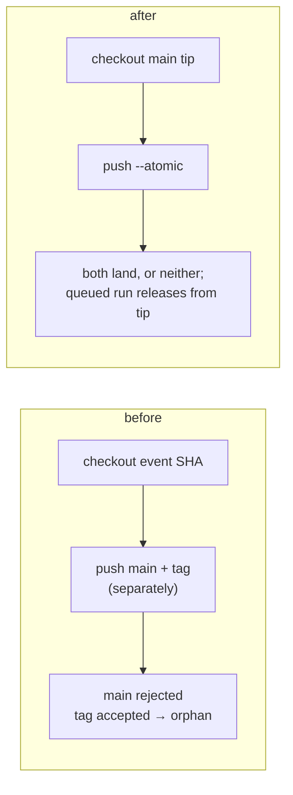

# Orphan release tag (issue-460): reviewer briefing

## TL;DR

Releases have failed since #457. PyPI is at **19.21.0**, the same as `main`. The run
for #457 pushed tag `v19.22.0` but not its bump commit, because #458 had already
landed. Every run since then recomputes 19.22.0 and dies on "tag already exists".

This PR moves the repository to 19.22.0, so the next release is **19.22.1**. It also
makes `release.yml` build from `main`'s tip and push the commit and tag atomically.
Risk tier 3.

## Where to focus

1. **`.github/workflows/release.yml`**: `ref: main` on checkout and `--atomic` on the
   push. Read the two comments.
2. **The version move**: this is `95bfe36`'s diff applied unchanged (the version files,
   `uv.lock` and the `CHANGELOG.md` entry).
3. **Skim:** `cli/tests/test_release_workflow.py`, plus the spec and evidence.

## Decision

The owner chose to move the repository to 19.22.0 rather than delete the remote tag.
That keeps the recovery inside this PR, at the cost of 19.22.0 never appearing on PyPI.
