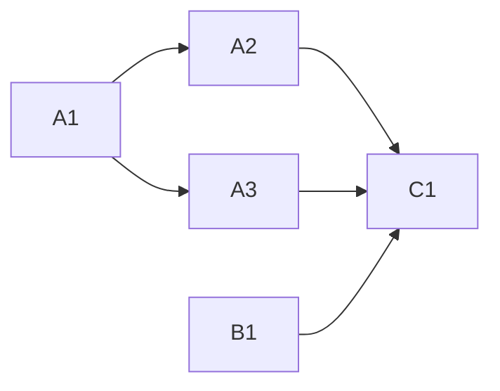

<!-- Authored per the the-loop:writing skill. -->

# Tasks: an orphan tag blocks every release

## Task list

- [x] **A1: red test.** `cli/tests/test_release_workflow.py`, with two cases, both failing
      against the pre-fix `release.yml`. *Req:* R4 · *Test:* T1.
- [x] **A2: build on the tip.** `ref: main` on `actions/checkout` in `release.yml`.
      *Req:* R2 · *Test:* T1, T6. *Deps:* A1.
- [x] **A3: atomic push.** `git push --atomic` in `Push bump commit + tag to main`.
      *Req:* R1 · *Test:* T1, T3, T4. *Deps:* A1.
- [x] **B1: recovery.** Apply `95bfe36`'s diff: the version files, `uv.lock` and
      `CHANGELOG.md` move to 19.22.0. *Req:* R3 · *Test:* T2, T5.
- [x] **C1: docs and evidence.** `docs/capabilities/release-publishing.md`, the evidence
      files. *Deps:* A2, A3, B1.

## Dependency graph (DAG)

