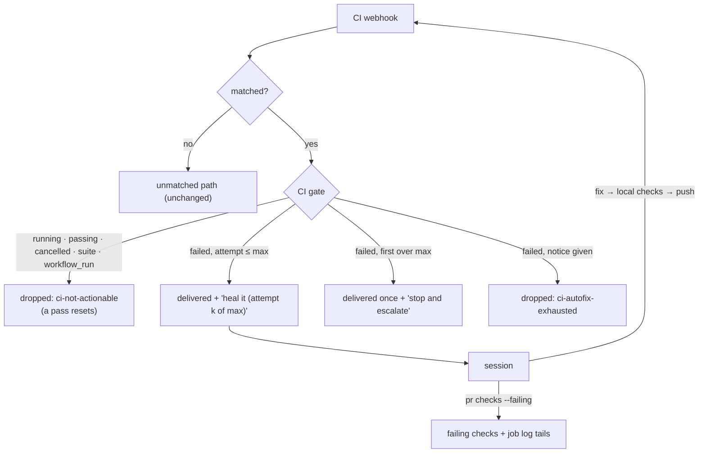

# CI monitoring and self-healing (issue-462): reviewer briefing

## TL;DR

the-loop already routed every CI webhook to the session working the pull request, but
it routed all of them raw. One push to a five-job PR meant 20 or more wake-ups, almost all
for nothing. A failure carried no way to read the job's log without `gh`. And a check
the agent could not fix had no end.

Now the dispatcher's **CI gate** delivers only a check that *failed*. It adds a section
naming the check, the commit and `attempt k of 3`, and points at the new **`the-loop pr
checks`**, which lists the failing checks with the tail of each failed Actions job's log.
Past `routing.ci.maxAttempts` failing commits, the session is told once to stop and
escalate, and the gate goes quiet for that check until it passes. A poll-only
installation gets the same events: on its own clock (`polling.ci.intervalSeconds`,
default 300 s), the poller reads each live pull request's checks and forwards each new
result to the same gate. The skill gains the healing procedure and its never-list. Risk
tier 3.

## Where to focus

1. **`cli/the_loop/webhook/cimonitor.py`.** `classify`: which conclusions count as a
   failure, a pass, or noise. Check the choice to ignore `cancelled` and every
   `check_suite` and `workflow_run`. `CiBudget.observe`: distinct SHAs per (PR, check),
   one notice, reset on a pass.
2. **`Dispatcher._ci_gate` and where `handle` calls it.** It runs after matching (an
   unmatched CI event is untouched) and before the pause and duplicate filters. A dropped
   event is logged and settled; a delivered one carries `ci_note`, which `_render_prompt`
   appends last.
3. **`GitHubClient.job_log_tail` / `_download_tail` / `_urlopen`.** It reads the `302`
   without following it, then fetches the signed URL over https only, with no
   credential, holding only the tail.
4. **`Poller._poll_ci` and `GitHubPollProvider.ci_events`** (added on review): only a PR
   a live session owns is read, and the `ciSeen` ledger forwards each result once.
5. **Skim:** `github_ops.pull_request_checks` and its seams (CLI, route, both facades,
   MCP, OpenAPI), the `routing.ci` schema and docs, the event catalogue, and the skill
   text in `workflow.md` § Self-healing CI.

## Low-level decisions

- **The per-job `check_run` is the unit, not the workflow.** It names the job whose log
  `pr checks` can read, and it avoids two or three wake-ups per failure.
- **`cancelled` is noise for the gate, failing for `pr status`.** A cancelled run is
  usually superseded by a newer push; the rollup's meaning is left as it was.
- **The escalation is the session's comment, not the daemon's.** Only the session knows
  what it tried, and `the-loop comment` already carries the marker and the channel
  mirror.
- **The budget lives in memory.** A restart allows another `maxAttempts` attempts. That
  is cheaper than a file, a lock and a migration (minimalism ladder, step 1).
- **`startup_failure` now fails the rollup.** It is a real GitHub conclusion that `pr
  status` treated as neither failing nor pending.

## Evidence

- New tests red before the change and green after; full suite, ruff, ruff format,
  pyright, markdownlint and config validation clean
  ([`verification.md`](verification.md)).
- Security checklist: pass ([`security-review.md`](security-review.md)).
- Self-review converged in 6 rounds (two after the poll-ingress ask); no critics configured in this cloud checkout
  ([`self-review.md`](self-review.md)).
- Docs touched: [`documentation.md`](documentation.md).

## Open questions for the reviewer

- **Default on.** `routing.ci.autofix` defaults to `true`, which changes what existing
  installations deliver: no more raw success and in-progress events. Is that the default
  you want, or should it ship off and be opted into?
- **Poll-only installations** — answered on the PR: they now get CI too, on
  `polling.ci.intervalSeconds` (default 300 s, floor 60). Is five minutes the default you
  want?
