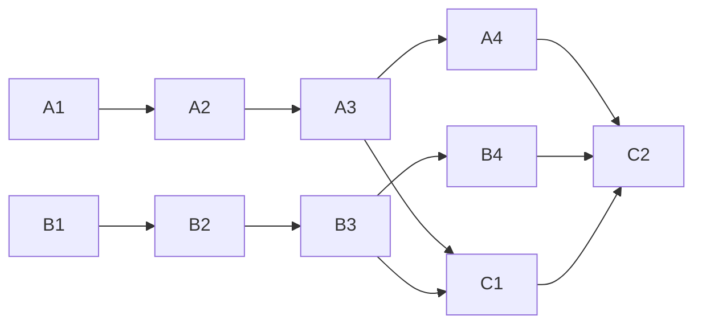

<!-- Authored per the the-loop:writing skill. -->

# Tasks: monitor a pull request's CI and heal its failing checks

## Task list

- [x] **A1: red tests for `pr checks`.** Client, core, CLI, integration and MCP tests,
      failing before the change. *Req:* R1, R2 · *Test:* T1–T6.
- [x] **A2: the client method.** `GitHubClient.job_log_tail` and `_download_tail`, and
      the fake's counterpart. *Req:* R1.4, R1.5 · *Test:* T1. *Deps:* A1.
- [x] **A3: the core verb.** `github_ops.pull_request_checks`, `startup_failure` in
      `_FAILED_CONCLUSIONS`. *Req:* R1 · *Test:* T2, T3. *Deps:* A2.
- [x] **A4: every seam.** CLI subcommand, route, API facade, manager facade, MCP tool,
      OpenAPI contract. *Req:* R2 · *Test:* T4–T6. *Deps:* A3.
- [x] **B1: red tests for the gate.** `test_cimonitor.py` and
      `test_ci_autofix_integration.py`. *Req:* R3, R4 · *Test:* T7, T8.
- [x] **B2: `cimonitor.py`.** `classify`, `CiBudget`, `render_section`. *Req:* R3, R4 ·
      *Test:* T7. *Deps:* B1.
- [x] **B3: wire the gate.** `RoutingConfig.ci`, the gate in `Dispatcher.handle`,
      `RoutedEvent.ci_note`, `_render_prompt`, settled outcomes, event catalogue.
      *Req:* R3, R4 · *Test:* T8. *Deps:* B2.
- [x] **B4: configuration.** Schema (both copies), routing options page, template
      config if it lists routing keys. *Req:* R3.3, R4.3 · *Test:* T9. *Deps:* B3.
- [x] **C1: skill text.** `reference/workflow.md` § Self-healing CI, `SKILL.md`,
      `reference/automation.md`, `/the-loop:work-on`. *Req:* R5. *Deps:* A3, B3.
- [x] **C2: docs and evidence.** CLI reference, capability docs (`cli.md`,
      `control-plane.md`, `webhook-triggers.md`), the evidence files. *Deps:* A4, B4, C1.

## Dependency graph (DAG)

