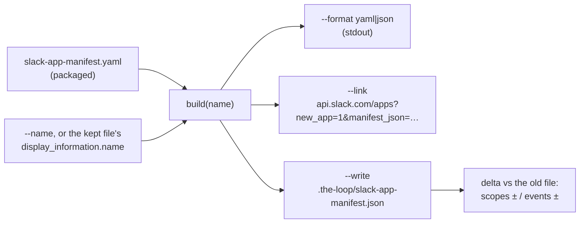

<!-- Authored per the the-loop:writing skill. -->

# Design: a Slack app from one click, named by its operator

> Phase 2 of 4. Derived from [`requirements.md`](requirements.md). One new module beside
> the packaged manifest, three options on an existing verb, and the init and upgrade
> walkthroughs that call it.

## Overview

The packaged YAML stays the single source. Every output (renamed YAML, JSON, the link,
the kept file) is computed from it plus one input, the name. Nothing else about the
operator's app is stored or read back, so regeneration cannot drift from the release.



## Components

### `the_loop/channels/app_manifest.py` (new)

| Function | Does |
|---|---|
| `handle(name) -> str` | R1.3's rule: trim, lowercase, collapse each run outside `[a-z0-9._-]` to `-`, strip `-`. |
| `check_name(name) -> str` | The trimmed name, or `ValueError` with R1.4's reason. |
| `build(name=None) -> dict` | `yaml.safe_load` of the packaged text; with a name, sets `display_information.name` and `features.bot_user.display_name` only. |
| `link(manifest) -> str` | `CREATE_URL + quote(json.dumps(manifest, separators=(",", ":")), safe="")`. |
| `render_json(manifest) -> str` | `json.dumps(indent=2, ensure_ascii=False) + "\n"`: the kept file's text, readable and pasteable. |
| `default_path() -> Path` | `cli_config.default_cli_config_path().parent / "slack-app-manifest.json"` (R3.1). |
| `write(path, name=None) -> dict` | R3.2–R3.5. Returns `{path, name, status: created/updated/unchanged, scopes: {added, removed}, events: {added, removed}, link}`. Raises `ValueError` for R1.4 and R3.3. |
| `delta(old, new) -> dict` | Set differences of `oauth_config.scopes.bot` and `settings.event_subscriptions.bot_events`. |

`write` reads the old file once and parses it as JSON. Without `--name` it takes the
name from the old file, or the packaged name when there is no file. It compares the
rendered text and writes only on a difference, through a temporary sibling file and
`os.replace` so a crash never leaves half a manifest. Parent directories are created.

The YAML output under `--name` is `yaml.safe_dump(sort_keys=False)`. It loses the
packaged file's comments, which is why the no-option path still prints the file verbatim
(R1.1).

### `the_loop/commands/channels_cmd.py`

The `manifest` subparser gains `--name NAME`, `--format {yaml,json}`, `--link` and
`--write [PATH]` (`nargs="?"`, a bare `--write` meaning `default_path()`). Precedence:
`--write` prints its report and the link. Otherwise `--link` prints the link, and
otherwise the manifest is printed in `--format`. A `ValueError` prints to stderr and
exits 2. The verb still reads no config beyond resolving its path, and needs no token.

`--write`'s report:

```text
wrote .the-loop/slack-app-manifest.json (app "the-loop-dana")
  bot scopes: + files:read
  bot events: (unchanged)
  An app created from the old manifest: replace its manifest (api.slack.com/apps →
  your app → App Manifest) and reinstall it, since its scopes changed.
create a new app from it: https://api.slack.com/apps?new_app=1&manifest_json=…
```

### Walkthroughs (`commands/init.md`, `commands/upgrade-the-loop.md`)

Init step 5's first sub-step becomes: ask the name, run `the-loop channels manifest
--name "<name>" --write <CLI config dir>/slack-app-manifest.json`, hand over the link,
and wait for *Create* and *Install to Workspace*. The token steps say where the token
goes (environment or `env.file`) and never ask for it in the chat.

Upgrade gains a step after the config migration: regenerate the kept manifest, report
the delta, or ask for a name when Slack is on and nothing is kept.

`.the-loop/manifest.yaml` lists `.the-loop/slack-app-manifest.json` (`role:
slack-app-manifest`, `managed: true`, `optional: true`).

## Decisions

- **The name is read back from the kept file, not stored in the CLI config.** A config
  key would need a schema change and a migration to hold one string the file already
  holds. Cost: renaming means `--name` again, which is the same command init ran.
- **The slash command stays `/the-loop`.** Slack lets two apps in a workspace declare the
  same command and asks the user which one they mean. Every reply and help text names
  `/the-loop`. Renaming it is a separate change if operators ask for it.
- **The kept file is JSON.** It is what the link carries and what Slack's *App
  Manifest* editor accepts, and it has no comments to lose. The packaged file stays YAML
  for its comments.
- **No tokens through the conversation** (requirements, R4.2).

## Error handling

| Condition | Result |
|---|---|
| Bad name (R1.4) | stderr reason, exit 2, nothing written |
| Kept file unreadable or not a manifest, no `--name` (R3.3) | stderr "pass --name", exit 2, file untouched |
| Write fails (permissions) | the `OSError` message, exit 1, the temporary file removed |

## Security design

Enforces the requirements' boundaries. The name is the only operator input and reaches
the output only through `json.dumps` and `quote(safe="")`. Regeneration takes nothing
but the name from the old file. The command opens no socket and reads no environment
variable beyond the CLI config's path resolution. The written file holds no secret.

## Testing strategy

Unit tests on `app_manifest` and on the verb through `ChannelsCommand().run`, in
`cli/tests/test_channels_commands.py`. The existing pin that the Slack guide reproduces
the packaged manifest keeps the guide honest. See [`testing-plan.md`](testing-plan.md).

## Dependencies

None new: `yaml` (already a dependency), `json` and `urllib.parse` from the standard
library.
