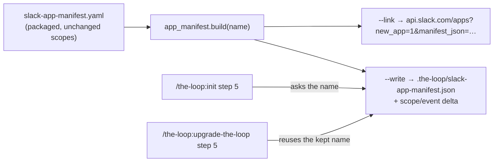

# A Slack app from one click, named by its operator — reviewer briefing

## TL;DR

`the-loop channels manifest --name "<app>" --write` keeps a renamed copy of the shipped
Slack manifest beside the CLI config and prints Slack's prefilled create-app link, so
creating the app takes one click. `/the-loop:init` asks the name and walks the link, and
`/the-loop:upgrade-the-loop` regenerates the file and names the scopes that changed.

## Where to focus (in this order)

1. **The token reading** — `commands/init.md` step 5. The issue says the user "pastes the
   bot token back". The loop's credential rule forbids a token in the conversation, so
   the walkthrough sends it to the environment or `env.file`. Confirm that reading.
2. **`write()`** — `cli/the_loop/channels/app_manifest.py`. It reads only the name back
   from the old file, refuses a file it cannot read unless `--name` is given, and writes
   atomically.
3. **The upgrade step** — `commands/upgrade-the-loop.md` step 5. Three cases (kept,
   Slack on but nothing kept, neither) and the dry-run.
4. **Skim:** the option wiring and report in `channels_cmd.py`, and the docs.

## What changed (map)

## Key decisions & why

- **The name lives in the kept file, not in the CLI config.** No schema change or
  migration for one string. Renaming is `--name` again.
- **The slash command stays `/the-loop`.** Every reply names it, and Slack lets two
  apps share a command.
- **The kept file is JSON.** It is what the link carries and what Slack's *App
  Manifest* editor accepts. The no-option output stays the commented YAML, verbatim.
- **Regeneration resets everything but the name.** That way a tampered or stale file
  cannot keep a scope the release does not ship.

## Evidence

Red then green unit tests, the full suite (5409 passed), ruff, pyright, the config
validator and markdownlint: [`verification.md`](verification.md). The security checklist
passed: [`security-review.md`](security-review.md). Self-review converged in three rounds:
[`self-review.md`](self-review.md).

## Open questions for the reviewer

- Is the token reading in focus item 1 what the issue meant?
- The link was not opened in a live Slack workspace from this session. The test decodes
  it back to the manifest. Worth one click on your side.
