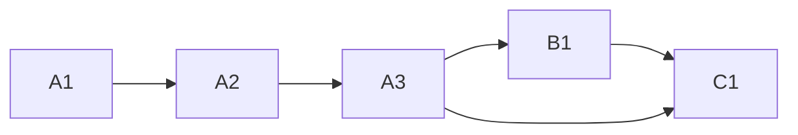

<!-- Authored per the the-loop:writing skill. -->

# Tasks: a Slack app from one click, named by its operator

## Task list

- [x] **A1: red tests.** Naming, formats, link and kept-file tests for `channels
      manifest`, failing before the change. *Req:* R1–R3 · *Test:* T1–T3.
- [x] **A2: `app_manifest` module.** `handle`, `check_name`, `build`, `link`,
      `render_json`, `default_path`, `delta`, `write`. *Req:* R1–R3 · *Test:* T1–T3.
      *Deps:* A1.
- [x] **A3: the verb's options.** `--name`, `--format`, `--link`, `--write [PATH]` and
      the report. *Req:* R1–R3 · *Test:* T1–T3. *Deps:* A2.
- [x] **B1: walkthroughs.** `/the-loop:init` step 5, `/the-loop:upgrade-the-loop`'s new
      step, `.the-loop/manifest.yaml`. *Req:* R4, R5. *Deps:* A3.
- [x] **C1: docs and evidence.** The packaged manifest's header and the Slack guide,
      the onboarding guide, the CLI reference, `docs/capabilities/channels.md`, and the
      evidence files. *Deps:* A3, B1.

## Dependency graph (DAG)

