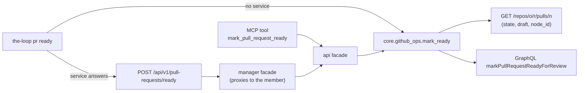

<!-- Authored per the the-loop:writing skill. -->

# Design: `the-loop pr ready`

> Phase 2 of 4. Derived from [`requirements.md`](requirements.md). It adds one verb along
> the path issue-447 laid for `pr merge` and `pr resolve-thread`
> ([issue-447 design](../issue-447/design.md)); nothing else moves.

## Overview

One core function does the work, and every seam calls it. That is the issue-447
convention, so the new verb is the same five thin wrappers the other lifecycle verbs
have, plus one GitHub client method.



## Why GraphQL

GitHub's REST API cannot take a pull request out of draft: `PATCH …/pulls/{n}` ignores
`draft`. The only way is the GraphQL mutation `markPullRequestReadyForReview`, addressed
by the pull request's node id. The node id comes from the REST document the verb reads
first (`node_id`), so the caller never supplies one (requirements § abuse cases).

## Components

### `ghapi.GitHubClient.mark_pull_ready(node_id, host="") -> bool`

Sends `markPullRequestReadyForReview(input: {pullRequestId: $id}) { pullRequest { id
isDraft } }` with the id as a variable, and returns `not isDraft`. The id is checked
against `_NODE_ID_RE` first, as `resolve_review_thread` checks its thread id.

### `core.github_ops.mark_ready(pr, work_item="", config=None, *, registry_dir="", client=None)`

1. Resolve `pr` (`resolve_pull_request`) and check the host (`_trusted`). A malformed
   argument is a `ValueError` (exit 2), raised before any request.
2. `_authority(target, work_item, config, registry_dir)` — the lifecycle guard. A
   refusal is exit 1 with no request made.
3. `get_pull` for the document. Not `open` → exit 1, "is merged" or "is closed".
   `draft` false → exit 0, `ready: true, changed: false`, "already ready for review".
4. `mark_pull_ready(node_id)`. GitHub answering still-draft → exit 1.
5. Emit `work_item.pr_ready` and return `ready: true, changed: true`.

Two requests on the path that changes something, one on the no-op path.

### The seams

| Seam | Change |
|---|---|
| CLI (`commands/github_cmd.py`) | `pr ready PR [--work-item REF]`, routed through `harness_routed` like `pr merge`. |
| Route (`api/routes.py`) | `POST /api/v1/pull-requests/ready`, `operationId: markPullRequestReady`, body `PullRequestReadyBody {ref, workItem, instance}`. |
| API facade (`api/facade.py`) | `mark_pull_request_ready(ref, work_item, instance)`. |
| Manager facade (`manager/facade.py`) | Runs it on the acting member (`_acting_member`), proxying to the member's route otherwise. |
| MCP (`api/mcp.py`) | Tool `mark_pull_request_ready`. |
| Contract | The route and its body in `docs/api-specs/openapi/the-loop.v1.yaml`. |
| Event catalogue (`eventlog.py`) | `work_item.pr_ready`. |

## Data model

No stored data changes. The result is the issue-447 envelope:

```json
{"pullRequest": "github:octo/repo#12", "ready": true, "changed": true,
 "exitCode": 0, "messages": [{"stream": "out", "text": "marked github:octo/repo#12 ready for review"}]}
```

## Error handling

| Case | Exit | Requests |
|---|---|---|
| Malformed PR argument, bare number without `--work-item` | 2 | none |
| Host not trusted | 2 | none |
| Not a registered work item's PR | 1 | none |
| PR closed or merged | 1 | 1 (read) |
| PR already ready | 0 | 1 (read) |
| GitHub refuses either request, or answers still-draft | 1 | 1–2 |

## Security design

- The lifecycle guard runs before any request, so an unowned PR costs GitHub nothing.
- The mutation's id is the node id GitHub returned for the resolved PR; no request field
  names an id.
- `_trusted` keeps the token on github.com and the operator's host.
- No new token scope: GitHub requires the same pull-request write access `pr create`
  already needs.

## Alternatives considered

- **A `--ready` flag on `pr create`, or dropping `--draft`.** Does not help the PR that
  is already a draft, which is the issue.
- **Folding it into `pr merge`.** A draft is readied to ask for review, long before a
  merge; tying the two would hide the review request.
- **A `--draft` reverse (convert back to draft).** Not asked for (YAGNI, minimalism
  ladder step 1).

## Testing strategy

See [`testing-plan.md`](testing-plan.md).
