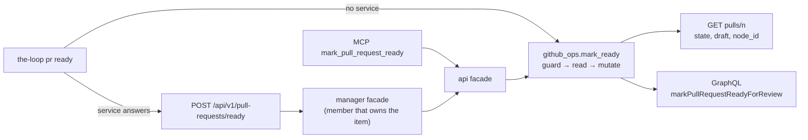

# `the-loop pr ready` (issue-465): reviewer briefing

## TL;DR

`the-loop pr create --draft` could open a draft PR, but nothing in the-loop could take
it out of draft, so an agent had to use `gh pr ready` (which the skill forbids) or leave
the PR stuck as a draft at the human gate. `the-loop pr ready <pr>` now does it, on every
seam the issue-447 verbs use: CLI, REST route, MCP tool and the manager's proxy. It is a
lifecycle act behind the same registered-work-item guard as `pr merge`. Risk tier 3.

## Where to focus

1. **`cli/the_loop/core/github_ops.py` → `mark_ready`.** The order: guard first (no
   request for an unowned PR), then read the PR, then refuse a closed or merged PR, then
   treat an already-ready one as a no-op, and only then mutate. The node id comes from
   GitHub's own document for the resolved PR.
2. **`cli/the_loop/ghapi.py` → `mark_pull_ready`.** GraphQL, because REST ignores
   `draft` on `PATCH …/pulls/{n}`. The id is a variable and is checked against
   `_NODE_ID_RE` first.
3. **Skim:** the wrappers (CLI subcommand, route and body, both facades, MCP tool,
   OpenAPI contract), the event `work_item.pr_ready`, and the skill and doc text.

## Low-level decisions

- **Gated like `pr merge`, not open like `pr status`.** Taking a PR out of draft
  requests its code owners' reviews, so it changes what people see. An ad-hoc `the-loop
  do` work item may still ready a PR it names.
- **An already-ready PR is exit 0 with `changed: false`.** An agent can run it
  unconditionally before asking for review without first checking `pr status`.
- **A closed or merged PR is exit 1.** GitHub would refuse anyway; refusing first says
  which, and spends no write.
- **No reverse verb (back to draft).** Nobody asked for it (minimalism ladder, YAGNI).

## Evidence

- 14 new tests red before the change and green after; full suite 5391 passed, 1
  skipped; ruff, ruff format, pyright, markdownlint and config validation clean
  ([`verification.md`](verification.md)).
- Security checklist: pass ([`security-review.md`](security-review.md)).
- Self-review converged in 3 rounds; no critics are configured in this cloud checkout
  ([`self-review.md`](self-review.md)).
- Docs touched: [`documentation.md`](documentation.md).

## Open questions for the reviewer

- Should the `human-approval` gate also warn when the PR it is about to put up for
  review is still a draft? This PR only tells the agent, in the skill, to ready it
  first. A gate-side check would be a separate work item.
