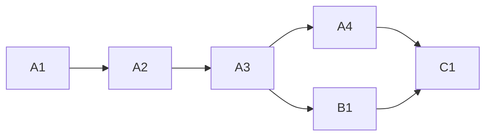

<!-- Authored per the the-loop:writing skill. -->

# Tasks: `the-loop pr ready`

## Task list

- [x] **A1: red tests.** Client, core, CLI and integration tests for `pr ready`, failing
      against the code before the change. *Req:* R1, R2 · *Test:* T1–T5.
- [x] **A2: the client method.** `GitHubClient.mark_pull_ready` and the fake's
      counterpart. *Req:* R1.1, R1.5 · *Test:* T1. *Deps:* A1.
- [x] **A3: the core verb.** `github_ops.mark_ready` and the `work_item.pr_ready`
      event. *Req:* R1, R2.5 · *Test:* T2, T3. *Deps:* A2.
- [x] **A4: every seam.** CLI subcommand, route and body, API facade, manager facade,
      MCP tool, OpenAPI contract. *Req:* R2 · *Test:* T4–T6. *Deps:* A3.
- [x] **B1: skill text.** `SKILL.md`, `reference/automation.md`, `/the-loop:work-on`.
      *Req:* R3. *Deps:* A3.
- [x] **C1: docs and evidence.** CLI reference (`pr`, command index), capability docs
      (`cli.md`, `control-plane.md`), the evidence files. *Deps:* A4, B1.

## Dependency graph (DAG)

