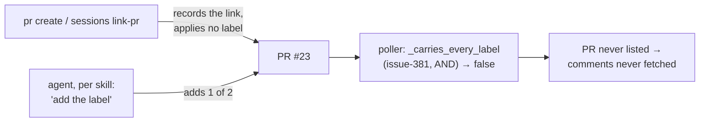

<!-- Authored per the the-loop:writing skill. -->

# Bugfix spec: a linked PR missing one arming label is never polled

> Phase 1 of 4 (bugfix → design → testing plan → tasks). The design is short enough to
> live in this file, under § The fix. Source:
> [issue-466](https://github.com/MadaraUchiha-314/the-loop/issues/466).

## Summary

A review comment on [yaah#23](https://github.com/MadaraUchiha-314/yaah/pull/23), the PR
delivering [yaah#22](https://github.com/MadaraUchiha-314/yaah/issues/22), never reached
the work item's session. The poller never fetched it. The operator configures two arming
labels, and the PR carried only one of them, so the poller filtered it out at discovery
and never read its comments. The PR was linked to the work item, but nothing in the
poller follows a link.

## Steps to reproduce

1. Configure `routing.autoExecuteLabels: ['the-loop: auto-execute', 'the-loop: rr']`
   with polling enabled and webhooks off.
2. Arm and start a work item. Its session runs `the-loop pr create`, which opens the PR
   and records it against the work item (`session.pr_linked`).
3. The agent follows the skill text ("add **the** auto-execute label") and adds
   `the-loop: auto-execute` only.
4. Post a review comment on the PR.

## Expected vs actual

| | Expected | Actual |
|---|---|---|
| Step 2 | The PR carries every label the poller requires | The PR carries no label. Labelling is left to the agent |
| Step 4 | The comment is forwarded to the session | `poll.item_filtered` (`missing_labels: ['the-loop: rr']`); every later cycle lists one item, forwards nothing |

The full evidence (event log, poller log, label timeline) is in the
[diagnosis comment](https://github.com/MadaraUchiha-314/the-loop/issues/466#issuecomment-6006916538).

## Root cause

- **Nobody owned the labels.** `core.github_ops.create_pull_request` and
  `core.sessions.link_pull_request` record the link and touch no label. The agent was
  expected to add them.
- **The instructions contradicted each other.** `reference/automation.md` and the
  `pull-requests.md` evidence template say "the label" (singular). The same file says a
  PR is routed only when it carries every label (issue-381).

## Requirements

- **R1** WHEN `the-loop pr create` opens a pull request and records it against the work
  item THEN the system SHALL put every label in `routing.autoExecuteLabels` (default
  `['the-loop: auto-execute']`, read as the dispatcher reads it) on that pull request.
- **R2** WHEN `the-loop sessions link-pr` (with a pull request, or `--discover`) records a
  pull request that was not already recorded THEN the system SHALL put the same labels on
  it. A re-run on a pull request already recorded SHALL ask GitHub nothing.
- **R3** WHEN the link was not recorded (no session, a registry failure) THEN the system
  SHALL put no label on the pull request.
- **R4** WHEN GitHub refuses the labels, or the pull request is on a host the operator did
  not configure, THEN the system SHALL keep the link and exit 0, report a note naming the
  labels on stderr, and send no request to an untrusted host.
- **R5** The skill and the slash commands SHALL say that recording a PR applies every
  configured label, and that the agent adds them by hand only when the verb reports it
  could not.

## Security considerations

- **Untrusted actors:** whoever can call the verb. That is already the session, or a
  caller of the service's routes, gated by the registered-work-item rule. No new caller.
- **Trust boundary:** the labels come from the executing process's own CLI config, never
  from the request. The pull request's host passes the same allow-list every other verb
  uses (`_trusted`, issue-447 A3), so the token never goes to an unconfigured host.
- **Abuse case:** labelling a PR that no work item tracks would arm it, and with
  `spawnOnUnmatched: labeled` start a session for it. R3 forbids that: labels follow a
  recorded link only.
- **Fail-closed:** a refusal applies nothing and changes nothing else.

## The fix

The owner chose this option (option 2 of the diagnosis) on the
[ticket](https://github.com/MadaraUchiha-314/the-loop/issues/466#issuecomment-6006949044):
label the PR in `create_pull_request` with the full `routing.autoExecuteLabels` set,
covering `sessions link-pr` too.

1. **`core.github_ops.auto_execute_labels(config)`** reads the list with the
   dispatcher's own default and `normalize_labels`. One reading, so the poller, the
   router and the labeller cannot disagree.
2. **`core.github_ops._arm`** checks the host, calls `GitHubClient.add_labels` (which
   adds and never replaces), emits `work_item.pr_labelled`, and turns a refusal into a
   stderr note (R4).
3. **`core.github_ops.link_pull_request`** wraps `core.sessions.link_pull_request` and
   arms only a newly recorded link (R2). The service route, the MCP tool (both through
   the facade), the SDK client, the CLI's in-process fallback and `--discover` all use
   it.
4. **`create_pull_request`** arms whenever its link succeeded, even one a racing webhook
   recorded first, because a PR opened a moment ago has had no label removed by a person
   (R1). It never arms after a failed link (R3).
5. **Skill text** (R5): `reference/automation.md`, the `pull-requests.md` evidence
   template, `/the-loop:work-on` and `/the-loop:execute-tasks`.

### Alternatives considered

- **The poller lists every linked PR regardless of labels** (diagnosis option 1). This is
  more robust, but it is not the option the owner chose.
- **Re-label on every link-pr run.** This would heal a PR linked before the fix, but
  discovery runs after every `git push`, so it would cost a request per push and put back
  a label a person removed on purpose. Rejected. A PR linked before this fix keeps the
  diagnosis' workaround: add the missing label by hand.

### Not covered

`polling.sources[].labels` can replace `routing.autoExecuteLabels` for one source. A PR
in such a source still needs that source's labels added by hand. Choosing which source
covers a PR's repository is a wider change than the option the owner chose.
