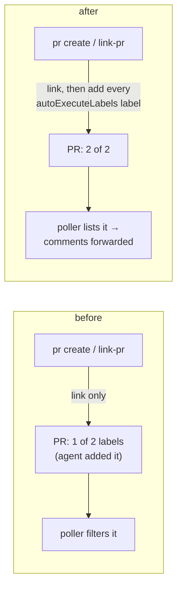

# Linked PRs carry every arming label (issue-466): reviewer briefing

## TL;DR

A review comment on yaah#23 never reached its session. The operator configured two
arming labels. The PR had one, because the skill told the agent to add "the label". The
poller's every-label filter (issue-381) dropped the PR, so its comments were never
fetched. Now `pr create`, `sessions link-pr` and `link-pr --discover` put the whole
`routing.autoExecuteLabels` list on the PR they record. This is the option the owner
chose on the ticket. Risk tier 3.

## Where to focus

1. **`cli/the_loop/core/github_ops.py`**: `_arm`, `link_pull_request`, and the two
   call sites in `create_pull_request` and `discover_pull_requests`. Check the
   conditions: label only after a recorded link, only a new link for `link-pr`, and
   never on an untrusted host.
2. **Entry points:** the facade (the service route and the MCP tool), the SDK and the CLI
   fallback now call `github_ops.link_pull_request`. Each change is one line.
3. **Skim:** the skill and command text, the capability docs, and the tests
   (`test_github_ops.py -k 466`, plus the Gherkin integration test that replays the
   issue against a two-label poller).

## Low-level decisions

- **Only a newly recorded link is labelled** (except `pr create`, which labels whenever
  its link succeeded). Discovery re-runs after every push. Re-labelling each time would
  cost a request per push and undo a person's deliberate removal.
- **No labels without a link.** A labelled but untracked PR could be started as a work
  item of its own.
- **A refusal is a note.** The PR exists and is linked, and a non-zero exit would invite
  a second `pr create`.
- **Not covered:** a `polling.sources[].labels` override, and PRs linked before this fix.
  yaah#23 still needs `the-loop: rr` added by hand.
