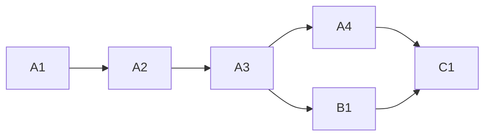

<!-- Authored per the the-loop:writing skill. -->

# Tasks: a linked PR missing one arming label is never polled

## Task list

- [x] **A1: red tests.** Nine unit tests in `test_github_ops.py` and the Gherkin
      integration test, all failing against the pre-fix code. *Req:* R1–R4 ·
      *Test:* T1–T4.
- [x] **A2: one reader of the list.** `github_ops.auto_execute_labels`, with the
      dispatcher's default and normalisation. *Req:* R1 · *Test:* T1. *Deps:* A1.
- [x] **A3: arm a linked PR.** `_arm` and `github_ops.link_pull_request`;
      `create_pull_request` and `discover_pull_requests` call them. *Req:* R1–R4 ·
      *Test:* T1–T3. *Deps:* A2.
- [x] **A4: every link-pr entry point.** The facade (service route and MCP tool), the
      SDK client and the CLI's in-process fallback call `github_ops.link_pull_request`;
      `work_item.pr_labelled` joins the event catalogue. *Req:* R2 · *Test:* T4, T5.
      *Deps:* A3.
- [x] **B1: skill text.** `reference/automation.md`, the `pull-requests.md` template,
      `/the-loop:work-on`, `/the-loop:execute-tasks`. *Req:* R5. *Deps:* A3.
- [x] **C1: docs and evidence.** The CLI reference (`sessions`, `pr`), the capability
      docs `cli.md` and `webhook-triggers.md`, and the evidence files. *Deps:* A4, B1.

## Dependency graph (DAG)

