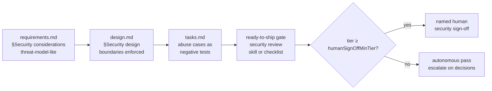

# Design: security as a first-class, gated concern in the work-item process

> Phase 2 of 3 (requirements → design → tasks). Derives from the requirements spec.

## Overview

No new phase and no new runtime code: each **existing** gate gains a security check,
and one new reference file carries the detail. The procedure lives in
`reference/security.md`; the artifacts (templates) gain the sections the gates check;
the config gains a `security` block the gates read; the workflow/review references and
commands point at all of it.



## Components & interfaces

- **`reference/security.md`** *(new)* — the single detailed source: the per-phase
  security lens, the fallback checklist, the human-sign-off tier rule, and the
  fail-closed principle. Everything else references it.
- **Templates** — `requirements.md` + `bugfix.md` gain **Security considerations**
  (actors/trust, boundaries/data, abuse cases as EARS, fail-closed); `design.md` gains
  **Security design** (authn/authz, validation/injection surfaces, secrets, least
  privilege, fail-closed, abuse-case coverage); `tasks.md` notes security-relevant
  tasks name their negative test and that the security gate follows the last task;
  `execution-log.md` gains a **Security review (gate)** section and a `security` review
  type in the review table.
- **`reference/workflow.md`** — phase descriptions name the new sections and their
  gates; the ready-to-ship gate gains the security-review item; the autonomy section
  gains the sign-off threshold.
- **`reference/reviewing.md`** — the security round: runs after self/critic converge,
  same reply-first-then-fix protocol, tightened dismissal rule (won't-fix needs a
  recorded justification; unresolved findings block completion at any tier).
- **`SKILL.md` / commands** — a "Security is gated, not bolted on" operating principle;
  `work-on`, `execute-tasks`, `new-requirement`, `create-design` mention the section or
  gate at the step where it applies.
- **`config.schema.json` + both `config.yaml`s** — the `security` block (below);
  `x-onboarding` folds `security` into the `reviews-autonomy` group (retitled
  "Reviews, security & autonomy").

## Data models

The `security` config block (schema-validated, defaults = strict posture):

```yaml
security:
  threatModel:
    required: true                # requirements/bugfix gate
    projectDoc: ""                # optional living threat-model doc
  design:
    required: true                # design gate
  review:
    required: true                # ready-to-ship gate item
    mechanism: auto               # auto | skill | checklist
    humanSignOffMinTier: 4        # 1–6; 6 = never require a human
```

## Error handling

- Gates **fail closed**: an empty/missing Security considerations or an unenforced
  boundary fails the phase; an unresolved security finding blocks completion at any
  tier; `mechanism: auto` falls back to the checklist when no skill exists, so the gate
  can never silently no-op.
- Config drift is caught by `scripts/validate_config.py` (schema + both configs), same
  as every other block.

## Security design

> Dogfooding: this work item's own trust-boundary statement.

- No new runtime ingress, privilege, or secret is introduced; the change is
  docs/templates/config. The one guardable surface is the config itself: relaxing a
  gate (`required: false`, `humanSignOffMinTier: 6`) is an explicit, schema-documented
  edit that shows up in a config diff and PR review — the defaults ship strict.
- Fail-closed posture is inherited from the gates themselves (see Error handling).

## Testing strategy

- `make validate` — schema + both configs stay green (proves R6).
- `make lint` — markdownlint over every touched/new markdown file.
- Inspection: `x-onboarding` group coverage still spans every top-level schema property
  except `version` (decision-024 invariant).

## Trade-offs & decisions

- **Weave into existing gates, not a new phase** — a separate "security phase" would
  add ceremony and be skippable; a lens on gates that already block is enforced for
  free. Recorded as [decision-026](../../decisions/decision-026.md).
- **`auto` mechanism** — resolves the issue's open question by preferring the built-in
  `/security-review` skill where the harness has one, with the-loop's checklist as the
  portable fallback (Cursor, bare harnesses).
- **Promote the `security` block** deferred in decision-023 — more security knobs now
  exist, which was that decision's stated re-evaluation trigger.

## Open questions

None — the issue's open questions are resolved by the defaults above, pending review.
